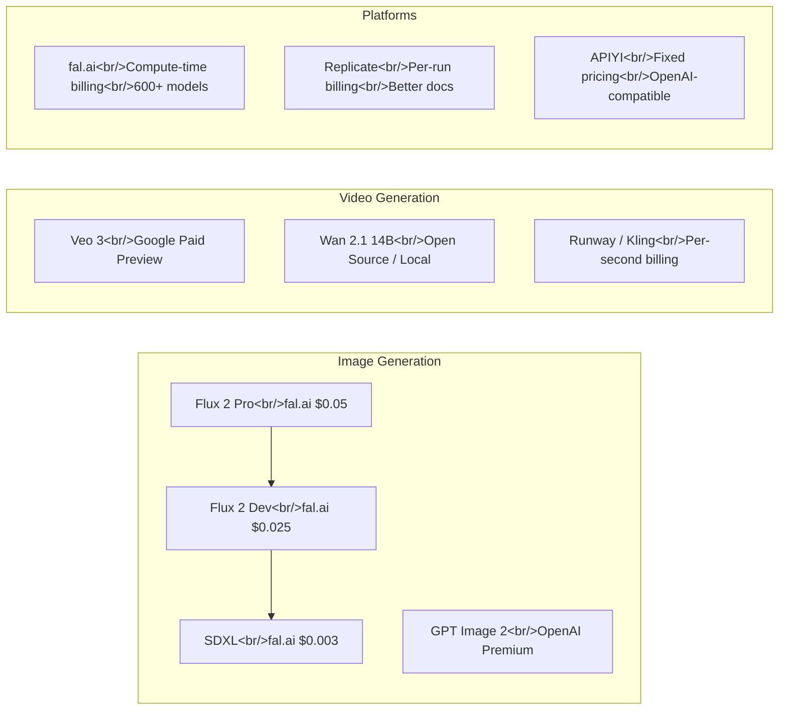

## Overview

The AI-generated media API market has reached an inflection point in early 2026. Google shipped Veo 3 with native audio generation, OpenAI's next-generation image model leaked through Chatbot Arena, open-source contenders like Wan 2.1 made local video generation viable, and pricing competition between platforms like fal.ai and Replicate is driving costs down rapidly. This post maps out the current landscape — what each platform offers, what it actually costs, and where the hidden gotchas are.

<!--more-->

## The Pricing Landscape at a Glance

## Image Generation Pricing Breakdown

The TeamDay.ai 2026 pricing survey reveals a clear tiering across platforms and models.

### Per-Image Cost Comparison

| Model | fal.ai | Replicate | OpenAI | Notes |
|---|---|---|---|---|
| Flux 2 Pro | $0.05 | ~$0.06 | — | Best quality-to-cost ratio |
| Flux 2 Dev | $0.025 | ~$0.03 | — | Good for prototyping |
| SDXL | $0.003 | ~$0.005 | — | Budget option, still decent |
| GPT Image (4o) | — | — | ~$0.02–0.08 | Best text rendering in images |
| GPT Image 2 | — | — | TBD | Leaked, not yet priced |

**Key takeaway**: fal.ai wins on raw price for most use cases. Replicate charges slightly more but offers significantly better documentation and developer experience. OpenAI commands a premium but remains the best option when you need accurate text rendered inside images.

### Cost Optimization Strategies

1. **Match model to task** — Do not use Flux 2 Pro for thumbnail generation when SDXL at $0.003 will do. Reserve premium models for hero images and client-facing assets.
2. **Batch processing** — Most APIs offer volume discounts or reduced latency overhead when batching requests.
3. **Resolution awareness** — A 512x512 preview followed by a selective 1024x1024 upscale is cheaper than generating everything at max resolution.

## Video Generation: The Big Three Approaches

### Google Veo 3 and 3.1

Google's Veo 3 is now available in paid preview through the Gemini API and Vertex AI. The headline feature: it is the first video model with **native audio generation**. Text-to-video produces both visuals and synchronized sound — speech, ambient noise, effects — in a single pass. Image-to-video support is coming soon.

Tens of millions of videos have already been generated through consumer-facing tools, and the API release opens this up to developers.

**Veo 3.1** builds on this with:
- Improved physics simulation and realism
- Better prompt adherence and multi-scene coherence
- Longer clip duration with scene expansion controls
- Audio upgrades including better speech synthesis and ambient sound synchronization
- Standard and Fast variants at 720p and 1080p
- Flow App integration for post-generation editing

The pricing is not yet fully public for API access, but Vertex AI usage falls under Google's standard compute billing.

### GPT Image 2 — The Grayscale Leak

On April 4, 2026, developer Pieter Levels discovered three codename models in Chatbot Arena: `maskingtape-alpha`, `gaffertape-alpha`, and `packingtape-alpha`. These turned out to be OpenAI's next-generation image model, internally referred to as GPT Image 2.

Key findings from community testing:

- **Completely new architecture** — not based on the 4o image pipeline
- **Text rendering breakthrough** — reliably generates readable text in images, a longstanding weakness of diffusion models
- **World knowledge integration** — understands real-world objects, brands, and spatial relationships far better than predecessors
- **Photorealistic output** — a noticeable jump in realism over previous generations

**How to trigger it**: Some ChatGPT users are randomly served the new model. Plus and Pro subscribers appear to have higher probability. Community reports suggest requesting 16:9 widescreen output increases the chance of getting routed to the new model, though this is unconfirmed.

### Wan 2.1 — Open Source Video Generation

Wan 2.1 from Wan AI (Alibaba) is the open-source alternative that changes the economics entirely. The 14B parameter model supports both text-to-video and image-to-video at 480p and 720p resolutions, and it runs locally via ComfyUI.

**Why this matters**: Zero marginal cost per generation if you have the hardware. A capable consumer GPU (24GB+ VRAM) can run the model, and ComfyUI provides a node-based workflow interface that makes experimentation accessible without writing code.

The tradeoff is obvious — generation speed and maximum quality lag behind cloud APIs, but for prototyping, education, and use cases where volume matters more than polish, local generation is now a real option.

## Platform Comparison: fal.ai vs. APIYI vs. Replicate

### fal.ai

- **Billing model**: Compute-time based (you pay for GPU seconds, not per generation)
- **Model catalog**: 600+ models, heavily focused on media generation
- **Strength**: Widest model selection, lowest per-generation cost for popular models
- **Risk**: Compute-time billing is inherently unpredictable — a model that takes 8 seconds one day might take 12 the next

**The $110 bill incident**: A Reddit user in r/n8n reported being shocked by a $110 bill after their $10 credit ran out. The community discussion highlighted that fal.ai's compute-time billing makes it difficult to predict costs, especially when integrating into automated workflows. If a pipeline retries on failure or processes more items than expected, costs can escalate quickly without clear per-unit pricing.

### APIYI

- **Billing model**: Fixed per-generation pricing
- **API style**: OpenAI-compatible REST API (drop-in replacement for existing code)
- **Scope**: Full-stack — covers LLMs, image generation, and video generation
- **Example**: Nano Banana Pro costs $0.05 on APIYI vs. $0.15 on fal.ai

The fixed pricing model is APIYI's main differentiator. For production workloads where budget predictability matters, knowing exactly what each generation costs simplifies capacity planning.

### Replicate

- **Billing model**: Per-run pricing with clear estimates
- **Documentation**: Best-in-class among the three
- **Community**: Strong open-source model hosting ecosystem

### Eight-Dimension Comparison

| Dimension | fal.ai | APIYI | Replicate |
|---|---|---|---|
| Pricing model | Compute-time | Fixed per-call | Per-run |
| Price predictability | Low | High | Medium |
| Model catalog | 600+ | Growing | Large |
| API compatibility | Custom | OpenAI-compatible | Custom |
| Focus | Media generation | Full-stack AI | Model hosting |
| Documentation | Good | Good | Excellent |
| Billing surprises | Possible | Unlikely | Unlikely |
| Best for | Experimentation | Production | Prototyping |

## Gemini API Image Input Pricing

A separate but related concern: the cost of sending images *into* AI models for analysis. Community discussions on the Google Developer Forum indicate ongoing confusion about Gemini API's image input pricing. When building pipelines that both generate and analyze images, these input costs add up and should be factored into total cost of ownership.

## Practical Recommendations

**For startups and MVPs**: Start with fal.ai for the lowest per-generation cost, but set hard spending limits and monitor usage closely. The compute-time billing model rewards careful optimization but punishes negligence.

**For production applications**: Consider APIYI's fixed pricing to avoid billing surprises. The OpenAI-compatible API means minimal code changes if you are already integrated with OpenAI.

**For experimentation and learning**: Run Wan 2.1 locally via ComfyUI. Zero marginal cost makes it ideal for iterating on prompts and workflows without watching a billing dashboard.

**For highest quality**: Google Veo 3/3.1 for video (especially if you need synchronized audio), OpenAI for images with text content. These cost more but the quality gap is real.

## What to Watch

- **GPT Image 2 official release** — pricing and API access will reshape the image generation market
- **Veo 3 general availability** — moving from paid preview to standard API pricing
- **Wan 2.1 community models** — fine-tuned variants and ComfyUI workflow packs are appearing rapidly
- **Pricing convergence** — as competition intensifies, expect per-generation costs to drop further through 2026

The AI media generation API market is moving fast enough that any pricing table has a shelf life measured in weeks. The structural dynamics, however, are clear: cloud APIs are racing to the bottom on price while competing on quality and features, and open-source models are making local generation increasingly viable. The winner depends entirely on your specific constraints — budget predictability, quality requirements, and willingness to manage infrastructure.
