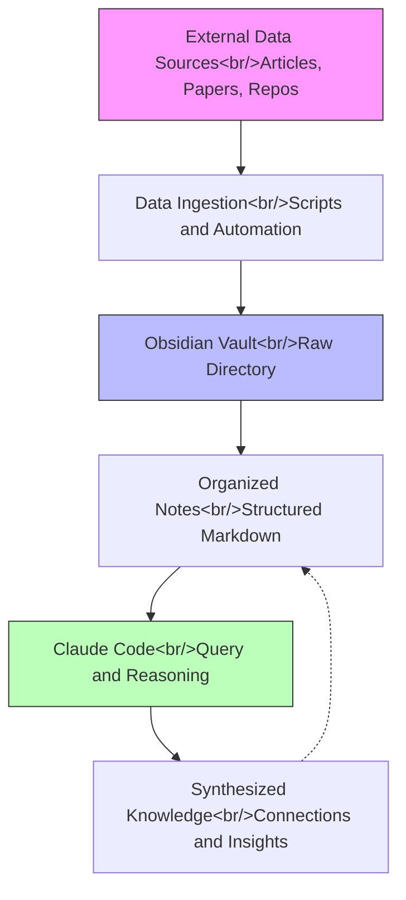
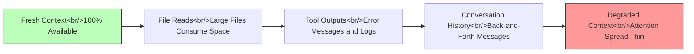

## Overview

Claude Code has rapidly evolved from a simple terminal-based coding assistant into a sophisticated development environment. This post covers four key developments that, taken together, represent a shift in how power users interact with AI coding agents: ultra plan mode for web-based planning, Karpathy's surprisingly simple Obsidian RAG system, self-evolving memory for coding agents, and practical rules for context window optimization. These aren't just incremental improvements — they address fundamental bottlenecks in the AI-assisted development workflow.

<!--more-->

## Ultra Plan Mode — Planning at Web Speed

The first major development is "ultra plan mode," which offloads Claude Code's planning phase to the web interface. The core insight is simple but powerful: planning and implementation have fundamentally different computational profiles.

When you plan locally in the terminal, Claude Code must work within the constraints of the CLI environment — sequential token generation, limited visual output, and the same context window that will later be used for implementation. Ultra plan mode breaks this coupling.

### How It Works

1. **Initiate planning** in the terminal as usual
2. **Planning transfers to Claude Code on the web**, where it runs with a dedicated context
3. **Web UI presents structured output**: context summaries, architecture diagrams, new file specifications, and modification plans
4. **Interactive review**: leave emoji reactions and comments on individual plan elements
5. **Approve the plan** on the web, which teleports execution back to the terminal

The speed difference is significant — roughly 1 minute on the web versus 4+ minutes locally. But speed isn't the only benefit. The web interface enables a richer planning format that the terminal simply cannot display well. You get visual structure, expandable sections, and the ability to annotate specific parts of the plan before implementation begins.

### Why This Matters

This is an early example of **multi-surface AI workflows** — the idea that different phases of a task should happen in different environments optimized for that phase. Planning is a visual, iterative activity that benefits from rich UI. Implementation is a sequential, file-system-oriented activity that belongs in the terminal. Ultra plan mode respects this distinction.

## Karpathy's Obsidian RAG — The Anti-RAG

Andrej Karpathy's approach to personal knowledge management with LLMs is notable for what it doesn't use: no vector database, no embeddings, no chunking strategy, no retrieval pipeline. Instead, it uses Obsidian as a structured file system and Claude Code as the query layer.

### The Architecture

### Why It Works Without Embeddings

Traditional RAG systems solve a specific problem: given a query, find the most relevant chunks from a large corpus. This requires embeddings to create a semantic search space. But Karpathy's system sidesteps this entirely by relying on two things:

1. **File system structure as implicit indexing** — a well-organized directory tree with descriptive filenames and folders acts as a human-readable index. Claude Code can traverse this structure and read file names to narrow down relevant content without embeddings.

2. **LLM context windows are large enough** — with 200K+ token context windows, you can feed substantial amounts of raw text directly to the model. The LLM itself performs the "retrieval" by reading and reasoning over the content.

This approach is essentially free to run, requires no infrastructure, and produces comparable results to traditional RAG for personal-scale knowledge bases. The tradeoff is that it doesn't scale to millions of documents — but for a solo developer or small team, that's rarely necessary.

### The Key Insight

The file system is an underrated data structure for LLM interaction. A thoughtfully organized directory with clear naming conventions provides enough structure for an LLM to navigate efficiently. You don't need a database when your file system *is* the database.

## Self-Evolving Agent Memory

Building on Karpathy's knowledge base concept, the second video explores applying the same pattern to Claude Code's own memory — but with a critical twist. Instead of ingesting external data, the system captures and structures internal data from coding conversations.

### From External Data to Internal Knowledge

Karpathy's original pattern:
- **Input**: articles, papers, repos (external)
- **Storage**: Obsidian vault
- **Query**: Claude Code reads the vault

The adapted pattern for coding agents:
- **Input**: conversation history, decisions made, patterns discovered (internal)
- **Storage**: structured memory files in the project
- **Query**: Claude Code reads its own memory on startup

This is fundamentally different from CLAUDE.md, which is a static instruction file. Self-evolving memory updates itself based on what happens during development sessions. When Claude Code discovers that a particular approach works well for your codebase, or learns about an architectural decision, that knowledge persists across sessions.

### Practical Implementation

The memory system mirrors Karpathy's vault structure:
- **Raw captures** from conversations (what was discussed, what was decided)
- **Structured notes** organized by topic (architecture decisions, debugging patterns, user preferences)
- **Cross-references** between related pieces of knowledge

The result is a coding agent that genuinely gets better at working with your specific codebase over time, rather than starting fresh with each conversation.

## Context Optimization — The 12 Rules

Context window management is the most underappreciated skill in AI-assisted development. Every file read, every tool call, every message consumes tokens. When context fills up with noise, the model's attention degrades and output quality drops.

### The Context Bloat Problem

### Key Rules Worth Highlighting

**Rule 1: Shorten CLAUDE.md** — The difference between a 910-line CLAUDE.md and a 33-line one is approximately 4% of the context window. That sounds small, but it's loaded on every single conversation. Over hundreds of sessions, that overhead compounds. Keep CLAUDE.md focused on what the agent needs to know for *every* task, and move specialized knowledge into topic-specific files that are loaded on demand.

**Rule 2: The 50% Threshold** — Add an instruction telling Claude to suggest starting a new conversation or using sub-agents when context exceeds 50%. This is counterintuitive — most users try to push through in a single session. But a fresh context with a clear, specific task consistently outperforms a bloated context trying to handle everything.

### The Mental Model

Think of context as working memory, not storage. You wouldn't try to hold an entire codebase in your head while debugging a single function. Similarly, an LLM works best when its context contains only what's relevant to the current task.

The 12 rules collectively push toward a principle: **make the agent actively work to keep its context clean**, rather than passively accumulating everything it touches.

## Connecting the Dots

These four topics form a coherent system:

| Component | Problem Solved | Mechanism |
|---|---|---|
| Ultra Plan Mode | Planning is slow and limited in terminal | Multi-surface workflow |
| Obsidian RAG | Knowledge retrieval is overengineered | File system as database |
| Self-Evolving Memory | Agent forgets between sessions | Structured conversation capture |
| Context Optimization | Context fills with noise | Active context management |

The common thread is **simplicity through structure**. Karpathy doesn't need a vector database because his file system is well-organized. Ultra plan mode doesn't need a complex orchestration system because it cleanly separates planning from implementation. Context optimization doesn't need fancy token management because a few clear rules keep things lean.

For developers building AI-assisted workflows, the takeaway is clear: before reaching for complex infrastructure, ask whether better organization of what you already have might solve the problem.

## References

- [Planning In Claude Code Just Got a Huge Upgrade](https://www.youtube.com/watch?v=example1) — nate herk
- [I Built Self-Evolving Claude Code Memory w/ Karpathy's LLM Knowledge Bases](https://www.youtube.com/watch?v=example2) — nate herk
- [Karpathy Just Replaced RAG With Obsidian + Claude Code](https://www.youtube.com/watch?v=example3)
- [How I Save Over 50% of My Claude Code Context (12 Rules)](https://www.youtube.com/watch?v=example4)
