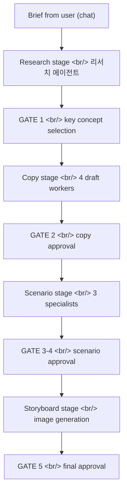

## Overview

This is the first dev log for **Creative Agent Studio** — a Korean-language multi-agent system for advertising creative work. A single user message enters a chat-first pipeline that walks four presentation stages — **research → copy → scenario → storyboard** — gated by explicit human approval between stages.

April was the mockup era. Twelve commits over two days produced a static HTML/JS prototype of the canvas, a runtime-flow spec, a "Creative Warmth" design theme that would survive the eventual React rewrite, and a deployment shape to put it on Vercel. The code thrown away later was not the point — the decisions written down in `interaction-model.md` and the design tokens baked into the mockup were.

<!--more-->



Twelve commits, one running theme — **lock in the principles before any of the implementation rusts.**

---

## The Three Decisions That Would Outlast the Mockup

The most important file added in April wasn't code — it was `interaction-model.md`, which crystallized three product decisions into a single load-bearing document:

> **결정 1. 인터랙션 모델 — 채팅 우선 (Chat-first).** The user's primary input is free-form chat. Clicking buttons to advance stages is forbidden. The orchestrator interprets what they typed and dispatches agents accordingly.

> **결정 2. 에이전트 투명성 — 한 줄 상태 표시 (One-line status).** When an agent is running, the feed shows a single one-line status message. No full dashboards, no real-time logs.

> **결정 3. 게이트 기반 자동 실행 (Gate-based auto-run).** After each stage completes, the pipeline pauses and waits for explicit human approval before running the next stage automatically.

Every UI commit that followed — through April and across the May rewrite — would be checked against these three rules. The first commit of the mockup (`b67eb98 Add Diffs creative agent studio mockup`) already had them encoded as DOM structure: no "next stage" button, agents appeared as bullet lists rather than a dashboard, and the composer was the only entry point.

---

## "Creative Warmth" — The Design Theme

The third commit (`72e0fdc`) was the visual baseline that would survive everything: **"Redesign: Apply Creative Warmth theme (warm white, DM Serif Display, Caveat)."**

Three tokens, three reasons:

| Token | Value | Why |
|---|---|---|
| Background | Warm white (#FAF7F2) | Pure white reads as software. Warm tints read as workshop. |
| Body type | DM Serif Display | A creative tool should feel literary, not productivity-coded. |
| Handwritten labels | Caveat | Specialist agent names get a handwritten badge — a small humanizing touch on what is otherwise a dense work surface. |

The rule was negative: **no pure black, no pure white, anywhere.** A subsequent commit (`640c755`) had to fix the logo visibility because the original SVG was dark-on-dark — the fix was a `filter: brightness(0)` CSS hack to invert it for the warm background rather than re-exporting the asset. Pragmatic, but the underlying constraint stayed: the design system would not bend to accommodate an asset that fought it.

These tokens would migrate verbatim into `web/tailwind.config.ts` six weeks later as the first feat(web) commit on the React side — proof that the design decisions were the right load-bearing layer.

---

## Three UI Cleanups That Made the Mockup Honest

Three commits in succession (`3c225c9`, `1be5253`, `d37b4c9`) attacked things that violated the three decisions:

```diff
- <p class="eyebrow">Project Management</p>
- <ul class="agents">
-   <li><span class="dot dot-1"></span>Agent 1</li>
-   <li><span class="dot dot-2"></span>Agent 2</li>
- </ul>
+ <ul class="agents">
+   <li>리서치 에이전트</li>
+   <li>Copy Draft Workers</li>
+ </ul>
```

`3c225c9` — Removed the "Project Management" eyebrow that framed the whole thing as a PM tool. Showed agent names as bullets instead of color-coded chips because the chips implied a dashboard.

`1be5253` — Removed the "Background Agents" section from the status rail entirely. It violated decision 2 (one-line status, no full dashboard).

`d37b4c9` — **Composer overhaul.** Moved the model selector into the input bar itself, added a file-attach icon, updated the model list. Why this matters: the composer is decision 1's entire surface area. If the composer doesn't feel like the right place to type "더 도전적으로" or "이 두 개 합쳐줘", the chat-first principle fails by accident.

These weren't features — they were *deletions* enforcing the spec.

---

## Runtime Flow Refinement — The Bones Underneath the Mockup

Three docs and one feat commit on 2026-04-07 laid the runtime groundwork:

- `ecac2e5 docs: add production poc state and routing spec` — defined what state the runtime would carry across the four stages.
- `7e26c12 docs: add runtime state cleanup spec` — defined how state would be retired between runs (relevant later when the React app needed to isolate per-session state).
- `97df876 feat: refine workspace runtime flow` — refined the actual flow code.
- `21f0ebc chore: add deployment and design reference files` — committed the deployment shape and a design-reference folder.

The "deployment reference" was a Vercel buildCommand pointing at the mockup directory. That deployment target would survive the rewrite — when the React frontend shipped in May, the only change to `vercel.json` was `outputDirectory: "web/dist"`.

---

## Commit Log

| Date | Message |
|---|---|
| 2026-04-06 | Add Diffs creative agent studio mockup |
| 2026-04-06 | Fix logo path for Vercel deployment |
| 2026-04-06 | Redesign: Apply Creative Warmth theme (warm white, DM Serif Display, Caveat) |
| 2026-04-06 | Fix logo visibility: apply brightness(0) filter for dark logo on light bg |
| 2026-04-06 | UI: Remove 'Project Management' eyebrow, show agent names as bullets, add LLM dropdown |
| 2026-04-06 | Remove Background Agents section from status rail |
| 2026-04-06 | Composer: move model selector into input bar, add file attach icon, update models |
| 2026-04-07 | docs: add production poc state and routing spec |
| 2026-04-07 | docs: add runtime state cleanup spec |
| 2026-04-07 | feat: refine workspace runtime flow |
| 2026-04-07 | chore: ignore local workspace artifacts |
| 2026-04-07 | chore: add deployment and design reference files |

---

## Insights

April produced one piece of software (a static mockup) and three pieces of writing (`interaction-model.md`, the routing spec, the runtime cleanup spec). The mockup would be deleted six weeks later — commit `chore: remove legacy mockup/ vanilla-JS SPA` lands in the megapush — but every paragraph of the writing would still be load-bearing.

The lesson worth keeping: **product principles outlive implementation.** Writing down "chat-first, one-line status, gate-based auto-run" as decisions — not as features, not as UI requirements, but as decisions with a `결정` heading and a `이유` heading — meant that every subsequent UI commit had a tribunal to pass through. When the React rewrite started in May, those three decisions were copy-pasted directly into the new `web/` tree's principles. The mockup was throwaway; the principles weren't.

Next: bitbucket migration, production-readying the runtime, and starting the React+Vite+TypeScript rewrite that would replace the entire mockup in one weekend.
