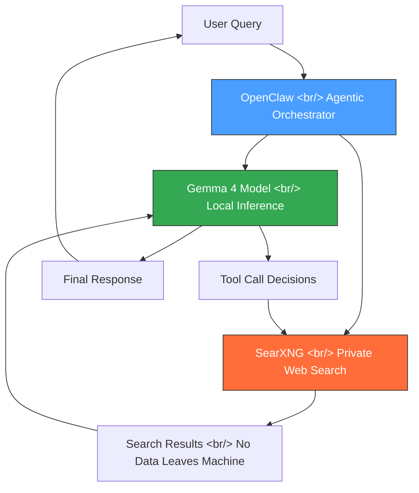

## Overview

Google just released Gemma 4, a family of open source models closely related to the Gemini 3 paid service and the Nano Banana image generation system. When combined with SearXNG for private web search and OpenClaw for agentic orchestration, you get a fully self-hosted AI assistant that rivals cloud offerings — completely free and with zero data leaving your machine.

This post walks through the full setup: which Gemma 4 model to pick, how to run SearXNG locally, and how to wire everything into OpenClaw for an agentic AI workflow with web search capabilities.

<!--more-->

## The Gemma 4 Model Family

Google released four new open source models under the Gemma 4 umbrella. They split into two tiers based on size and modality support:

### Small Models (Mobile-Capable)

| Model | Parameters | Modalities | Target Hardware |
|-------|-----------|------------|-----------------|
| **E2B** | ~2B | Text, Image, Video, Audio | Mobile phones |
| **E4B** | ~4B | Text, Image, Video, Audio | Mobile phones |

### Large Models (Desktop/Server)

| Model | Parameters | Modalities | Target Hardware |
|-------|-----------|------------|-----------------|
| **26B** | ~26B | Text, Image | Desktop GPU, server |
| **31B** | ~31B | Text, Image | Desktop GPU, server |

The smaller E2B and E4B models are remarkable for their multimodal breadth — text, image, video, and audio processing in a package small enough for a phone. The larger 26B and 31B models trade audio/video support for deeper reasoning on text and image tasks.

For OpenClaw's agentic tool-calling workflow, the **E4B model** stands out. Despite its small size, it handles structured function calls and multi-step reasoning with surprising competence. If you have the VRAM for the 26B or 31B, those will give better results on complex reasoning, but E4B is the sweet spot for most setups.

## Architecture: How the Pieces Fit Together



The flow is straightforward:

1. **User** sends a query to **OpenClaw**
2. OpenClaw routes the query to the **Gemma 4** model running locally
3. Gemma 4 decides whether it needs web search and issues **tool calls** to SearXNG
4. **SearXNG** executes the search entirely locally — scraping results from search engines without sending your query to any third-party API
5. Results feed back into Gemma 4 for synthesis
6. The final response returns to the user

At no point does your data leave your machine. SearXNG acts as a meta-search engine proxy, and Gemma 4 runs entirely on local hardware.

## Step 1: Install and Run a Local Gemma 4 Model

You need a local inference server. The most common options are **Ollama** and **llama.cpp**. Ollama is simpler to set up:

```bash
# Install Ollama (macOS/Linux)
curl -fsSL https://ollama.com/install.sh | sh

# Pull the E4B model (recommended for most setups)
ollama pull gemma4:e4b

# Or pull the 27B model if you have sufficient VRAM (16GB+)
ollama pull gemma4:27b

# Verify it's running
ollama list
```

Ollama exposes an OpenAI-compatible API at `http://localhost:11434` by default. OpenClaw can connect to this directly.

### VRAM Requirements

| Model | Quantization | Minimum VRAM |
|-------|-------------|-------------|
| E2B | Q4_K_M | ~2 GB |
| E4B | Q4_K_M | ~3 GB |
| 26B | Q4_K_M | ~16 GB |
| 31B | Q4_K_M | ~20 GB |

For Apple Silicon Macs, unified memory counts as VRAM. A 16GB M-series Mac can comfortably run E4B and potentially the 26B model with aggressive quantization.

## Step 2: Set Up SearXNG for Private Search

SearXNG is a free, open source meta-search engine. It aggregates results from Google, Bing, DuckDuckGo, and dozens of other engines without ever sharing your queries with those services directly in a trackable way.

The easiest deployment method is Docker:

```bash
# Clone the SearXNG Docker setup
git clone https://github.com/searxng/searxng-docker.git
cd searxng-docker

# Edit the .env file to set your hostname
# For local-only use, localhost is fine
cp .env.example .env

# Start SearXNG
docker compose up -d
```

SearXNG will be available at `http://localhost:8080`. You can verify it works by opening it in a browser and running a test search.

### Key SearXNG Configuration

Edit `searxng/settings.yml` to enable the JSON API, which OpenClaw needs:

```yaml
server:
  secret_key: "your-random-secret-key"
  limiter: false  # Disable rate limiting for local use

search:
  formats:
    - html
    - json  # Required for API access
```

Restart the container after editing:

```bash
docker compose restart
```

## Step 3: Wire Everything into OpenClaw

OpenClaw is an agentic framework that connects local LLMs with tools. Configure it to use your local Gemma 4 instance and SearXNG:

```yaml
# openclaw config
llm:
  provider: ollama
  model: gemma4:e4b
  base_url: http://localhost:11434

tools:
  web_search:
    provider: searxng
    base_url: http://localhost:8080
    format: json
    categories:
      - general
      - news
      - science
```

Once configured, launch OpenClaw and you have a fully functional AI assistant with web search — entirely self-hosted.

## Performance Observations

After running this setup, a few things stand out:

**E4B Tool Calling is Surprisingly Good.** For a 4B parameter model, E4B handles agentic workflows well. It correctly decides when to search, formulates reasonable queries, and synthesizes results coherently. It is not at the level of GPT-4o or Claude for complex multi-step reasoning, but for a free, private, local model, the quality is impressive.

**SearXNG Latency is Acceptable.** Search queries typically return in 1-3 seconds. The bottleneck is usually the LLM inference, not the search.

**Privacy is Genuine.** Running `tcpdump` during a session confirms that no query data is sent to external AI APIs. SearXNG does make outbound requests to search engines, but these are standard web requests without persistent identifiers tied to your queries.

**The 26B/31B Models Are Noticeably Better** for complex reasoning tasks, but the E4B model is the right default for most people. The jump from E4B to 26B requires significantly more hardware but doesn't always produce proportionally better results for straightforward Q&A with search.

## When to Use This vs. Cloud AI

This setup is ideal when:

- **Privacy is non-negotiable** — legal, medical, or financial queries you don't want logged by any third party
- **You want zero recurring costs** — no API fees, no subscriptions
- **You're on a restricted network** — environments where cloud AI services are blocked
- **You enjoy self-hosting** — the tinkering is part of the appeal

Stick with cloud AI when:

- You need state-of-the-art reasoning on complex tasks
- You're working with very long documents that exceed local model context windows
- Uptime and reliability matter more than privacy

## Conclusion

The Gemma 4 + SearXNG + OpenClaw stack represents a meaningful milestone for self-hosted AI. A year ago, running a capable agentic AI assistant with web search locally would have required expensive hardware and produced mediocre results. Today, a laptop with 8GB of RAM can run E4B with SearXNG and get genuinely useful results — for free, with complete privacy.

The setup takes about 15 minutes if you already have Docker and a package manager. For anyone who has been waiting for local AI to reach a practical threshold, this combination is worth trying.

## References

- [Gemma 4 Model Card — Google](https://ai.google.dev/gemma)
- [SearXNG Documentation](https://docs.searxng.org/)
- [OpenClaw GitHub Repository](https://github.com/openclaw)
- [Ollama — Local LLM Runner](https://ollama.com/)
