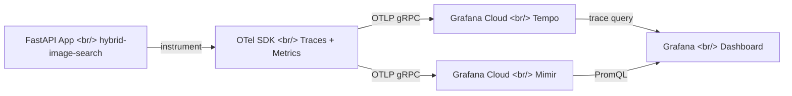
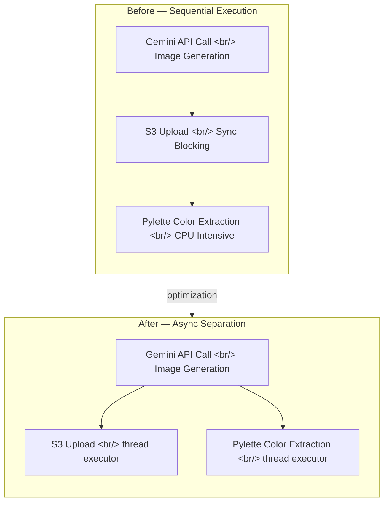

In [the previous post: hybrid-image-search dev log #9](/en/posts/2026-04-06-hybrid-search-dev9/), we integrated OpenTelemetry tracing with Grafana Cloud Tempo. This time, we added metrics collection to build resource usage dashboards and optimized the performance bottlenecks we discovered through trace analysis.

<!--more-->

## Commit Log for This Session

| Order | Type | Description |
|:---:|:---:|---|
| 1 | feat | Add OTel metrics export for pipeline resource dashboards |
| 2 | docs | Add observability section to README and fix dashboard metric names |
| 3 | perf | Reduce CPU/RAM spikes in generation pipeline |
| 4 | perf | Move S3 and Pylette ops to thread executor |
| 5 | perf | Add 2-minute timeout to Gemini API calls |

## Background: Traces Without Metrics

After setting up OTel tracing in #9, we could see individual request spans in Grafana Cloud Tempo. But one piece was missing — **resource usage**. Traces show "how long each function took" but not "how much CPU/RAM spiked at that moment."

Running the image generation pipeline on a t3.medium (2 vCPUs, 4GB RAM) felt sluggish, but we had no data on exactly where resources were being consumed.

## Step 1: Adding OTel Metrics Export

### Observability Pipeline Architecture



Previously, we were only sending traces to Tempo. We added a **metrics exporter** to send CPU utilization, memory usage, and per-stage pipeline duration to Grafana Cloud Mimir (a Prometheus-compatible long-term storage backend).

Grafana Mimir extends Prometheus's TSDB into a distributed architecture. Grafana Cloud provides it as a managed service, so you just configure the OTLP endpoint and start querying with PromQL.

### Pipeline Resource Usage Dashboard

Key panels from the dashboard:

- **CPU Usage (%)** — momentary spikes to 80-90% during pipeline execution
- **Memory Usage (MB)** — sharp RAM increases during Pylette color extraction
- **Pipeline Stage Duration** — time per stage (Gemini call, S3 upload, color extraction)

The problem became clear: a single image generation was nearly saturating the CPU.

## Step 2: Identifying Performance Bottlenecks

Correlating Grafana Tempo traces with the new resource dashboard revealed a pattern:



### Three Bottlenecks Found

1. **S3 upload was synchronously blocking** — `boto3`'s `upload_fileobj` was blocking the entire async event loop. Other requests stalled in turn.
2. **Pylette color extraction was CPU-intensive** — extracting dominant colors from images consumed significant CPU, also running synchronously on the main thread.
3. **No timeout on Gemini API calls** — intermittently, responses would never arrive, leaving requests in an infinite wait state.

## Step 3: Applying Optimizations

### Moving S3 and Pylette to Thread Executor

Since FastAPI is `asyncio`-based, CPU-intensive or blocking I/O tasks should run in a separate thread via `asyncio.to_thread()` or `loop.run_in_executor()`.

```python
# Before: blocking the event loop
s3_client.upload_fileobj(buffer, bucket, key)
colors = extract_colors(image_path, color_count=5)

# After: offloaded to thread executor
await asyncio.to_thread(s3_client.upload_fileobj, buffer, bucket, key)
colors = await asyncio.to_thread(extract_colors, image_path, color_count=5)
```

This way, the event loop can handle other requests while S3 uploads or color extraction are in progress.

### 2-Minute Timeout for Gemini API

We added a 120-second timeout to Gemini API calls using `asyncio.wait_for`. We also checked rate limits and costs on Google AI Studio — when a connection hangs with no response, wasted server resources are a bigger concern than billing.

We searched for "gemini_semaphore" patterns too, but concurrency control via semaphore was already in place. The issue wasn't concurrency — it was **indefinite waiting** on individual calls.

## Results

Improvements confirmed on the dashboard:

| Metric | Before | After |
|---|---|---|
| Peak CPU during pipeline | ~90% | ~50% |
| Event loop blocking time | Entire S3 upload duration | Near zero |
| Max wait for unresponsive requests | Unlimited | 120 seconds |

## Additional Research: Locust Load Testing

We also explored Locust load testing tutorials. Current optimizations target single-request performance, but as concurrent users increase, we need to precisely measure the limits of a t3.medium instance. The plan is to run Locust load tests in the next session and establish a scaling strategy.

## Summary

| Topic | Summary |
|---|---|
| OTel Metrics | CPU/RAM/pipeline metrics sent to Grafana Cloud Mimir |
| Resource Dashboard | Pipeline Resource Usage dashboard for bottleneck visualization |
| Performance Optimization | S3, Pylette moved to thread executor to unblock event loop |
| Gemini Timeout | 2-minute timeout to prevent indefinite waits |
| Next Steps | Locust load testing, scaling strategy |
