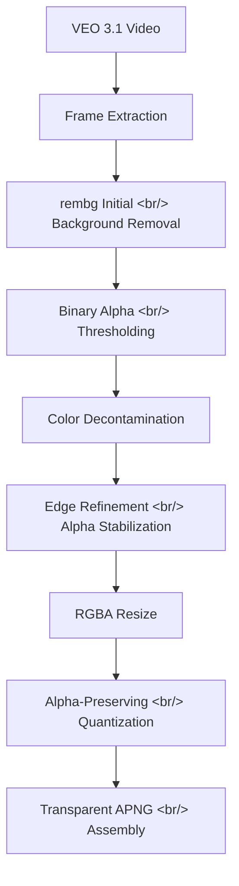

VEO 3.1 generates animation on solid backgrounds, but LINE animated emoji requires transparent APNGs. This post covers the post-processing pipeline built to strip backgrounds from every frame — from rembg-based initial removal through binary alpha thresholding, color decontamination, and edge refinement — plus all the RGBA plumbing changes needed in the resize, quantize, and assembly stages.

<!--more-->

> Previous post: [PopCon Dev Log #2](/en/posts/2026-04-03-popcon-dev2/)

## The Problem: Opaque Backgrounds from VEO

PopCon's pipeline works like this:

1. Google Imagen generates character pose images
2. VEO 3.1 converts pose images into animated video
3. Frames are extracted from the video and assembled into APNG

The problem: **VEO always generates video with a solid background**. LINE animated emoji spec requires transparent-background APNGs, so per-frame background removal was essential.

A simple chroma key approach (replacing a specific color with transparency) was insufficient. VEO's background colors are inconsistent, and anti-aliased edges create semi-transparent pixels that blend foreground and background colors.

## Design: Multi-Stage Background Removal Pipeline

After research, we designed the following multi-stage pipeline:



What each stage solves:

| Stage | Problem Solved |
|-------|---------------|
| rembg | AI-based foreground/background segmentation — more accurate than solid-color chroma key |
| Binary Alpha | Cleans up semi-transparent pixels (alpha 128-254) left by rembg |
| Color Decontamination | Removes background color bleeding into foreground edge pixels |
| Edge Refinement | Stabilizes alpha boundaries across frames to reduce flickering |

## Implementation

### Stage 1: rembg-Based Background Removal

We added a `remove_background()` function using the rembg library, which leverages U2-Net for foreground segmentation on each frame.

Initial results were decent, but two problems emerged:

- **Semi-transparent edges**: Pixels with alpha values between 50-200 remained along character outlines, creating "ghost" borders in the APNG
- **Color bleeding**: Background color mixed into the RGB values of edge pixels, leaving visible residue even after making them transparent

### Stage 2: Binary Alpha Thresholding

To fix the semi-transparent pixel problem, we applied binary thresholding to the alpha channel. Pixels above a threshold (e.g., 128) become fully opaque (255), and those below become fully transparent (0).

This can make edges slightly rougher, but at emoji dimensions (LINE spec: 320x270), clean boundaries matter more than anti-aliasing smoothness.

### Stage 3: Color Decontamination

This stage corrects the RGB values of edge pixels contaminated by background color bleed. For pixels with low alpha (near-transparent), the background color contribution is mathematically removed.

The principle: reverse the premultiplied alpha compositing to subtract the background color component. After this stage, edge colors look natural against any background.

### Stage 4: Edge Refinement and Alpha Stabilization

When background removal runs independently per frame, the alpha boundary flickers between frames. Character outlines jitter by 1-2 pixels, especially in moving areas.

To mitigate this, we applied erosion/dilation operations and Gaussian blur to alpha boundaries for inter-frame consistency.

## RGBA Support Across the APNG Pipeline

Updating the existing pipeline for RGBA was just as involved as the background removal itself. The existing code assumed RGB throughout.

### resize_frame() Update

The original resize logic pasted images onto a white canvas `(255, 255, 255)`. For RGBA mode, this was changed to a **transparent canvas** `(0, 0, 0, 0)`.

### _quantize_frames() Update

LINE animated emoji have a file size limit (300KB), making color quantization essential. The existing `Image.quantize()` call ignored the alpha channel, quantizing only RGB.

The fix: separate the alpha channel before quantization, quantize RGB only, then recompose — preserving transparency information throughout.

### process_video() Pipeline Integration

Finally, `remove_background()` was wired into the `process_video()` pipeline. It runs after frame extraction but before resize:

```
Frame Extraction → Background Removal → Resize → Quantize → APNG Assembly
```

## Research Notes

Beyond background removal, several related technologies were researched:

- **Frame Interpolation**: [FILM](https://github.com/google-research/frame-interpolation) and [RIFE](https://github.com/hzwer/ECCV2022-RIFE) — explored for generating smoother animations when VEO produces insufficient frames. Not yet integrated, but potentially needed in the next iteration.
- **Wan 2.1**: Evaluated as an alternative video generation model to VEO. Accessible via Alibaba Cloud's DashScope API or fal.ai.
- **APNG creation**: Investigated the Aspose Python library for APNG generation, but decided to keep the existing Pillow-based approach.

## Commit Log

| Commit Message | Changes |
|---------------|---------|
| docs: add post-process background removal design spec | Design document for background removal |
| docs: add post-process background removal implementation plan | Implementation plan document |
| chore: add .worktrees/ to gitignore | Ignore git worktree directory |
| feat: add remove_background() with rembg and alpha edge stabilization | Core background removal function with alpha edge stabilization |
| feat: update resize_frame() to support RGBA with transparent canvas | RGBA transparent canvas support in resize |
| feat: update _quantize_frames() to preserve alpha channel | Alpha channel preservation during quantization |
| feat: wire remove_background() into process_video() pipeline | Integrate background removal into the video processing pipeline |
| test: add end-to-end APNG transparency verification | E2E test for APNG transparency |
| fix: clean up intermediate directories after frame processing | Clean up temp directories after frame processing |
| feat: post-process background removal with rembg on extracted VEO frames | Apply rembg post-processing to VEO frames |
| feat: enhance background removal with binary alpha, color decontamination, and edge refinement | Quality improvements with binary alpha, color decontamination, edge refinement |
| feat: enhance background removal (continued) | Continued background removal improvements |

## Next Steps

- Evaluate frame interpolation integration (FILM or RIFE)
- Automate A/B testing for background removal quality
- Optimize VEO prompts to reduce background removal burden
- Final LINE spec validation and submission testing
