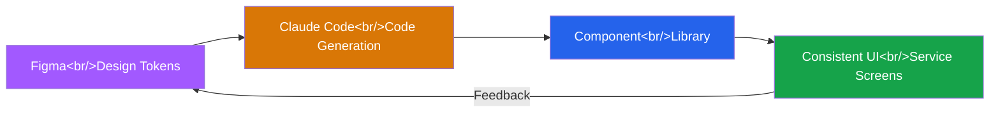

## Overview

The Figma community in Korea has been producing an increasing number of resources on combining Claude Code with Figma for design workflows. Integrating AI coding tools into the design process enables design token management, repetitive task automation, and accessibility validation within a single workflow.

This post summarizes the potential of the Claude Code + Figma combination, based on resources shared by Figma Tutor (@figma_tutor) in their weekly live sessions.

<!--more-->

## Claude Code + Figma Workflow

The core idea is to have Claude Code read design tokens (colors, typography, spacing, etc.) defined in Figma and convert them into actual code components. Instead of manually referencing design system documentation to write code, AI generates code that directly reflects the token values.

## Maintaining Design Consistency

The most common cause of design inconsistency is the gap between design files and code. Claude Code can help bridge this gap.

**Design Token Synchronization**

- Extract design tokens from Figma Variables or styles
- Claude Code converts them into CSS variables, Tailwind config, or theme objects
- When token values change, code updates automatically

**Component Code Generation**

- Analyze Figma component structures to generate React/Vue component code
- Map Variant information to props
- Automate repetitive boilerplate code

## Content Design Automation

For services with frequently changing content (event banners, promotional pages, etc.), the same layout needs different text/images applied repeatedly.

Tasks that can be automated with Claude Code + Figma:

| Task | Manual | Automated |
|------|--------|-----------|
| Banner text replacement | Edit one by one in Figma | Data-driven batch generation |
| Multi-language versions | Copy and paste translations | Auto-generate via translation API |
| Responsive variants | Manual adjustment per breakpoint | Rule-based auto-resize |
| Image asset export | Manual Export | Batch export via script |

## Web Accessibility Automation

Another weekly live session from Figma Tutor covers designing web pages with accessibility in mind from the Figma stage. Leveraging Claude Code for accessibility validation:

- **Color contrast checks** — Automatically verify contrast ratios meet WCAG standards (AA/AAA)
- **Focus order design** — AI analyzes whether tab order is logical
- **Alt text generation** — Suggest appropriate alt text for image components
- **Semantic structure validation** — Verify that the visual hierarchy matches HTML semantics

Catching accessibility issues at the design stage significantly reduces the cost of late-stage fixes during development.

## References

These Figma community files provide more detailed information:

1. **[Weekly Live] How to Achieve Consistent Design with Claude Code and Figma** — [@figma_tutor](https://www.figma.com/@figma_tutor)
   - Methods for maintaining design consistency across a service using Claude Code with Figma

2. **[Figma Tutor] Automating Service Content Design with Claude Code + Figma** — [@figma_tutor](https://www.figma.com/@figma_tutor)
   - Hands-on practice automating content design with the Claude Code + Figma combination

3. **[Weekly Live] Designing Web Pages with Accessibility in Figma** — [@figma_tutor](https://www.figma.com/@figma_tutor)
   - Approaches to accessibility-conscious screen design in Figma

## Conclusion

The combination of AI coding tools and design tools is still in its early stages, but it is already showing practical results in areas like design token synchronization, repetitive task automation, and accessibility validation. It is encouraging to see the Korean Figma community actively sharing these workflows.

The core value of this combination is reducing the handoff friction between designers and developers while maintaining a single source of truth for the design system.
