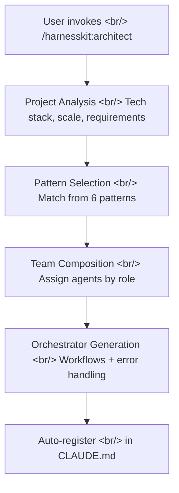
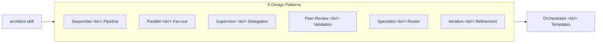
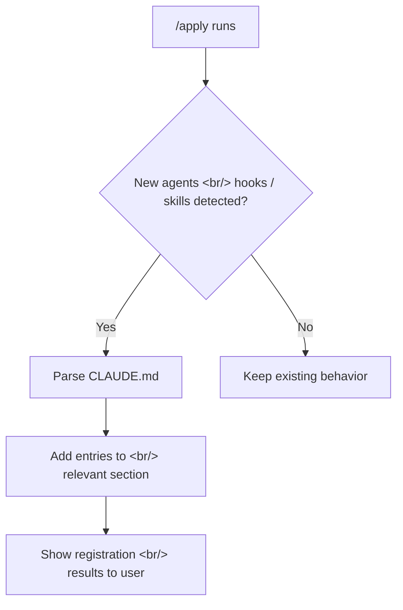

## Overview

[Previous Post: #4 — Marketplace Stabilization and v0.3.0 Release](/posts/2026-04-02-harnesskit-dev4/)

In this #5 installment, the core `/harnesskit:architect` skill was added across 10 commits and v0.4.0 was released. The architect skill designs multi-agent teams for complex projects, backed by a reference guide covering 6 agent design patterns and orchestrator templates. Additionally, `/apply` now auto-registers custom agents, hooks, and skills in CLAUDE.md.

<!--more-->

---

## Starting from Competitive Analysis

Early in the session, HarnessKit was compared against a competing plugin (revfactory/harness). After mapping out the feature scope, approach, and differentiators of both plugins, gaps in HarnessKit were identified. The biggest gap turned out to be "multi-agent team design for complex projects" — this became the starting point for the architect skill.

---

## /harnesskit:architect — Agent Team Design Skill

### Concept

`/harnesskit:architect` analyzes complex projects and designs multi-agent team structures. It examines the project's tech stack, scale, and requirements, then recommends appropriate agent compositions and orchestration patterns.

### Implementation

First, the command registration (`/harnesskit:architect`) was added to enable autocomplete. Then the skill itself was implemented, with the orchestrator agent enhanced with concrete workflows and error handling logic. A test suite was also written to verify consistency between the skill and reference documents.

---

## Agent Design Patterns Reference

Six design patterns referenced by the architect skill were documented as a reference guide.

Each pattern specifies suitable project types, agent configurations, and communication methods. A separate orchestrator templates document was also created, providing concrete implementation templates for each pattern.

---

## CLAUDE.md Auto-Registration — Evolution of /apply

### Problem

After creating custom agents, hooks, or skills, manually registering them in CLAUDE.md was tedious and error-prone. If registration was missed, Claude Code would not recognize the agent or hook's existence.

### Solution

Auto-registration was added to `/harnesskit:apply`. When `/apply` applies improvement proposals, it detects newly created agents, hooks, and skills, and automatically registers them in the appropriate section of CLAUDE.md.

---

## v0.4.0 Release

The `plugin.json` version was bumped to 0.4.0, along with adding a homepage URL, author URL, and agent-related keywords. Rich metadata improves discoverability in marketplace search results.

---

## feature_list.json Population

The complete feature inventory of HarnessKit was systematically organized into `feature_list.json` with a save implementation. This file serves as shared reference data across multiple skills — progress tracking in `/harnesskit:status`, feature analysis in `/harnesskit:insights`, and more.

---

## Commit Log

| Message | Changes |
|---------|---------|
| docs: update installation instructions for plugin menu workflow | docs |
| docs: add agent design patterns reference guide | docs |
| docs: add orchestrator templates reference for 6 patterns | docs |
| feat: register /harnesskit:architect command for autocomplete | commands |
| enhance: orchestrator agent with concrete workflows and error handling | skills |
| chore: bump to v0.4.0, add homepage/author URL and agent keywords | plugin |
| feat: add /harnesskit:architect skill for agent team design | skills |
| feat: auto-register custom agents/hooks/skills in CLAUDE.md via /apply | skills |
| test: add test suite for /harnesskit:architect skill and references | tests |
| feat: populate feature_list.json with HarnessKit features + save implementation | data |

---

## Insights

From competitive analysis to building the architect skill, the core of this session was "finding gaps and filling them." Multi-agent orchestration is conceptually simple, but practical implementation cascades into design pattern classification, template documentation, and auto-registration. The auto-registration feature in particular fundamentally solves the problem of "creating a tool but forgetting to register it." Making a tool register itself — that is the essence of good DX (Developer Experience).
