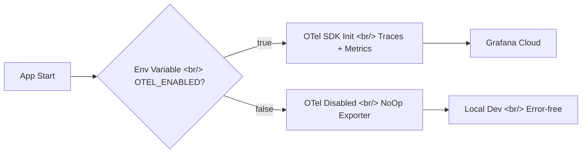

In [the previous post: Hybrid Image Search Dev Log #10](/en/posts/2026-04-07-hybrid-search-dev10/), we built an OTel metrics dashboard and optimized pipeline performance. This time, we significantly improved the tone/angle injection UX, scaled up the EC2 instance, and wrote deployment automation scripts.

<!--more-->

## Commit Log for This Session

| Order | Type | Description |
|:---:|:---:|---|
| 1 | chore | Increase Gemini API timeout from 2 to 3 minutes |
| 2 | fix | Disable OTel exporters locally to avoid connection errors |
| 3 | feat | Allow category change in tone/angle injection regeneration |
| 4 | fix | Change EC2 instance type from t3.medium to m7g.2xlarge |
| 5 | feat | Add toggle to enable/disable tone/angle auto-injection |
| 6 | feat | Auto-set injection toggle to match original on regeneration |
| 7 | feat | Show ratio controls when adding injection to non-injected image |
| 8 | feat | Add EC2 setup and deploy scripts |

## Background: Two Parallel Tracks Toward Production

After fixing performance bottlenecks in #10, two issues remained:

1. **UX problems** — the tone/angle injection feature existed but lacked flexibility: no category changes during regeneration, no toggle control
2. **Infrastructure problems** — t3.medium couldn't handle the resource demands of the image generation pipeline, and deployments were manual

This session tackled both in parallel.

## Step 1: Gemini API Timeout and OTel Local Error Fixes

### Timeout: 2 Minutes to 3 Minutes

In #10, we set a 2-minute timeout on Gemini API calls. In practice, complex image generation requests occasionally exceeded 2 minutes during legitimate processing. Cutting off a valid request wastes both API cost and user time, so we bumped it to 3 minutes.

### OTel Local Connection Errors

The OTel exporters were attempting to connect to Grafana Cloud endpoints even in local development, flooding the console with connection errors. We added a conditional check to disable OTel exporters locally.

A single environment variable now cleanly separates local and production OTel behavior.

## Step 2: Tone/Angle Injection UX Improvements

The system has a feature that injects tone (color mood) and angle (perspective) into search results to generate new images. Previously, once generated, modifications were cumbersome. We made three UX improvements.

### Category Change During Regeneration

Previously, when regenerating an image with injection applied, the original image's category was locked. Users couldn't explore "what if I regenerated this in a different category style?"

We enabled the category dropdown in regeneration mode, so users can keep the tone/angle settings while switching categories.

### Injection Enable/Disable Toggle

Having tone/angle injection always automatically applied was sometimes inconvenient. We added a toggle switch so users can directly control whether injection is applied.

### Auto-Restore Toggle State on Regeneration

When regenerating an injected image, if the toggle resets to its default (off), the result differs from the original. We now automatically restore the original image's injection toggle state during regeneration.

### Ratio Controls for Adding Injection

When a user wanted to add injection to a previously non-injected image, the ratio slider wasn't appearing. We fixed this so that turning on the injection toggle also reveals the ratio controls.

## Step 3: EC2 Scale-Up and Deployment Automation

### t3.medium to m7g.2xlarge

Based on the resource usage data from #10, we changed the instance type.

| Spec | t3.medium | m7g.2xlarge |
|---|---|---|
| vCPU | 2 | 8 |
| RAM | 4 GB | 32 GB |
| Architecture | x86_64 | ARM (Graviton3) |
| Cost Efficiency | General purpose | Better price-performance with ARM |

Graviton3-based m7g instances offer superior price-performance compared to x86, and Python workload compatibility is well-established. Given that the image generation pipeline is CPU/RAM-intensive, we ensured ample headroom.

### EC2 Setup and Deploy Scripts

We automated the previously manual SSH-and-configure process with scripts:

- **Setup script** — installs Python, system packages, configures virtual environment, sets environment variables
- **Deploy script** — pulls latest code, updates dependencies, restarts services

With these scripts, spinning up a new instance is a quick environment clone, and code deployments are a single command.

## Summary

| Topic | Summary |
|---|---|
| Gemini Timeout | Adjusted from 2 to 3 minutes to prevent premature cutoffs |
| OTel Local Errors | Environment-variable-based OTel exporter disable for local dev |
| Injection UX | Category change, toggle, state restoration, ratio controls |
| EC2 Scale-Up | t3.medium to m7g.2xlarge (Graviton3, 8 vCPU, 32 GB) |
| Deployment Automation | EC2 setup and deploy scripts added |
