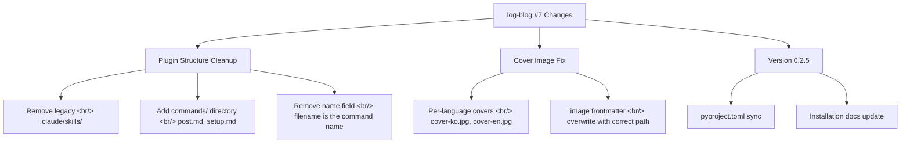

## Overview

[Previous post: Log-Blog Dev Log #6](/en/posts/2026-04-03-log-blog-dev6/)

If #6 was about marketplace migration and CDP reliability, #7 is about finalizing the plugin structure. The legacy `.claude/skills/` directory was removed in favor of the plugin's own `skills/` directory. A `commands/` directory was added for slash command autocomplete, and cover image generation was fixed to produce per-language files for bilingual blogs. Version bumped to 0.2.5.

<!--more-->

---



---

## Plugin Structure Cleanup

### Background: Dual Path Problem

log-blog originally stored skill files in `.claude/skills/`, which Claude Code would read directly. When the plugin migrated to marketplace-based installation in #6, the skill files moved to the plugin's `skills/` directory. However, the project root's `.claude/skills/` was never deleted. Having the same skills in two locations creates ambiguity about which one takes precedence and risks version mismatches.

### Fix: Remove Legacy Skills

The `.claude/skills/` directory was deleted entirely. The plugin's `skills/post/SKILL.md` and `skills/setup/SKILL.md` are now the single source of truth for all skill definitions.

### Adding the commands/ Directory

Claude Code plugins register markdown files in the `commands/` directory as slash commands. The filename becomes the command name:

```
commands/
├── post.md     → /logblog:post
└── setup.md    → /logblog:setup
```

Initially each file included a `name:` field in the YAML frontmatter, but this caused errors. Command names are derived automatically from filenames, so the field was unnecessary. Removing it resolved the issue.

With this change, typing `/logblog:` presents `post` and `setup` in the autocomplete list. Previously users had to remember the exact skill names.

---

## Bilingual Cover Image Fix

### Problem: Shared Cover Filename

On a bilingual blog, both Korean and English posts pointed to the same `cover.jpg` path. When cover images include title text, the Korean-title cover and the English-title cover need to be separate files.

### Fix

The cover image generator now receives a `language` parameter. When specified, filenames split into `cover-ko.jpg` and `cover-en.jpg`:

```
static/images/posts/2026-04-08-example/
├── cover-ko.jpg    ← Korean title
└── cover-en.jpg    ← English title
```

The `image:` frontmatter injection was also fixed to overwrite with the correct per-language path. Previously, generating a cover image did not update the frontmatter path — a silent bug that left posts pointing to stale or wrong images.

---

## Version 0.2.5 and Installation Docs

`pyproject.toml` was synced to version 0.2.5, and installation documentation was updated to reflect the plugin menu workflow. The previous docs still described the global installation method, which was replaced with the marketplace-based flow.

---

## Commit Log

| Message | Changes |
|---------|---------|
| fix: overwrite image frontmatter with correct cover path and bump to 0.2.5 | Cover path + version |
| fix: pass language to cover image generator for per-language filenames | Bilingual covers |
| chore: sync pyproject.toml version to 0.2.5 | Version sync |
| fix: remove old .claude/skills/ — use plugin skills/ directory only | Legacy removal |
| feat: add commands/ directory for /logblog:post and /logblog:setup slash commands | Commands added |
| fix: remove name field from commands — filename is the command name | Name field removal |
| docs: update installation instructions for plugin menu workflow | Install docs |

---

## Insights

This was a 7-commit session with modest code changes, but the nature of the work was structural finalization. Deleting legacy `.claude/skills/` is a one-line decision, but postponing it means constantly questioning which directory is authoritative. Cleanup work is less visible than new features, but skipping it compounds confusion on every subsequent change.

The `name` field insert-then-remove cycle in `commands/` is a classic case of writing code before reading the docs. Checking the plugin's command registration rules first would have reduced two commits to one. The fix was quick, but the unnecessary commit remains in history.

The bilingual cover image change is small but has outsized UX impact. Cover images appear as og:image in social media shares — showing a Korean-title cover on an English post confuses readers. Per-language separation is a baseline requirement for bilingual blogs that was missing until now.
