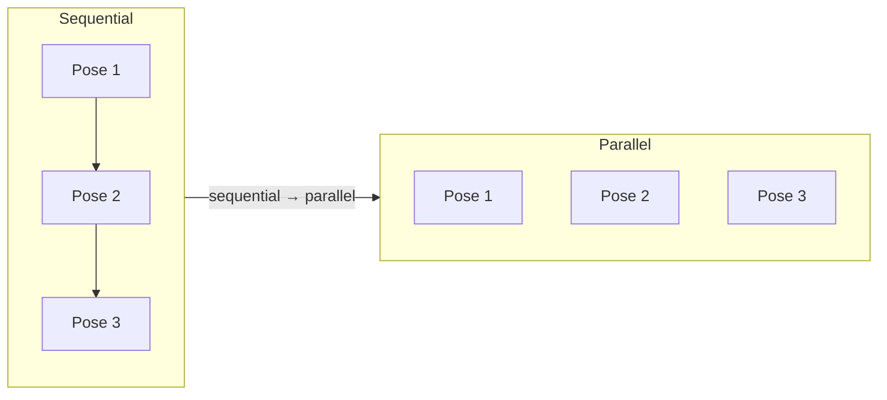
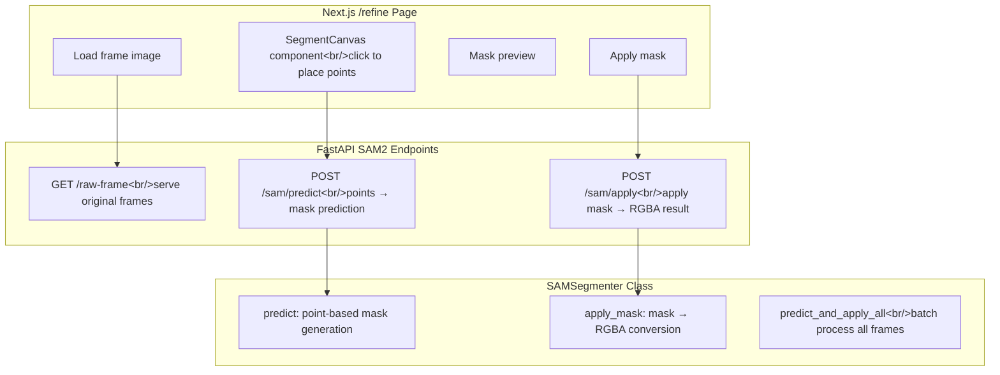

[Previous post: PopCon Dev Log #3](/en/posts/2026-04-07-popcon-dev3/)

## Overview

This is the fourth entry in the PopCon dev log series. Two major changes happened this round. First, VEO 3's cost was unsustainable, so I switched the video generation model to Alibaba's DashScope Wan 2.2. Second, rembg's background removal quality wasn't cutting it, so I built an interactive segmentation workflow using Meta's SAM 2.1 — users click on the foreground object and SAM generates a precise mask.

<!--more-->

## Video Generation Model Swap: VEO 3 → DashScope Wan 2.2

### The Cost Problem

VEO 3 produced good results, but the cost added up fast. PopCon needs to generate multiple action videos per emoji character, so per-generation cost matters a lot.

I evaluated several alternatives:

| Option | Pros | Cons |
|--------|------|------|
| fal.ai Wan 2.1 | Simple API | Mediocre quality-to-price ratio |
| RunPod GPU | Full control | Infrastructure overhead |
| **Alibaba DashScope Wan 2.2** | **Lowest cost, decent quality** | China-based API |

DashScope Wan 2.2 won on price-to-quality ratio.

### Related Improvements

Alongside the model swap, several other changes went in:

- **Frontend action selection**: Users can now pick which actions to generate instead of getting all of them
- **Backbone generation removed**: No longer needed with Wan 2.2
- **End pose generation removed**: Eliminated an unnecessary processing step
- **Inter-action throttles removed**: No more artificial delays between action generations

## Character Generation Improvements

### Full-Body Enforcement

AI character generation sometimes produced only upper-body results. This caused inconsistent lower bodies across different actions. I updated the prompts to enforce full-body generation every time.

### Reference Image Support

Users can now upload a reference image when generating characters. This is useful for creating variations of existing characters or matching a particular style.

### Other Improvements

- **Broader image format support**: WebP, GIF, BMP, and TIFF uploads now accepted
- **Background removal for uploads**: Uploaded character images can optionally have their background removed
- **Media preview modal**: Click an emoji card to see it at full size
- **Asset download links**: Direct download for generated assets

## Performance Optimization

Pose generation was changed from sequential to parallel. Startup delay and inter-action throttles were removed. End pose generation was eliminated entirely. The perceived speed improvement is significant.

## SAM 2.1 Interactive Background Removal

### Why rembg Wasn't Enough

In the [previous post](/en/posts/2026-04-07-popcon-dev3/), I implemented background removal with rembg. The quality issues were hard to ignore:

- Inaccurate foreground boundaries on complex backgrounds
- Parts of the character getting clipped, or background artifacts remaining
- Fundamental limitation of fully automated approaches — the model can't always tell what's foreground

### Why SAM 2.1

Meta's SAM 2.1 (Segment Anything Model) segments based on user-provided point prompts. Key advantages:

- **Interactive**: Users indicate foreground/background directly, improving accuracy
- **Runs on M1 Mac**: I initially considered cloud GPU options like RunPod, but confirmed SAM 2.1 runs well on M1 Mac via PyTorch's MPS backend
- **Easy integration**: Available through the `ultralytics` package

### Architecture

### Workflow Changes

Previously, the pipeline was fully automatic: video generation → frame extraction → background removal. With SAM, there's now a user interaction step in the middle:

1. Video generation → frame extraction (worker stage 3 completes here)
2. Status changes to `awaiting_refinement`
3. User visits `/refine` page and clicks to remove backgrounds
4. Final asset generation after refinement

I added the `awaiting_refinement` status so the frontend can show a "waiting for background removal" state and display a Refine Backgrounds link. The ProgressTracker treats this status as generation-complete.

### Implementation Details

**Backend — SAMSegmenter class**:
- `predict`: Takes click points, returns predicted masks
- `apply_mask`: Applies a predicted mask to the original image, producing an RGBA result
- `predict_and_apply_all`: Batch processes all frames

**Backend — API endpoints**:
- `GET /raw-frame`: Serves original frame images
- `POST /sam/predict`: Point-based mask prediction, returns RGBA mask
- `POST /sam/apply`: Applies mask to frame

**Frontend — SegmentCanvas component**:
- Renders frame image on a canvas
- Captures click events to collect point coordinates
- Calls SAM API for mask preview
- Calls apply API on confirmation

## Commit Log

| Message | Changes |
|---------|---------|
| feat: replace VEO 3 with DashScope Wan 2.2 and remove backbone generation | Swap video generation model, remove backbone step |
| feat: pass selected action names from frontend to backend | Frontend action selection |
| fix: clear character preview when switching between upload and generate modes | Reset preview on mode switch |
| feat: add optional reference image support for AI character generation | Reference image upload |
| feat: support WebP, GIF, BMP, and TIFF image uploads | Broader format support |
| feat: add background removal option for uploaded character images | Background removal for uploads |
| perf: remove end pose generation and inter-action throttles | Remove unnecessary steps and delays |
| feat: enforce full-body character generation and add asset download links | Full-body enforcement, download links |
| fix: add media preview modal with close button to emoji cards | Media preview modal |
| perf: parallelize pose generation and eliminate startup delay | Parallel pose generation |
| docs: add SAM2 interactive background removal design spec | SAM2 design document |
| docs: add SAM2 interactive background removal implementation plan | SAM2 implementation plan |
| feat: add ultralytics SAM 2.1 dependency and sam_model config | Add SAM 2.1 dependency |
| feat: add awaiting_refinement status to models | New awaiting_refinement status |
| refactor: simplify process_video to extract-only (no bg removal) | Simplify video processing |
| refactor: worker stage 3 extracts frames only, ends at awaiting_refinement | Worker stage 3 stops at extraction |
| feat: add SAMSegmenter class with predict, apply_mask, predict_and_apply_all | Core SAMSegmenter implementation |
| feat: add SAM2 endpoints and raw frame serving to FastAPI | SAM2 API endpoints |
| feat: add SAM embed/predict/apply API functions | Frontend SAM API functions |
| feat: add SegmentCanvas click-to-segment component | Click-to-segment canvas component |
| feat: add /refine page for interactive SAM2 background removal | /refine page implementation |
| feat: add Refine Backgrounds link and awaiting_refinement status display | Refine link and status display |
| feat: treat awaiting_refinement as generation-complete in ProgressTracker | ProgressTracker status handling |
| fix: address code review findings | Code review fixes |
| merge: integrate main refactors with SAM2 interactive bg removal | Merge main refactors |
| merge: integrate main branch changes with SAM2 implementation | Merge main changes |
| fix: return RGBA mask from SAM predict endpoint | Fix SAM predict RGBA mask |

## Next Steps

- Improve UX for applying segmentation results across all frames at once
- Connect the final APNG/GIF asset generation pipeline
- Optimize SAM model loading for deployment environments

---

*This is the fourth post in the PopCon series. More to come.*
