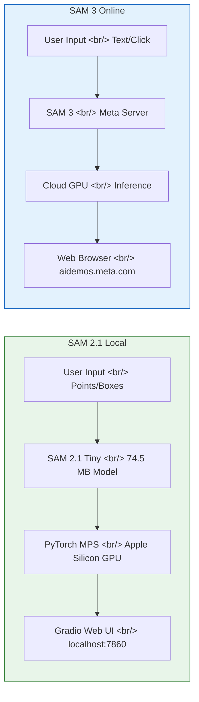

## Overview

Meta's Segment Anything Model (SAM) changed the game for image segmentation. SAM 2.1 can be run locally on your own machine, while the latest SAM 3 is available through Meta's online playground. In this post, I run SAM 2.1 on an Apple Silicon Mac with MPS GPU acceleration and compare it with the SAM 3 online demo.

<!--more-->

## SAM 2.1 Local vs SAM 3 Online — Architecture Comparison



## SAM 2.1 on Apple Silicon Mac

The [ice-ice-bear/sam2-mac-test](https://github.com/ice-ice-bear/sam2-mac-test) repository provides a ready-to-run SAM 2.1 setup for Apple Silicon Macs.

### Key Features

- **MPS GPU Acceleration**: Uses PyTorch's Metal Performance Shaders backend to run inference on M1/M2/M3/M4 GPUs
- **Multi-point Segmentation**: Place include/exclude points for fine-grained segmentation with undo/clear support
- **Segment Everything Mode**: Segment all objects in an image at once
- **Gradio Web UI**: Browser-based interface accessible right away
- **SAM 2.1 Tiny Model**: Lightweight 74.5 MB model, auto-downloaded on first run

### Quick Start

```bash
git clone https://github.com/ice-ice-bear/sam2-mac-test.git
cd sam2-mac-test
uv sync
uv run python app.py
```

Open `http://127.0.0.1:7860` in your browser to access the Gradio UI.

### Performance

Benchmarks on an M1 MacBook:

| Task | Time |
|------|------|
| Single point segmentation | ~1.6s |
| Multi-point update | ~1.5s per update |

The Tiny model keeps memory usage low, and MPS acceleration provides significant speedup over CPU-only inference.

### Tech Stack

- **SAM 2.1**: Via the Ultralytics library
- **PyTorch MPS**: Apple Silicon GPU backend
- **Gradio**: Web UI framework
- **uv**: Package manager

## Meta SAM 3 Online Playground

Meta offers the latest SAM 3 as an online demo at [aidemos.meta.com/segment-anything](https://aidemos.meta.com/segment-anything).

### What Sets SAM 3 Apart

- **Text-prompt Segmentation**: Find objects using natural language — "find animal", "find person"
- **One-click Effects**: Apply blur, clone, desaturate, and more with a single click
- **Motion Trails**: Add motion effects to segmented objects
- **Contour Lines / Bounding Boxes**: Various visualization options
- **Video Segmentation**: Track Anything feature for object tracking in video
- **Community Templates**: Use effects created by other users

## SAM 2.1 Local vs SAM 3 Online Comparison

| Aspect | SAM 2.1 Local | SAM 3 Online |
|--------|--------------|--------------|
| Environment | Local Mac (Apple Silicon) | Meta cloud servers |
| GPU | MPS (M1/M2/M3/M4) | Cloud GPU |
| Model Size | Tiny 74.5 MB | Full-size (undisclosed) |
| Input Methods | Point click, box | Text, click, box |
| Text Prompts | Not supported | Supported |
| Post-processing Effects | None | Blur, clone, desaturate, etc. |
| Video Support | Not supported | Supported |
| Privacy | Data stays local | Uploaded to Meta servers |
| Internet Required | Only for model download | Always |
| Customization | Full code access | Limited |

## Which One Should You Choose?

**SAM 2.1 local** is the right choice when:
- You don't want sensitive images leaving your machine
- You need to integrate segmentation into an automated pipeline
- You want to modify or extend the model
- You need to work offline

**SAM 3 online demo** is the right choice when:
- You want to find objects using text prompts
- You need quick access to effects like blur and cloning
- You need video segmentation
- You want to try it out without any installation

## Wrapping Up

Running SAM 2.1 locally is a practical option for Apple Silicon Mac users. The 74.5 MB Tiny model delivers usable segmentation results, and MPS acceleration makes good use of the GPU. The SAM 3 online demo takes it further with text prompts and a rich set of effects. Depending on your use case, combining local and cloud approaches gives you the best of both worlds.

### Links

- [ice-ice-bear/sam2-mac-test (GitHub)](https://github.com/ice-ice-bear/sam2-mac-test)
- [Meta AI Demos — Segment Anything](https://aidemos.meta.com/segment-anything)
- [Ultralytics SAM 2 Documentation](https://docs.ultralytics.com/models/sam-2/)
- [PyTorch MPS Backend](https://pytorch.org/docs/stable/notes/mps.html)
