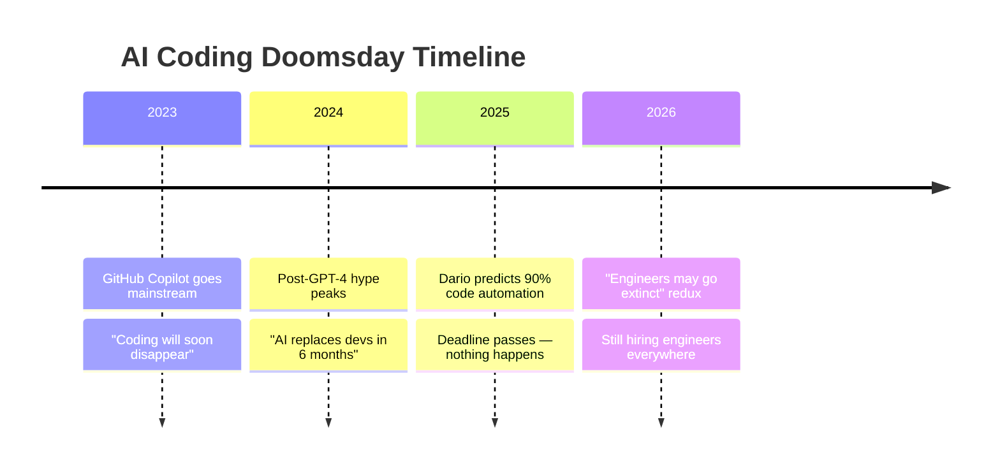
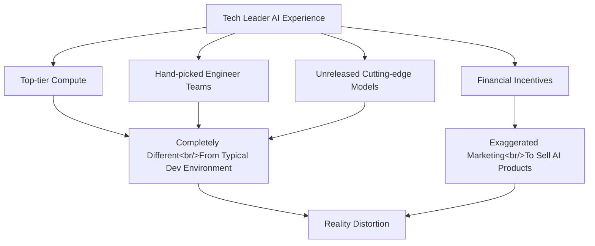
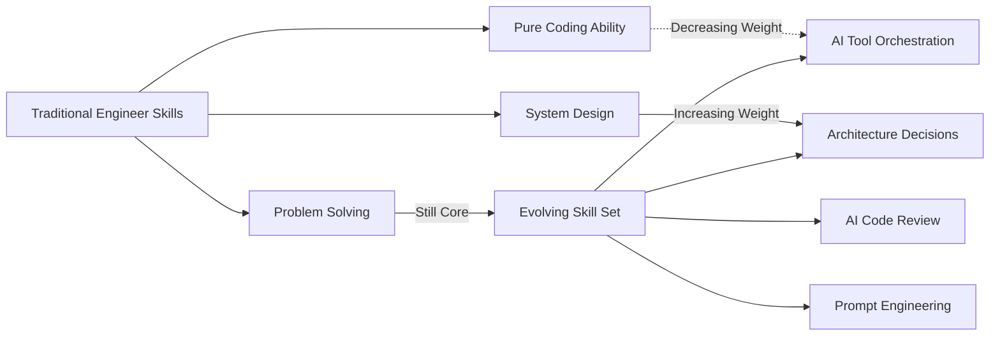

## Overview

There is a prophecy that repeats every six months: "AI will replace coding." Tech leaders like Dario Amodei, Jensen Huang, and Sam Altman keep declaring the end of software engineering. Cole Medin recently dissected these claims with data and logic in his video. As someone who uses AI coding tools daily in real work, I want to add practical experience to his analysis.

<!--more-->

## The 6-Month Prophecy Pattern

The most striking pattern Cole identified is this — coding's death is always "6 months away."

In March 2025, Dario Amodei predicted AI would write 90% of code within 6 months. That deadline passed without it happening. Now the prediction has shifted to engineers potentially going extinct in 2026. Amazon's CEO and Microsoft's AI CEO echo similar sentiments.

This pattern resembles the old joke about fusion power always being "30 years away." The difference is that AI coding tools are genuinely useful. The problem lies in **confusing "augmentation" with "replacement."**

## Why Tech Leaders Exaggerate

This is the sharpest part of Cole's analysis. There are structural reasons why tech leaders are inevitably biased.

Using Claude Code daily, what I notice most is that the tool's performance is **extremely environment-dependent**. On well-structured projects, it delivers remarkable results. But faced with legacy codebases or complex business logic, human judgment remains essential. Tech leaders generalize from the former while ignoring the latter.

## What AI Coding Can and Cannot Do

Working with AI coding tools daily makes the boundaries of capability very clear.

### Where AI Excels

- **Boilerplate code** — repetitive CRUD operations, config files, type definitions
- **Scaffolding** — setting up initial project structure
- **Test generation** — writing unit tests for existing code
- **Documentation** — code comments, READMEs, API docs
- **Simple features** — self-contained features with clear specifications

### Where AI Struggles

- **Complex architecture decisions** — design judgments requiring a holistic system view
- **Intricate bug debugging** — tracing issues across multiple layers
- **Business context understanding** — decisions requiring domain knowledge
- **Large codebase maintenance** — grasping dependencies across hundreds of thousands of lines

From daily usage, my honest estimate is that AI accelerates roughly 40-50% of my work. Not 90%. And that 40-50% requires me to set the right direction, verify the output, and provide context.

## The Adoption Gap — Between Possibility and Reality

Another key point Cole emphasized is the **adoption gap**.

A massive chasm exists between AI coding tools' technical capabilities and actual enterprise adoption. Most companies are still in the experimental phase of basic integration.

- **Security concerns** — corporate anxiety about code being sent to external APIs
- **Compliance** — regulatory barriers in finance, healthcare, and government sectors
- **Legacy systems** — AI tools are helpless against 20-year-old COBOL or proprietary frameworks
- **Organizational inertia** — training, workflow changes, and cultural shifts required for adoption

Startups and individual developers adopt AI tools quickly, but the enterprise sector — which makes up the bulk of the software industry — moves slowly. Ignoring this gap while claiming "replacement is imminent" betrays a disconnect from reality.

## The Real Shift — Evolution, Not Extinction

Software engineering is not dying. It is evolving. I fully agree with Cole's conclusion on this.

Here is what the shift feels like in practice. Where I used to spend 60% of my time typing code line by line, I now spend more time **designing what to build and verifying what AI has produced**. Coding ability has not become irrelevant — a new layer has been added on top of it.

## Practical Advice

Adding practical experience to Cole's recommendations:

1. **Do not panic** — stop reacting to the doomsday predictions that come every 6 months
2. **Learn AI tools** — apply Claude Code, GitHub Copilot, and similar tools to real projects
3. **Invest in system design** — this is the area hardest for AI to replace
4. **Build domain knowledge** — we are entering an era where context matters more than code
5. **Develop critical evaluation skills** — blindly trusting AI-generated code is dangerous

AI coding tools are undeniably game-changers. But they are changing the rules of the game, not ending it. Engineers who adapt will be more productive than ever. Those who do not will fall behind. But "extinction"? Not yet.

---

**Reference**: [Cole Medin — Is Software Engineering Finally Dead?](https://www.youtube.com/watch?v=kM3V3MUFmA8)
