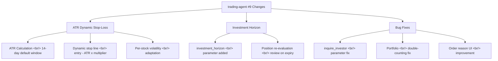
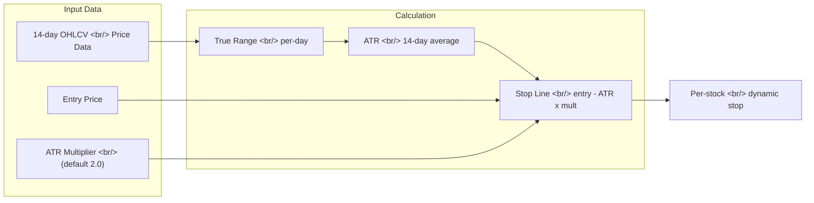

## Overview

[Previous post: Trading Agent Dev Log #8](/en/posts/2026-04-02-trading-agent-dev8/)

If #8 was about building the 5-factor composite score system, #9 focuses on upgrading the core risk management mechanism: **stop-loss**. The fixed-percentage stop-loss was replaced with **ATR (Average True Range) dynamic stop-loss** that automatically adjusts to each stock's volatility. An **investment horizon** parameter was introduced alongside **position re-evaluation** logic for actively managing held positions. Bug fixes addressed investor inquiry parameter mismatches and portfolio double-counting.

<!--more-->

---



---

## ATR Dynamic Stop-Loss

### Background: Limitations of Fixed Stop-Loss

Previously, stop-loss lines were set at a fixed percentage below the entry price (e.g., -5%). The problem is applying the same threshold to stocks with vastly different volatility profiles. A -5% stop makes sense for a large-cap with 2% daily swings, but for a mid-cap with 7% daily swings, the same threshold triggers on normal price action.

### What is ATR

**Average True Range (ATR)** is a technical indicator that averages the "True Range" over a given period. True Range is the maximum of:

- Current high minus current low
- |Current high minus previous close|
- |Current low minus previous close|

By capturing gap-up and gap-down moves, ATR measures actual volatility more accurately than simple high-low range.

### Implementation

The ATR-based stop-loss line is calculated as:

```
Stop line = Entry price - (ATR x multiplier)
```

The default ATR window is 14 days and the default multiplier is 2.0. For a stock with a daily range of 1,000 KRW, the stop is set 2,000 KRW below entry. For a stock with a 3,000 KRW daily range, it automatically widens to 6,000 KRW below.



The key advantage is adaptability. When volatility increases, ATR rises and the stop widens. When volatility decreases, the stop tightens. The system responds to changing market conditions without manual adjustment.

---

## Investment Horizon and Position Re-evaluation

### Investment Horizon Parameter

An **investment_horizon** parameter was added to the agent settings. This specifies the expected holding period in days. The expert panel references this value during analysis to tailor recommendations for short-term trading versus medium-term investing.

### Position Re-evaluation Logic

When a held position exceeds its investment horizon or market conditions shift significantly, it is automatically flagged for re-evaluation. During re-evaluation, the system refreshes technical indicators and fundamental data to update the HOLD/SELL decision.

Previously, once a BUY signal triggered entry, the position sat untouched until an explicit SELL signal appeared. The re-evaluation logic fills the gap of "no signal, but review needed" — enabling proactive management of existing positions.

---

## Bug Fixes

### Investor Inquiry Parameter Mismatch

The `inquire_investor` function was called with parameter names that didn't match the API spec. Incorrect parameters caused the API to return empty values silently, resulting in missing institutional flow data. Parameters were corrected to match the API specification.

### Portfolio Double-Counting

Under certain conditions, the same stock was counted twice during portfolio aggregation. The root cause was duplicate data source references when constructing the holdings list. A deduplication step was added to ensure portfolio values are calculated accurately.

### Order Reason UI Improvement

The reason text displayed during order execution was improved. Previously shown as a plain string, it now presents expert opinions and composite score components in a structured layout.

---

## Commit Log

| Message | Category |
|---------|----------|
| fix: inquire_investor params, portfolio double-counting, order reason UI | Bug fix |
| feat: ATR dynamic stop-loss, investment horizon, position re-evaluation | Feature |

---

## Insights

Fixed-percentage stop-loss is simple to implement but fundamentally flawed in treating all stocks identically. ATR-based dynamic stop-loss solves this, but the multiplier becomes a new hyperparameter. Too large and the stop is too loose, allowing bigger losses. Too small and normal fluctuations trigger exits prematurely. The default of 2.0 is general consensus, but users should be able to tune this per their risk tolerance.

Position re-evaluation addresses a blind spot where "no signal" was interpreted as "do nothing." Markets change continuously, and the analysis at entry time doesn't remain valid indefinitely. By introducing an explicit horizon, positions that exceed their expected holding period are mechanically reviewed — preventing the drift of forgotten positions.

Portfolio double-counting is a textbook silent error. If total assets are reported higher than reality, the risk manager may conclude there is sufficient available capital and permit additional buys. Data integrity issues propagate through the entire decision chain.
