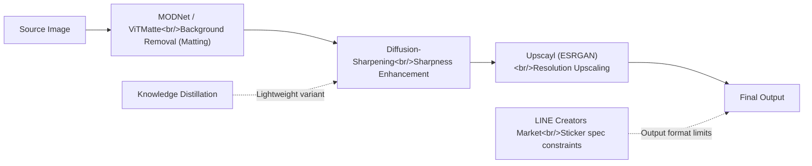

An exploration of the open-source ecosystem for AI-powered image processing. From background removal (matting) through sharpening and upscaling, here is a comparison of each stage's leading tools, how they compose into a pipeline, and what LINE emoji format constraints mean for the final output.

<!--more-->

## Background Removal: MODNet and ViTMatte

Traditional **image matting** — separating a foreground subject from its background — required manually specifying a trimap (a coarse mask indicating foreground, background, and unknown regions). [MODNet](https://github.com/ZHKKKe/MODNet) (4,292 stars) eliminates that requirement with a **trimap-free** real-time portrait matting model, published at AAAI 2022. A single input image is all it needs to produce an alpha matte.

MODNet's key insight is decomposing the matting problem into three sub-objectives:

```python
# MODNet's three-branch decomposition (conceptual)
# S: Semantic Estimation — understand foreground/background semantics
# D: Detail Prediction — predict fine boundary details
# F: Final Fusion — synthesize the final alpha matte

# At inference time, this runs as a single forward pass
from MODNet.models.modnet import MODNet
modnet = MODNet(backbone_pretrained=False)
modnet.load_state_dict(torch.load('modnet_photographic_portrait_matting.ckpt'))
# Input: RGB image → Output: alpha matte
```

[ViTMatte](https://github.com/hustvl/ViTMatte) (522 stars) takes a different angle. The Information Fusion 2024 paper adapts a pretrained **Vision Transformer (ViT)** for the matting task. The ViT's global attention mechanism captures wide contextual information, which improves quality on challenging boundaries like hair and semi-transparent objects. Where MODNet excels at real-time throughput, ViTMatte is the better choice when quality is the priority.

## Image Sharpening and Enhancement

Several distinct approaches coexist in the image sharpening space. [Diffusion-Sharpening](https://github.com/Gen-Verse/Diffusion-Sharpening) (72 stars) applies **RLHF-style alignment** to fine-tune a diffusion model. The project provides training scripts that walk through an SFT (Supervised Fine-Tuning) stage followed by RLHF to align with human preference. It's a compelling example of alignment techniques crossing over from LLMs into image generation.

[ImageSharpening-KD](https://github.com/beingdhruvv/ImageSharpening-KD-Restormer-UNet) uses **Knowledge Distillation**. A large Restormer model serves as the teacher; a lightweight Mini-UNet is the student. The target is practical inference on mobile and edge devices.

```
Teacher (Restormer)           Student (Mini-UNet)
━━━━━━━━━━━━━━━━━━━━          ━━━━━━━━━━━━━━━━━━━
- Transformer-based           - UNet-based (lightweight)
- High quality, slow          - Fast inference, small footprint
- Generates soft labels  →    - Trains on KD loss
```

## Upscayl: ESRGAN-Based Upscaling for Everyone

[Upscayl](https://github.com/upscayl/upscayl) (44,475 stars) is the **#1 open-source AI image upscaler** by a wide margin. Built on ESRGAN (Enhanced Super-Resolution GAN) and packaged as an Electron app, it's accessible to non-developers via a GUI — no command line required. Drag-and-drop an image and get up to 4x resolution. That zero-friction experience is why it dominates the category.

## The Image Processing Pipeline

These tools can be composed into a coherent image processing pipeline:



## LINE Emoji Format Constraints

I also reviewed the LINE Creators Market guidelines for stickers and animated emoji. If you're targeting that platform, the final output stage needs to conform to specific resolution and frame count requirements — worth keeping in mind when designing the pipeline's export step.

## Insights

The common thread across these tools is **pipeline thinking**. Matting, sharpening, and upscaling each solve a distinct problem, but the real leverage comes from composing them into a coherent workflow. The quality of the final output depends less on any single tool and more on how well the stages fit together.

It's also worth watching how techniques like Knowledge Distillation and RLHF are spreading beyond their LLM origins into image processing. Diffusion-Sharpening applying RLHF to image generation is a clear example of training paradigms proven in one domain being adapted across domains at an accelerating pace — and that cross-pollination is one of the more underappreciated drivers of the current AI moment.
