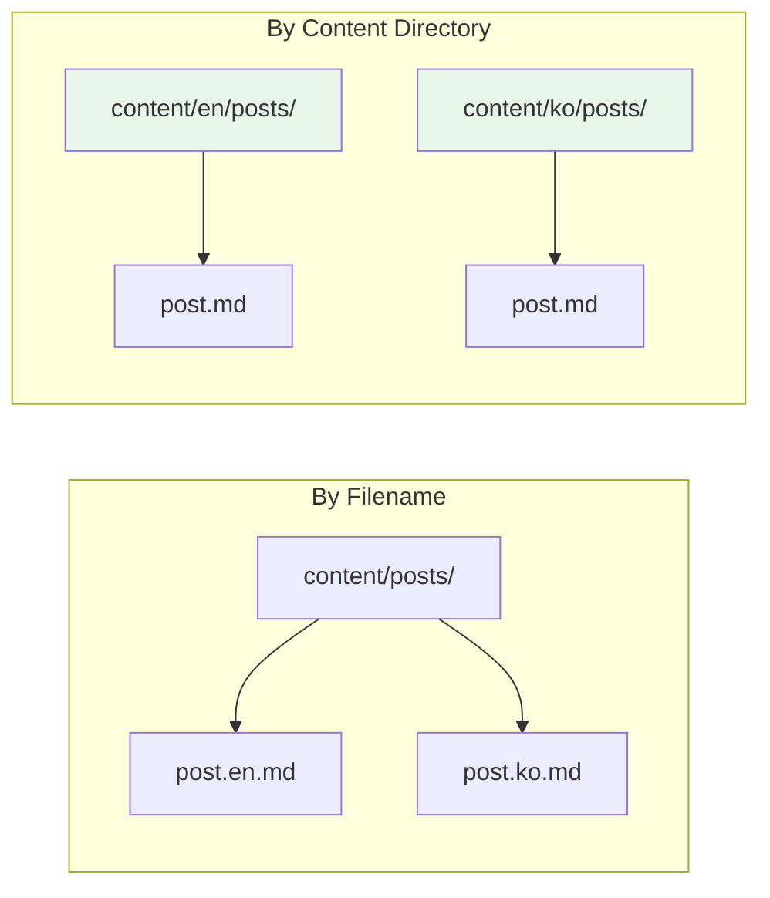
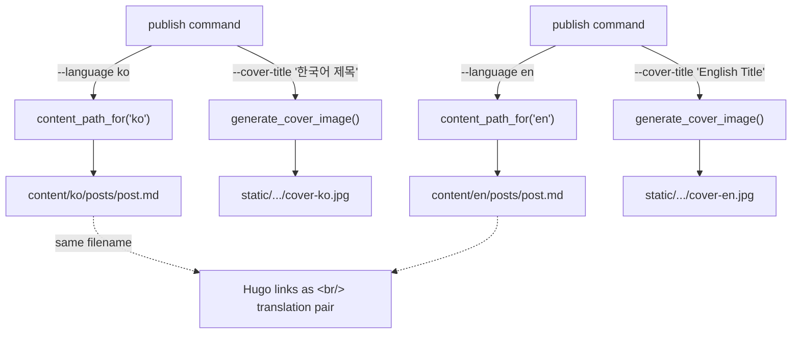

## Overview

A blog that exists in only one language reaches half its audience. Today I built a bilingual publishing pipeline for Hugo that routes posts to language-specific directories, generates per-language cover images with localized titles, and links translation pairs automatically — all from a single `--language` flag on the CLI.

<!--more-->

## Hugo's Two Translation Methods

Hugo supports multilingual content through two approaches:

**By filename**: `about.en.md` / `about.ko.md` in the same directory. Simple for small sites, but filenames get cluttered.

**By content directory**: `content/en/posts/` / `content/ko/posts/` with separate directory trees per language. Better for CLI automation — the language is a routing decision, not a naming convention.



log-blog uses the content directory approach. The config maps language codes to directories:

```yaml
blog:
  default_language: "en"
  language_content_dirs:
    ko: "content/ko/posts"
    en: "content/en/posts"
```

## Content Routing: `content_path_for()`

The routing function is minimal — a dict lookup with a fallback:

```python
@dataclass
class BlogConfig:
    content_dir: str = "content/posts"  # fallback
    language_content_dirs: dict[str, str] = field(default_factory=dict)
    default_language: str = "en"

    def content_path_for(self, language: str | None = None) -> Path:
        lang = language or self.default_language
        if lang in self.language_content_dirs:
            return self.repo_path_resolved / self.language_content_dirs[lang]
        return self.content_path
```

When `publish --language ko` is called, the post lands in `content/ko/posts/`. Without `--language`, it defaults to the `default_language` setting. If the language has no mapping in `language_content_dirs`, it falls back to the generic `content_dir`.

This design means adding a third language (e.g., Japanese) is a one-line config change — no code modifications needed.

## Per-Language Cover Images

Each language gets its own cover image with the title rendered in that language:

```
static/images/posts/2026-04-10-firecrawl/
├── cover-en.jpg   ← "Deep Docs Crawling with Firecrawl"
└── cover-ko.jpg   ← "Firecrawl을 활용한 딥 문서 크롤링"
```

The image generator in `image_handler.py` appends the language suffix:

```python
cover_name = f"cover-{language}.jpg" if language else "cover.jpg"
rel_url = f"/images/posts/{post_slug}/{cover_name}"
```

The CLI auto-injects the correct `image:` frontmatter path — users never write it manually. When `--cover-title "Korean Title" --language ko` is passed, the generated image shows Korean text with tag pills, and the frontmatter points to `cover-ko.jpg`.



## Hugo Configuration: `hasCJKLanguage` Matters

One critical Hugo setting for Korean content:

```yaml
hasCJKLanguage: true
```

Without this, Hugo calculates `.Summary` and `.WordCount` using space-based word splitting — which produces nonsensical results for Korean, Chinese, and Japanese text. With it enabled, Hugo uses CJK-aware segmentation.

The Stack theme provides built-in Korean language support. Menu items translate automatically when configured under `languages.ko.menu`:

```yaml
languages:
  ko:
    languageName: 한국어
    weight: 1
    menu:
      main:
        - name: 포스트
          url: /posts
        - name: 카테고리
          url: /categories
        - name: 태그
          url: /tags
```

## The Translation Workflow

The publishing flow for a bilingual post:

1. **Write the original** (typically English)
2. **Rewrite for Korean audience** — not literal translation, but restructuring for natural Korean flow. Technical terms stay in English where conventional in Korean tech writing
3. **Publish both with same filename**:

```bash
# English version → content/en/posts/
uv run log-blog publish post-en.md \
  --cover-title "English Title" \
  --tags "hugo,i18n" --language en

# Korean version → content/ko/posts/
uv run log-blog publish post-ko.md \
  --cover-title "한국어 제목" \
  --tags "hugo,i18n" --language ko
```

Hugo automatically detects that both files share the same filename and displays a language switcher on the post page. The `.Translations` template variable handles the linking.

### Translation Guidelines

Key rules for the Korean rewrite:
- **Translate**: title, description, body text, Mermaid labels, section headers
- **Keep unchanged**: tags, categories, code blocks, URLs, CLI commands
- **Don't include `image:`** — the CLI auto-injects the per-language path
- Mermaid safety rules (entities, quoted slashes) apply identically in both languages

## GitHub Multi-Account SSH Setup

One complication: the blog repo (`ice-ice-bear`) uses a different GitHub account than the main dev account (`lazy-mango`). SSH key-based routing solves this:

```
# ~/.ssh/config
Host github-blog
    HostName github.com
    User git
    IdentityFile ~/.ssh/id_ed25519_blog
```

The blog repo's remote URL uses the alias: `git@github-blog:ice-ice-bear/ice-ice-bear.github.io.git`. GitHub maps SSH keys 1:1 to accounts, so the alias ensures the correct key (and account) is selected for push operations.

## Insights

Hugo's multilingual support is mature but documentation-heavy — the "by content directory" vs "by filename" decision has cascading effects on your entire publishing workflow. For a CLI-driven pipeline, content directories win decisively: the language becomes a routing parameter rather than a naming convention baked into every file.

The per-language cover image pattern turned out to be more important than expected. Social media previews (Open Graph, Twitter Cards) show the cover image — having "Deep Docs Crawling" on the thumbnail while the post is in Korean creates a jarring disconnect. Localized cover images make shared links feel native in each language community.

The `hasCJKLanguage` flag is the kind of setting that's invisible until it breaks. Korean `.Summary` without it produces garbled word counts and truncated previews. It's a one-line fix, but discovering the problem requires actually testing with CJK content — English-only development would never surface it.

What surprised me most is how little code the bilingual support required. The core routing is a dict lookup. The cover image is a filename suffix. The translation linking is Hugo's built-in behavior when files share a name. The complexity isn't in the implementation — it's in knowing which Hugo features to combine and which settings matter for non-Latin scripts.
