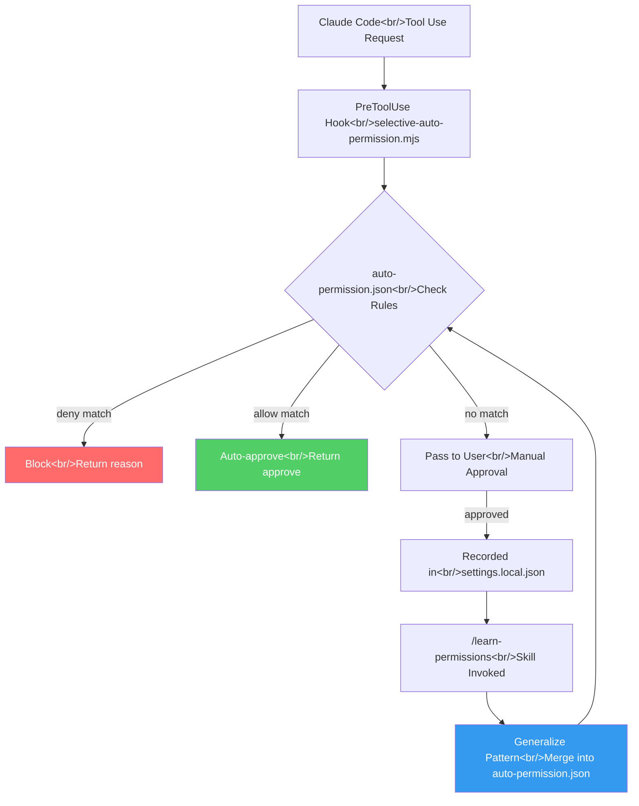

## Overview

If you use Claude Code heavily, you know the pain: hundreds of "Allow" clicks per session. Reading a file? Allow. Running `git status`? Allow. Running tests? Allow. The built-in `settings.local.json` accumulates one-off approvals that quickly become unmanageable. To solve this, I built **claude-auto-permission** — a hook-based auto-permission system with preset-driven configs and a learning mechanism.

<!--more-->

## The Problem — Hundreds of "Allow" Clicks

Claude Code requires user approval for every tool use. This is the right default for security, but in practice it creates significant friction during development:

- `Read` tool to open a file — approve
- `Bash` to run `git status` — approve
- `Bash` to run `npm test` — approve
- `Grep` to search code — approve

A one-hour coding session easily generates 100-200 approval prompts. And as you approve them one by one, `settings.local.json` accumulates entries like this:

```json
{
  "permissions": {
    "allow": [
      "Bash(git status)",
      "Bash(git diff)",
      "Bash(git log --oneline -20)",
      "Bash(git log --oneline -10)",
      "Bash(npm test)",
      "Bash(npm run test)",
      "Bash(npx jest)",
      ...
    ]
  }
}
```

Since it records exact command strings, `git log --oneline -20` and `git log --oneline -10` are separate entries. No pattern generalization means the list grows endlessly.

## Design — Hook Architecture

Claude Code's hook system lets you attach external scripts to events like `PreToolUse` and `PostToolUse`. By hooking into `PreToolUse`, we can intercept every tool invocation and decide whether to auto-approve, block, or pass through to the user.

Here is the overall architecture:



Three core components make this work:

1. **`selective-auto-permission.mjs`** — The PreToolUse hook. On every tool use, it checks the allow/deny lists in `auto-permission.json` and returns a verdict.
2. **`permission-learner.mjs`** — Analyzes manual approval history and extracts patterns.
3. **`/learn-permissions` skill** — An interactive workflow that merges learned patterns into `auto-permission.json`.

## Preset System

Writing rules from scratch for every project is impractical. So the system ships with five presets for common development environments:

| Preset | Use Case | Auto-Approve Scope |
|--------|----------|-------------------|
| `safe-read` | Read-only | Read, Grep, Glob, git status/log/diff |
| `node-dev` | Node.js development | + npm/npx, jest, eslint, tsc |
| `python-dev` | Python development | + uv, pytest, ruff, mypy, pip |
| `fullstack-dev` | Full-stack | node-dev + python-dev combined |
| `full-trust` | Full trust | Nearly all tools (except deny list) |

Every preset shares a **universal deny list** that is never auto-approved:

```javascript
const UNIVERSAL_DENY = [
  "rm -rf",
  "git push --force",
  "git reset --hard",
  "git clean -f"
];
```

Even with the `full-trust` preset, these four commands always require manual approval. An accidental `rm -rf /` should never be auto-approved.

## auto-permission.json Structure

Rules are defined in `.claude/auto-permission.json` at each project root:

```json
{
  "preset": "python-dev",
  "custom_allow": [
    {
      "tool": "Bash",
      "pattern": "docker compose *"
    },
    {
      "tool": "Bash",
      "pattern": "hugo server *"
    }
  ],
  "custom_deny": [
    {
      "tool": "Bash",
      "pattern": "docker system prune *"
    }
  ]
}
```

The `preset` provides baseline rules, while `custom_allow` and `custom_deny` add project-specific overrides. Patterns support glob-style matching, so `docker compose *` covers `docker compose up`, `docker compose down`, `docker compose logs -f`, and so on.

**Rule priority**: deny always takes precedence over allow. If a command matches both lists, it is blocked. When in doubt, err on the side of safety.

## Permission Learner — Extracting Patterns from Approval History

As you manually approve commands, `settings.local.json` accumulates similar entries:

```
Bash(pytest tests/test_auth.py)
Bash(pytest tests/test_api.py)
Bash(pytest tests/test_models.py -v)
Bash(pytest --tb=short)
```

`permission-learner.mjs` analyzes these entries by:

1. Extracting common prefixes (`pytest`)
2. Classifying safety (read-only vs. filesystem-modifying)
3. Generalizing into patterns (`pytest *`)

When you run the `/learn-permissions` skill, it presents the learned patterns for review and, upon confirmation, adds them to `custom_allow` in `auto-permission.json`. Once learned, the entire family of similar commands is auto-approved going forward.

## Design Decisions

### Hook Response Time

The PreToolUse hook runs on every single tool use. Spawning a new Node.js process each time could be a concern, but in practice, reading one JSON file and running pattern matching takes only tens of milliseconds — well below any perceptible delay.

### Balancing Security and Convenience

The most important question in an auto-permission system is "how much should be auto-approved?" Too permissive is dangerous; too restrictive is useless.

This project follows three principles:

1. **Deny always wins** — no matter how broad the allow list, a deny match blocks the action
2. **Universal deny is preset-independent** — destructive commands are blocked regardless of which preset is active
3. **Learning only suggests** — the permission learner proposes patterns, but the user must confirm before they take effect

### Per-Repo Configuration

`auto-permission.json` lives in the `.claude/` directory at the project root. Different projects need different permissions even for the same developer. A blog repo needs `hugo server *`, while an API server repo needs `docker compose *`. This has to be per-project, not global.

## Current State and Next Steps

What the first release includes:
- Five presets with custom rule support
- PreToolUse hook-based auto-approve and block
- Permission learner and `/learn-permissions` skill
- Universal deny list

What comes next:
- Edge cases discovered while applying to real projects
- Guide for customizing and creating new presets
- Potential integration with other hook events (`PostToolUse`, `Notification`)

GitHub repository: [ice-ice-bear/claude-auto-permission](https://github.com/ice-ice-bear/claude-auto-permission)
