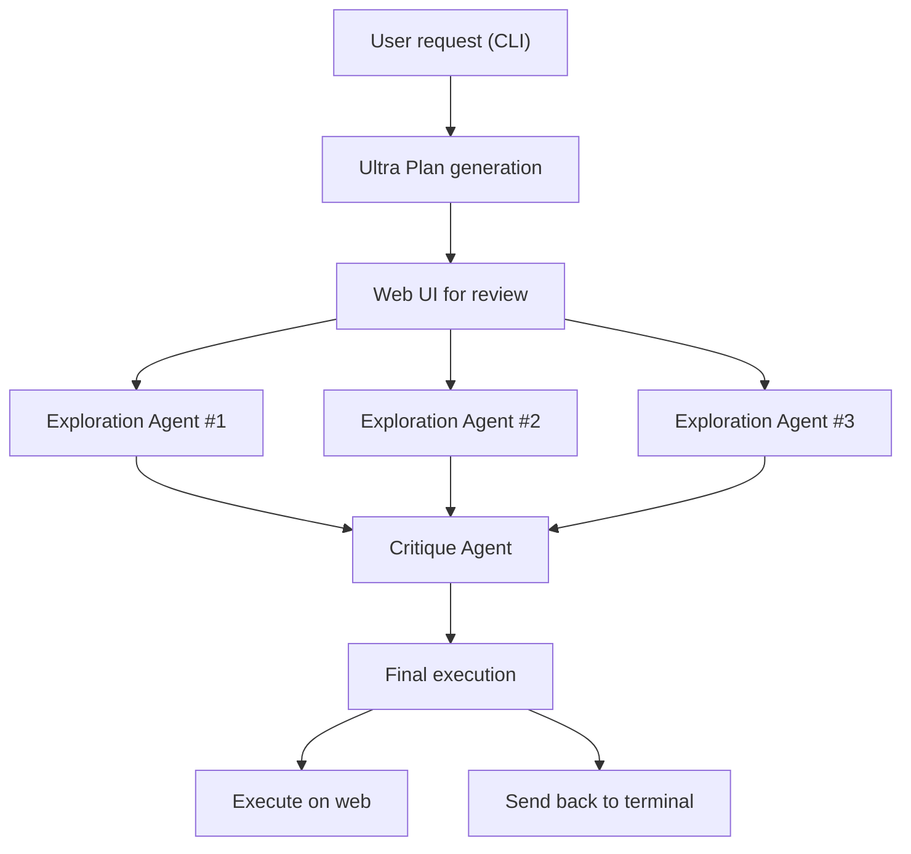
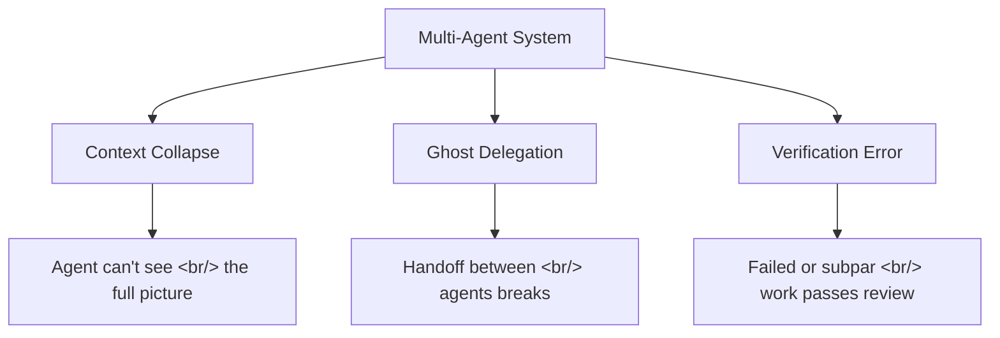

## Overview

Claude Code's Ultra Plan ships multi-agent planning to the cloud: three exploration agents run in parallel while a critique agent validates the result. Combined with YC's report that engineers now run 3-8 Claude instances simultaneously, and a $5,000 field test exposing why multi-agent orchestration keeps failing — the landscape of AI-assisted development is crystallizing around orchestration as the core skill.

<!--more-->

## Ultra Plan: Cloud-Based Multi-Agent Planning

Ultra Plan is a research preview feature (v2.1.91+) that offloads plan creation from your local CLI to Anthropic's cloud infrastructure. The key architectural change: instead of a single agent planning in your terminal, four agents collaborate.

Three exploration agents analyze the codebase independently, approaching the problem from different angles. A critique agent synthesizes their findings and validates the plan. The reported result: **15-minute tasks completing in 5 minutes** — not just from parallelism, but from the exploration agents covering edge cases that a single agent would miss.

### Three Ways to Launch

1. **Command**: `/ultraplan` followed by your prompt
2. **Keyword**: include "ultraplan" anywhere in a normal prompt
3. **From local plan**: when a local plan completes, choose "Refine with Ultraplan" to send it to the cloud

### The Terminal-Web Bridge

The workflow bridges local and cloud seamlessly. You start in the CLI, the plan drafts on cloud infrastructure while your terminal stays free for other work, then you review in a web browser with a rich UI — section-by-section commenting, targeted feedback, and team sharing via link.

This solves a fundamental UX problem with CLI-based planning: reviewing a complex plan in a terminal is painful. The web interface surfaces structure, allows inline comments, and most importantly, lets team members review without CLI access.

Once the plan is approved, you choose: execute on the web (which can open a PR directly), or send it back to your terminal for local execution with full file system access.

### Requirements and Limitations

Ultra Plan requires a Claude Code on the web account and a GitHub repository. It runs on Anthropic's cloud infrastructure, so it's not available with Amazon Bedrock, Google Cloud Vertex AI, or Microsoft Foundry backends.

## YC's AI-Native Startup Velocity

Y Combinator's "The New Way To Build A Startup" revealed that Anthropic engineers themselves use Claude Code to write code, with **individual engineers running 3-8 Claude instances simultaneously**. YC companies are shipping "dramatically faster" — not as marketing speak, but as a structural consequence of this workflow.

The implication is a role shift: from "code writer" to "AI agent orchestrator." Instead of typing code line by line, the core competency becomes distributing tasks across multiple AI instances and verifying results.

This maps directly to Ultra Plan's architecture. The explore-critique pattern isn't just Anthropic's internal tooling philosophy — it's the emerging pattern for how human developers interact with AI coding assistants at scale.

## The Multi-Agent Orchestration Reality: $5,000 of Lessons

Shalomeir's analysis, "멀티 에이전트 오케스트레이션은 왜 잘 안 되는가?" (Why does multi-agent orchestration keep failing?), is the most grounded assessment I've encountered. After spending $5,000 in API tokens testing systems like Gastown (Steve Yegge's "city" metaphor for organizing agents) and Paperclip (a "zero-human company" concept), they identified three structural bottlenecks:

### The Three Bottlenecks

**Context Collapse** — Each agent operates within a limited context window. As the system scales, no single agent can hold the full project state. Information gets lost across agent boundaries.

**Ghost Delegation** — When Agent A hands work to Agent B, the handoff often silently drops context. The receiving agent proceeds with incomplete information, producing work that looks correct but misses critical constraints.

**Verification Error** — The reviewing agent either fails to catch errors or accepts subpar implementations. Without deep understanding of the original intent, review becomes a rubber stamp.

### What Actually Works

The article concludes that the number of agents isn't the key — **orchestrator design** is. The systems that succeed share these traits:

- **Domain-deep, cross-domain-loose**: Agents work deeply within their domain but connect loosely between domains
- **Shared environment over conversation**: Real coordination happens through shared file systems and state, not message passing
- **The tools already have the answer**: Claude Code's worktrees, git branches, and file system already provide the coordination primitives

### Five Delegation Criteria

For determining how much to delegate to agents:
1. **Task decomposability** — Can it be broken into independent sub-tasks?
2. **Verification clarity** — Can the output be objectively checked?
3. **Context locality** — Does the agent have enough context to work independently?
4. **Failure recoverability** — If the agent fails, how costly is recovery?
5. **Domain stability** — Is the domain well-understood or rapidly changing?

## Claude Code Cache Bugs: A Cautionary Note

ArkNill's [claude-code-hidden-problem-analysis](https://github.com/ArkNill/claude-code-hidden-problem-analysis) documents **11 confirmed client-side bugs** plus 4 preliminary findings. Cache bugs (B1-B2) were fixed in v2.1.91, but **nine bugs remain unfixed as of v2.1.97** — six releases shipped zero fixes for token accounting, context mutation, or log integrity issues.

Notable findings:
- **B10**: `TaskOutput` deprecation causes 21x context injection, leading to fatal errors
- **B11**: Adaptive thinking zero-reasoning leads to fabrication (Anthropic acknowledged on HN but hasn't followed up)
- **Proxy-captured rate limit headers** reveal a dual 5h/7d window quota system with a thinking token blind spot

This matters for Ultra Plan users: if cache bugs cause 10-20x token inflation locally, the same issues could amplify in a multi-agent cloud environment where four agents are running simultaneously.

## Insights

The Ultra Plan architecture validates a specific pattern: **explore multiple approaches in parallel, then critique and synthesize**. This is the same pattern that works in human software teams — you don't assign three developers the same task, but you do want multiple perspectives during design review. Ultra Plan automates this for planning, not execution.

The tension revealed across today's exploration is between the promise and reality of multi-agent systems. Ultra Plan succeeds because it constrains the problem: four agents, one task (planning), structured roles (explore vs. critique), and human review at the end. Gastown and Paperclip fail because they attempt open-ended orchestration across many agents with autonomous delegation.

The emerging rule of thumb: multi-agent works when agents are **domain-deep and coordination-light**. The moment you need agents to deeply understand each other's work — not just consume outputs — you hit context collapse. Ultra Plan stays on the right side of this boundary by keeping the coordination simple: three agents explore, one critiques, human decides.

Shalomeir's five delegation criteria should be every AI-augmented team's checklist before scaling from one agent to many. The question isn't "can we add more agents?" but "does this task decompose cleanly enough that agents can work independently?"
