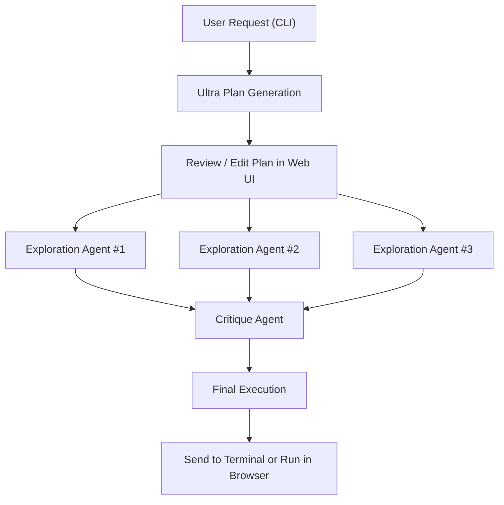

An exploration of how Claude Code Ultra Plan is reshaping the AI development workflow — alongside Y Combinator's AI-native startup model, RunPod serverless GPU deployment, and noteworthy developer tools in the ecosystem.

<!--more-->

## Ultra Plan: Multi-Agent Coding Workflow

A YouTube video from 午後5時 walked through the **Claude Code Ultra Plan** workflow in detail. The core idea is a multi-agent architecture: three exploration agents independently analyze the codebase, and a single critique agent consolidates and validates their findings.



The reported outcome: **tasks that took 15 minutes now take 5**. This isn't just a speed improvement — the exploration agents run in parallel and try different approaches, which means edge cases that a single linear pass might miss tend to get caught. The web UI and desktop integration enables a smooth loop: generate a plan in the CLI, review and refine it in the browser, then send it back to the terminal for execution.

## Y Combinator and the AI-Native Startup Model

Y Combinator's "The New Way To Build A Startup" video was more striking. Anthropic engineers themselves write code using Claude Code, and the video describes **individual engineers running 3-8 Claude instances simultaneously**. The claim that YC companies are shipping "dramatically faster" isn't hype — it reflects a structural change in how software gets built.

What this signals is a shift in the developer's role: from "person who writes code" to "orchestrator of AI agents." The core skill is no longer typing out implementations line by line — it's distributing tasks across multiple AI instances and verifying the results.

## RunPod: Serving LLMs on GPU Cloud

[RunPod](https://runpod.io) is a GPU cloud infrastructure provider — also an OpenAI infrastructure partner. A Korean blog post covering **RunPod Serverless + vLLM** for LLM deployment was one of the more practical guides I found.

```python
# Serving an LLM on RunPod Serverless with vLLM (conceptual)
# Example: gemma-2-9b-it

# 1. Package vLLM + model into a Docker image
# 2. Create a RunPod Serverless endpoint
# 3. Call it via OpenAI-compatible API

import openai

client = openai.OpenAI(
    api_key="your-runpod-api-key",
    base_url="https://api.runpod.ai/v2/{endpoint_id}/openai/v1"
)

response = client.chat.completions.create(
    model="google/gemma-2-9b-it",
    messages=[{"role": "user", "content": "Hello!"}]
)
```

Serverless GPU pods mean you pay nothing during idle time, and the OpenAI-compatible API means existing code only needs a `base_url` swap. The barrier to self-hosting an LLM has dropped considerably.

## Dev Tools Worth Noting

[OpenScreen](https://github.com/siddharthvaddem/openscreen) (27,132 stars) is a free, open-source alternative to Screen Studio — no watermarks, no subscription. Useful for developer tutorials and demo recordings.

The **self.md ui-design plugin** for Claude Code bundles nine UI/UX design skills into a single plugin — from design system setup to component architecture. It's a good example of how Claude Code's plugin ecosystem is maturing into something more than just task shortcuts.

I also compared two different projects that both go by the name **HarnessKit** — both in the AI agent harness space but with distinct approaches. Worth keeping an eye on as the agentic tooling landscape continues to fragment and consolidate.

## Insights

The overarching theme is **orchestration**. Claude Code Ultra Plan decomposes coding tasks into an exploration-critique-execution pipeline. YC startups run multiple AI instances in parallel. RunPod simplifies LLM serving with serverless GPU. The competitive edge is shifting from individual model performance to how well you compose and manage these systems.

The developer role shift is equally significant. Time spent directly writing code is becoming less important than time spent distributing tasks across AI agents and verifying their output. Tools like OpenScreen and self.md reflect this same trend — automating other parts of the development workflow (demo recording, UI design) so the developer can focus on orchestration and judgment.
