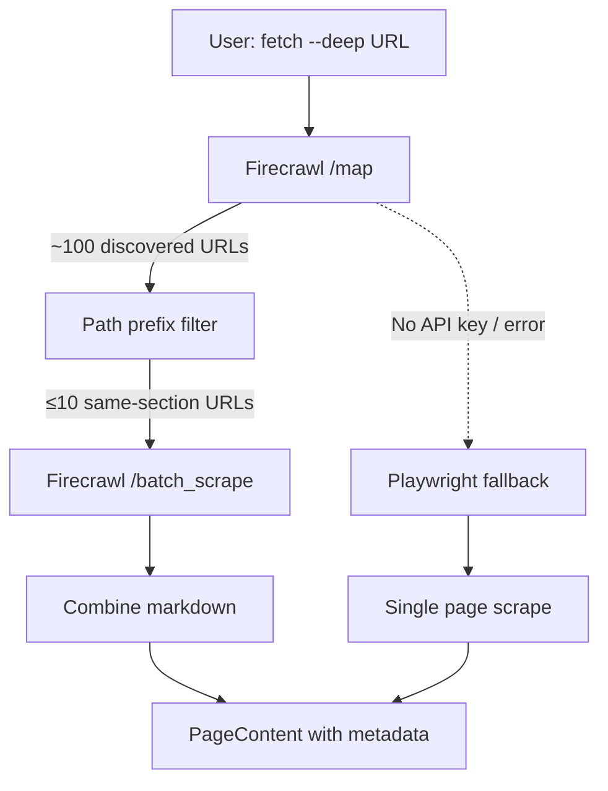

## Overview

Single-page scraping misses context. When a developer visits a docs page, the surrounding pages — API references, guides, tutorials — form a knowledge graph that gives meaning to any single page. Today I integrated Firecrawl into log-blog to crawl entire documentation sections with a single `--deep` flag, falling back to Playwright when the API isn't available.

<!--more-->

## The Problem: One Page Is Never Enough

When building a tool that turns browsing history into blog posts, the naive approach is: visit each URL, extract the text, done. But documentation doesn't work that way. A page about `asyncio.gather()` makes more sense when you also have the pages for `asyncio.create_task()`, error handling, and the event loop architecture.

Playwright can scrape one page at a time. To get the full picture, you'd need to:
1. Parse all links on the page
2. Filter to same-domain, same-section URLs
3. Visit each one sequentially with a headless browser
4. Combine the results

That's slow, resource-heavy, and fragile. Firecrawl solves this with a three-step API pipeline: **map → filter → batch scrape**.

## Firecrawl's Architecture

Firecrawl bills itself as "The Web Data API for AI" — it handles proxy rotation, anti-bot measures, JavaScript rendering, and outputs clean LLM-ready markdown. The key endpoints:

| Endpoint | Purpose | Credits |
|----------|---------|---------|
| `/scrape` | Single page → markdown/JSON | 1 per page |
| `/map` | Discover all URLs on a domain | 1 per call |
| `/batch_scrape` | Scrape multiple URLs async | 1 per page |
| `/crawl` | Full site crawl with link following | 1 per page |
| `/extract` | Structured data extraction | varies |

The `/map` endpoint is the game-changer. It discovers URLs from sitemaps, SERP results, and crawl cache in ~2-3 seconds, returning up to 30,000 URLs per call for a single credit. Combined with `/batch_scrape`, you get parallel fetching without managing browser instances.



## The Implementation

The integration lives in `firecrawl_fetcher.py` with two core functions:

### URL Filtering: `_filter_by_path_prefix()`

The `/map` endpoint returns every URL it can find on a domain. For docs crawling, we only want pages in the same section. The filter uses the parent directory of the input URL as a path prefix:

```python
def _filter_by_path_prefix(
    base_url: str,
    links: list[str],
    max_pages: int = 10,
) -> list[str]:
    parsed = urlparse(base_url)
    base_domain = parsed.netloc
    # Use parent directory as prefix
    # e.g., /guides/intro → /guides/
    path_parts = parsed.path.rstrip("/").rsplit("/", 1)
    base_prefix = path_parts[0] + "/" if len(path_parts) > 1 else "/"

    filtered = []
    for link in links:
        p = urlparse(link)
        if p.netloc != base_domain:
            continue
        if p.path.startswith(base_prefix):
            filtered.append(link)
        if len(filtered) >= max_pages:
            break
    return filtered
```

This means fetching `https://docs.example.com/guides/auth/oauth2` discovers all `/guides/auth/*` pages but skips `/api-reference/*` or `/blog/*`. The `max_pages` cap (configurable via `config.yaml`) prevents runaway crawls on large doc sites.

### Deep Fetch Pipeline: `fetch_docs_deep()`

The main function orchestrates the three-step pipeline:

```python
def fetch_docs_deep(url: str, config: Config):
    client = Firecrawl(api_key=config.firecrawl.api_key)

    # Step 1: Map — discover sub-links
    map_result = client.map(url=url, limit=100)
    all_links = [link.url for link in map_result.links]

    # Step 2: Filter to same path prefix
    filtered = _filter_by_path_prefix(
        url, all_links, max_pages=config.firecrawl.max_pages
    )

    # Step 3: Batch scrape
    batch_result = client.batch_scrape(
        filtered, formats=["markdown"], poll_interval=2
    )

    # Step 4: Combine with section headers
    parts = []
    for page in batch_result.data:
        page_title = page.metadata.title or "Untitled"
        page_url = page.metadata.source_url or ""
        parts.append(f"--- {page_title} ({page_url}) ---")
        parts.append(page.markdown.strip())

    return PageContent(
        url=url, title=first_title,
        text_content="\n".join(parts),
        metadata={"source": "firecrawl", "pages_crawled": len(parts)}
    )
```

The return value is a standard `PageContent` dataclass — the same type Playwright returns. The caller doesn't need to know which fetcher produced the result.

### Graceful Fallback

The integration point in `content_fetcher.py` makes Firecrawl optional:

```python
if deep_urls and url in deep_urls and url_type == UrlType.DOCS_PAGE:
    from .firecrawl_fetcher import fetch_docs_deep
    fc_result = fetch_docs_deep(url, config)
    if fc_result is not None:
        results[url] = fc_result
        continue
# Falls through to Playwright if Firecrawl returns None
```

No API key? Import error? API timeout? Each case returns `None`, and the caller transparently falls back to a single-page Playwright scrape. Users without a Firecrawl account get the same CLI — just without the `--deep` enrichment.

## Firecrawl vs Playwright: When to Use Each

| | Firecrawl | Playwright |
|---|---|---|
| **Best for** | Documentation sites, public content | Authenticated pages, AI chat scraping |
| **Multi-page** | Native (map + batch) | Manual link following |
| **Anti-bot** | Managed proxies, stealth | DIY or basic |
| **Output** | Clean markdown | Raw HTML → custom extraction |
| **Cost** | Per-credit API | Free (compute only) |
| **Auth flows** | Limited | Full browser control (CDP) |

In log-blog, both coexist: Playwright handles generic pages and authenticated AI chat fetching via Chrome DevTools Protocol, while Firecrawl handles deep documentation crawling. The `--deep` flag on `log-blog fetch` triggers Firecrawl for docs URLs.

## Insights

The "managed API + local fallback" pattern is becoming standard for AI-adjacent tooling. Firecrawl handles the complexity of proxy management, JavaScript rendering, and clean markdown extraction — things that are tedious to maintain in a custom Playwright setup. But keeping Playwright as a fallback means the tool works offline, without API keys, and for authenticated content that no external API can access.

What struck me most about the `/map` endpoint is its efficiency: one credit discovers the entire URL structure of a documentation site. Combined with path-prefix filtering, you get precisely the context window an LLM needs — not the whole site, not just one page, but the relevant section. This mirrors how developers actually read docs: starting from one page and expanding outward through the section.

The broader pattern here is that AI tools are shifting from "scrape what you can" to "understand the structure, then fetch what matters." Firecrawl's map-before-scrape approach is the web equivalent of `git log --stat` before `git diff` — survey first, then dive deep.
