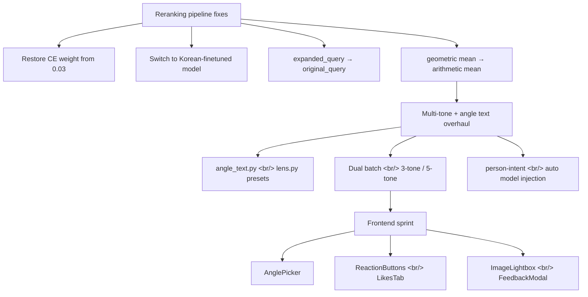
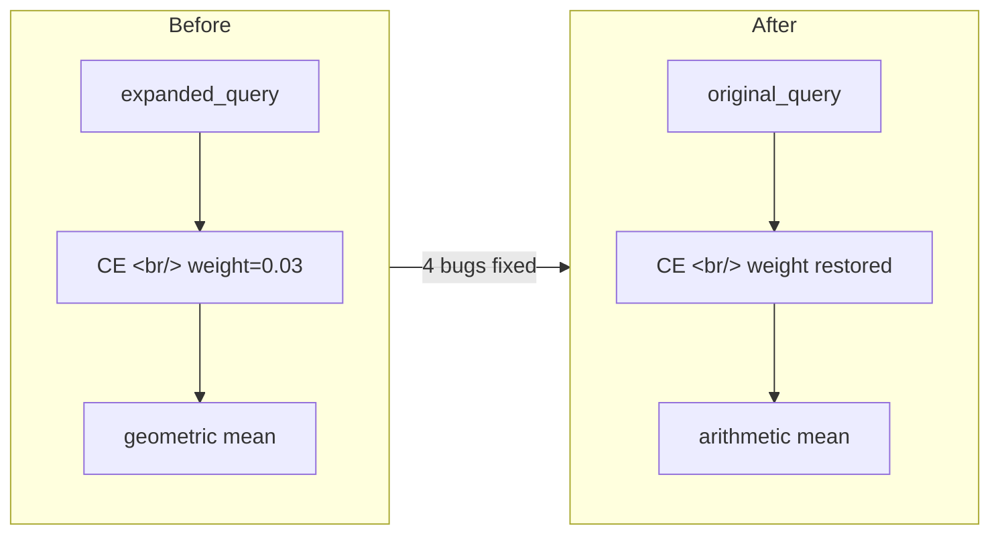

[Previous: Hybrid Image Search Dev Log #11](/ko/posts/2026-04-08-hybrid-search-dev11/)

Dev log #12 covers three major tracks. First, I tracked down and fixed four bugs that had been quietly breaking the reranking pipeline. Second, I replaced the single-tone + angle-image generation approach with a dual-batch system (3-tone and 5-tone) driven by text-based angle directives. Third, I implemented a batch of frontend components — AnglePicker, ReactionButtons, LikesTab, ImageLightbox, and FeedbackModal. Total diff: 42 files, +2,749/-662 lines.

<!--more-->

## Overall Work Flow

## 1. Reranking Pipeline — Four Bugs Fixed at Once

Reranking was effectively doing nothing. When I traced the root cause, I found not one bug but four.

### Problem Analysis

| Bug | Symptom | Impact |
|-----|---------|--------|
| CE weight 0.03 | Cross-Encoder scores contributed only 3% to the final score | Reranking had almost zero effect |
| Model not fine-tuned on Korean | Poor relevance judgment for Korean queries | Degraded search quality |
| Passing `expanded_query` to CE | Expanded query distorted CE scores away from the original intent | Irrelevant results ranked higher |
| Geometric mean | A single low sub-score dragged down otherwise strong partial matches | Good partial matches disappeared from results |

### Fix

All four were fixed together. CE weight was restored to a sensible value, `original_query` replaced `expanded_query` as the Cross-Encoder input, and geometric mean was replaced with arithmetic mean.

I also attempted a model upgrade. `bge-reranker-v2-m3` (568M parameters) showed noticeably better Korean performance, but took 16 seconds per component on an EC2 CPU — not viable in production. I rolled back to `mmarco-mMiniLMv2` (136M) and kept the other three fixes.

## 2. Multi-Tone + Angle Text Overhaul

The previous approach injected a single tone and a single angle reference image per generation. This sprint replaced that entirely.

### Angle: From Images to Text Directives

I removed angle reference images and switched to text-based presets. `angle_text.py` defines presets like "45-degree downward angle," "overhead," and "eye level." `lens.py` adds per-category focal length presets (e.g., 85mm for portraits, 24mm for landscapes).

The advantage is straightforward: no more cost of finding and managing angle reference images, and finer control is possible at the prompt level.

### Tone: Single → Dual Batch (3-tone / 5-tone)

A single generation request now runs a 3-tone batch and a 5-tone batch in parallel. Users can compare results via a tone3/tone5 toggle in the frontend. The DB schema was updated to add multi-tone columns, and `log_generation` was updated accordingly.

### person-intent Auto Model Injection

An `intent_person` field was added to the Gemini classification prompt. If the user's reference images contain no people but the query implies a person, the system automatically injects a model image from the `refs/model_image_ref/` directory. This covers the case where the intent is person-focused but the uploaded references don't include any people.

## 3. Frontend Feature Sprint

Frontend components were built out to match the backend changes.

### New Components

- **AnglePicker** — Search and select angle presets. Fetches the list from `/api/angle-presets`. Integrated into the detail page so the angle can be changed after generation.
- **ReactionButtons** — Quick emoji reaction buttons for generated images.
- **LikesTab** — A gallery tab collecting all images the user has liked.
- **ImageLightbox** — Expanded view on thumbnail click.
- **FeedbackModal** — A modal for submitting detailed text-based feedback.

### Dual-Batch UI

`MAX_REFS` was raised to 7 on the frontend, and dual-batch generation is now supported. The detail page shows multi-tone metadata and a tone3/tone5 toggle.

### API Endpoints

Added `GET /api/angle-presets`, reaction and feedback endpoints, and updated API interface type definitions.

## 4. Production Server Debugging & Infrastructure

### Grafana Data Missing

`DEPLOYMENT_ENV` was not set, and a missing newline in the `.env` file was causing the S3 path to be assembled incorrectly. Both were fixed to restore monitoring data collection.

### Missing DB Migration

The `injected_model_filename` column was absent from the production database, causing the auto model injection feature to fail. A migration script was added to resolve this.

### Infrastructure Improvements

- Switched prod SSH key to ed25519 and added a lifecycle guard
- Closed open ports and configured nginx reverse proxy
- Removed duplicate 401 errors that occurred during startup auth checks
- Fixed mobile responsive layout
- Updated Security Group descriptions to match AWS validation requirements
- Removed `APP_ENVIRONMENT` from ecosystem.config.js

## Wrap-Up

The most meaningful work in this sprint was the reranking fix. Four bugs coexisted in a way that masked each other's effects — fixing them one at a time actually made results worse in some cases. Only after fixing all four simultaneously did reranking start working correctly.

The dual-batch generation and text-based angle directives haven't gathered enough user feedback yet. The next step is to use reaction and feedback data to validate whether 3-tone or 5-tone is preferred, and whether text angle presets actually outperform angle reference images.
