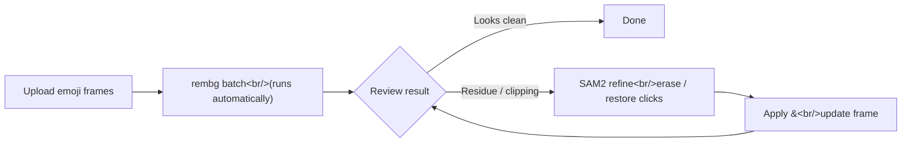

> [Previous post: PopCon Dev Log #4](/en/posts/2026-04-08-popcon-dev4/)

## Overview

Dev Log #4 covered SAM 2.1 interactive segmentation and cost optimization. This post picks up from there: building out the **refine page from scratch** and completing a **hybrid pipeline** that runs rembg in batch first, then lets SAM2 handle the touch-ups. On the video side, I upgraded to wan2.6-i2v-flash at 720P and rewrote the motion prompts around physical body mechanics.

<!--more-->

## 1. Hybrid Background Removal Pipeline

### The problem: rembg alone isn't enough

rembg is fast and great for batch processing, but with complex-boundary images like emoji frames, it often leaves background residue or clips off parts of the character. SAM2 is precise, but clicking through every single frame one by one takes forever.

### The solution: rembg batch → SAM2 touch-up

The answer was to combine both tools' strengths into a hybrid approach.



The key idea is that when the user navigates to `/refine`, **rembg runs automatically** in the background while a loading screen is displayed. Once it finishes, the user lands directly in the refine canvas and only needs to touch up the frames that need it.

```typescript
// refine/page.tsx — trigger auto-rembg on page load
useEffect(() => {
  if (frames.length > 0 && !rembgComplete) {
    runRembgOnAllFrames(frames).then(() => {
      setRembgComplete(true);
    });
  }
}, [frames]);
```

### SAM2 erase / restore refinement

SAM2 on top of the rembg result operates in two modes:

- **Erase**: click a leftover background region — it gets masked out
- **Restore**: click a part of the character that rembg accidentally removed — it gets restored from the original

`RembgRefineCanvas.tsx` collects canvas click coordinates and sends a list of points to the backend SAM2 endpoint. One tricky part: **multi-point input must be wrapped as a single object**. If the SAM2 API interprets each point as a separate object, you get one mask per point instead of a single unified mask.

```python
# backend/main.py — wrap multi-point as single object
input_points = [[p["x"], p["y"]] for p in points]
input_labels = [p["label"] for p in points]  # 1=foreground, 0=background

# Pass as single object to get one unified mask
masks, scores, _ = predictor.predict(
    point_coords=np.array([input_points]),
    point_labels=np.array([input_labels]),
    multimask_output=False,
)
```

## 2. Dedicated Refinement Canvas for Character Images

Beyond emoji frames, the **character source image** also needs SAM2 refinement. If the character upload has a messy background, it propagates problems through the entire downstream pipeline.

I built `CharacterRefineCanvas.tsx` as a standalone component called from `CharacterUpload.tsx`. The erase/restore logic is identical to the emoji side, but the UI focuses on a single image without frame navigation.

## 3. Refine UX Polish

The pipeline was working, but using it in practice exposed a pile of UX issues. A significant portion of the 24 commits in this sprint went into fixing them.

### Side-by-side original reference

When refining, you constantly need to check "is this part background or character?" — which means you need the original visible. I added a side-by-side layout with the original next to the refine canvas, and **synchronized crosshairs** so the mouse position shows up on both views simultaneously.

### Frame navigation

Emoji sets typically have dozens of frames. I added arrow-key navigation between frames and a clickable thumbnail strip at the bottom. Per-frame SAM2 segmentation state also resets automatically on frame switch.

### Toolbar consolidation

The initial version had buttons scattered everywhere. I moved undo / reset / apply into a compact toolbar above the canvas and collapsed everything into a single row. A tabbed UI lets you toggle between viewing the rembg result and entering SAM2 refine mode.

### Small bug fixes

- **Click dots lingering after Apply** — fixed by clearing the dots array in the apply event handler
- **Unnecessary CORS preflight on same-origin images** — setting `crossOrigin` on a canvas `Image` object triggers a preflight even for same-origin URLs; removed the unneeded attribute

## 4. Video Generation Upgrade

### wan2.6-i2v-flash at 720P

I upgraded the video generation model to **wan2.6-i2v-flash** and bumped the resolution to 720P. The model parameter update also required a field name change in the API call.

```python
# Renamed prompt_extend → extend_prompt, added negative_prompt
response = client.video.generate(
    model="wan2.6-i2v-flash",
    image=image_url,
    prompt=motion_prompt,
    extend_prompt=True,        # was: prompt_extend
    negative_prompt="blurry, low quality, distorted",
    resolution="720P",
)
```

### Motion prompt rewrite

The old motion presets were simple instructions like "wave hand" or "nod head". I rewrote them as **detailed physical body mechanics descriptions**. For example:

- Before: `"wave hand"`
- After: `"character raises right arm from resting position, forearm rotates at elbow joint, hand pivots at wrist with fingers spread, smooth pendulum motion"`

### Background prompt correction

Effects (particles, light, etc.) were sticking to the character during video generation. I added an explicit instruction to keep effects separate from the character and forced a **solid white background** in the prompt.

## 5. Matting Model Benchmark

### Why a separate benchmark was needed

I kept saying rembg works "most of the time," but had no quantitative evidence. To systematically compare which matting model works best for the specific domain of LINE animated emoji frames, I created a dedicated repository: **popcon-matting-bench**.

### Test conditions

Six models/configurations were compared:

| Model | Description |
|-------|-------------|
| rembg | Default U2-Net based (baseline) |
| rembg_enhanced | rembg with enhanced post-processing |
| MODNet ONNX | Lightweight 25MB portrait matting |
| ViTMatte_5 | trimap width 5px |
| ViTMatte_10 | trimap width 10px |
| ViTMatte_20 | trimap width 20px |
| RVM | Robust Video Matting (designed for real human video) |

### Metrics

Two metrics were used:

- **Halo Score**: White fringe intensity at the alpha edge when composited on a black background. Lower is better.
- **Coverage Ratio**: Foreground area relative to the rembg baseline. 1.0 means identical to baseline.

```python
# Halo Score calculation — measures white fringe at alpha boundary
def compute_halo_score(alpha: np.ndarray, rgb: np.ndarray) -> float:
    """Measure brightness leakage at alpha edge on black composite."""
    # Extract alpha boundary (pixels where 0 < alpha < 255)
    edge_mask = (alpha > 10) & (alpha < 245)
    if edge_mask.sum() == 0:
        return 0.0
    # Composite on black background
    composite = (rgb * (alpha[..., None] / 255.0)).astype(np.uint8)
    # Average brightness at edge region
    edge_brightness = composite[edge_mask].mean() / 255.0
    return float(edge_brightness)
```

### Results: cartoon bear character (24 frames)

| Model | Clean Rate | Halo Score | Coverage Ratio | Notes |
|-------|-----------|------------|----------------|-------|
| **rembg** | **100%** | **0.000** | **1.000** | Best for high-contrast cartoon |
| rembg_enhanced | 100% | 0.000 | 1.000 | Identical to rembg |
| ViTMatte_20 | 100% | 0.031 | 1.016 | Best detail preservation (motion lines, effects) |
| ViTMatte_10 | 100% | 0.024 | 1.008 | Stable |
| ViTMatte_5 | 100% | 0.018 | 1.002 | Conservative |
| MODNet | 96% | 0.045 | 0.860 | Loses 14% of foreground (portrait-trained) |
| RVM | 42% | 0.089 | 0.630 | Destroys cartoon content (real video-trained) |

### Conclusions

- **rembg**: For thick-outline, high-contrast cartoon characters — zero halo, 100% coverage. No additional model needed.
- **ViTMatte_20**: For frames with thin lines, pastel tones, or motion blur, it preserves 1.6% more detail than rembg. Suitable for complex emoji.
- **MODNet / RVM**: Optimized for portraits and real-world video respectively — unsuitable for cartoon emoji. MODNet loses 14% of foreground; RVM loses 37%.

This benchmark drove the hybrid pipeline design decision — simple characters are handled fine by rembg auto-processing, and only complex frames need SAM2 touch-up.

## 6. Other Improvements

### Custom prompt editor

Users can now edit motion prompts directly in a text editor. Editor state persists across page navigation.

### Download buttons

Added per-frame and per-video download buttons so refined frames and generated videos can be saved individually.

## Summary

The theme of this sprint was **balancing automation with manual touch-up**.

| Area | What changed |
|------|--------------|
| Background removal | rembg auto-batch → SAM2 manual touch-up hybrid |
| Matting benchmark | 6 models compared — rembg best for high-contrast cartoon, ViTMatte_20 best for detail preservation |
| Refine UX | Side-by-side reference, keyboard navigation, tabbed UI |
| Character refinement | Dedicated SAM2 canvas separated out |
| Video generation | wan2.6-i2v-flash 720P, body mechanics prompts |
| Convenience | Custom prompts, download buttons, state persistence |

With rembg handling ~90% of the work and SAM2 catching the remaining 10%, the time spent removing backgrounds across dozens of emoji frames dropped to less than half of what it was before. The next post will cover deploying these finished assets to actual sticker and emoji platforms.
