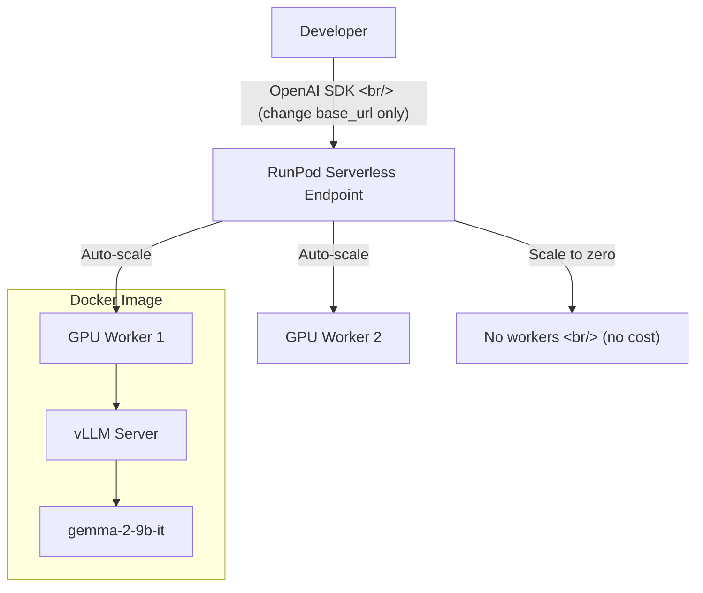
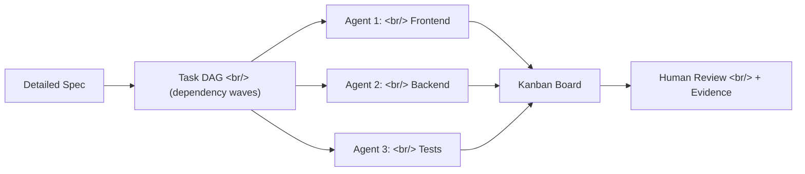

## Overview

Self-hosting LLMs is getting dramatically easier. RunPod Serverless with vLLM provides OpenAI-compatible API endpoints with zero idle costs. Meanwhile, the open-source dev tool ecosystem is filling gaps — OpenScreen replaces paid screen recording, and HarnessKit proposes engineering patterns for AI agent orchestration.

<!--more-->

## RunPod Serverless: GPU Cloud Without Idle Costs

[RunPod](https://runpod.io) is a GPU cloud infrastructure service — notably, also an infrastructure partner for OpenAI. The key proposition: serverless GPU pods that scale to zero when not in use, with an OpenAI-compatible API layer.



### The vLLM Integration

The deployment pattern uses vLLM as the inference engine inside a Docker container on RunPod's serverless platform:

```python
# The entire migration from OpenAI to self-hosted:
# Just change the base_url and api_key

import openai

client = openai.OpenAI(
    api_key="your-runpod-api-key",
    base_url="https://api.runpod.ai/v2/{endpoint_id}/openai/v1"
)

response = client.chat.completions.create(
    model="google/gemma-2-9b-it",
    messages=[{"role": "user", "content": "Hello!"}]
)
```

The barrier to self-hosted LLMs has dropped to: package a model in a Docker image with vLLM, deploy to RunPod Serverless, and swap your `base_url`. Existing code using the OpenAI SDK works unchanged. Supported models include Llama 3, Mistral, Qwen3, Gemma, DeepSeek-R1, and Phi-4.

### FlashBoot: Solving Cold Starts

The biggest pain point with serverless GPU is cold start latency — spinning up a new worker with a large model can take 60+ seconds. RunPod's FlashBoot optimization reduces this to ~10 seconds at roughly 10% additional cost. It retains model state after spin-down so workers warm up faster on the next request. For bursty traffic patterns (typical of developer tools), this makes the difference between "usable" and "feels broken."

### Why This Matters

The serverless model eliminates the biggest pain point of GPU cloud: paying for idle time. Traditional GPU instances charge by the hour whether you're running inference or not. RunPod's serverless pods spin up on request and scale down to zero, making self-hosted LLMs viable for intermittent workloads — exactly the pattern most developer tools follow.

For teams building AI features, this creates a practical middle ground between:
- **OpenAI/Anthropic APIs** — simple but expensive at scale, no model customization
- **Dedicated GPU servers** — full control but high fixed costs
- **RunPod Serverless** — self-hosted models with usage-based pricing

## OpenScreen: Free Screen Recording for Developers

[OpenScreen](https://github.com/siddharthvaddem/openscreen) (27,321 stars) is an open-source alternative to Screen Studio — the $29/month screen recording tool popular with developers for creating product demos and tutorials.

Built with Electron and TypeScript, using PixiJS for rendering, OpenScreen covers more than just basics:
- Automatic and manual zoom with adjustable depth on clicks
- Auto-pan and motion blur for smooth animations
- Screen capture with webcam overlay and resizable webcam
- Crop capability with custom backgrounds (solid colors, gradients, wallpapers)
- Microphone + system audio recording with undo/redo
- Export to MP4 (with recent fixes for Wayland/Linux)
- No watermarks, free for commercial use

The project grew explosively — spiking 2,573 stars in a single day at its peak. With 380+ pull requests and active i18n contributions (Turkish, French), it's rapidly closing the gap with Screen Studio. The main missing features are Screen Studio's polished cursor effects and auto-framing, but for developer demos, OpenScreen already delivers.

### Why Developers Need This

Developer advocacy and documentation increasingly require video. READMEs with GIFs, PR descriptions with screen recordings, and demo videos for launches. Screen Studio's quality is excellent but $29/month adds up when all you need is a clean recording of a terminal session or UI interaction.

## HarnessKit: Patterns for AI Agent Orchestration

[HarnessKit](https://github.com/deepklarity/harness-kit) (32 stars) by deepklarity takes a different angle on AI agent tooling. Rather than being another orchestration framework, it focuses on **engineering patterns** around agent-based development:

- **TDD-first execution** — agents write tests before implementation
- **Structured debugging** — systematic approach to agent failures
- **Knowledge compounding** — each run makes the next one better
- **Cost-aware delegation** — track and optimize token spend per agent

The architecture provides a kanban board UI, DAG-based task decomposition, and per-agent cost tracking. The philosophy is notable: "The system is only as good as the specs you feed it. Spend time on the spec, not the code."



### Same Name, Different Approach

Interestingly, there's another project also called HarnessKit (the Superpowers plugin) that focuses on Claude Code integration — harness configuration, toolkit management, and feature tracking via `.harnesskit/` directory. Comparing the two reveals the breadth of approaches to the same problem: how to structure human-AI collaboration for software development.

deepklarity's version leans into visual project management (kanban, DAG views) while the Superpowers version focuses on CLI-native developer experience (skills, hooks, worktrees). Both share the insight that the orchestration layer matters more than any individual agent's capability.

## Insights

The thread connecting RunPod, OpenScreen, and HarnessKit is **democratization through tooling**. RunPod makes GPU inference accessible without DevOps expertise. OpenScreen makes screen recording free without sacrificing quality. HarnessKit attempts to make multi-agent orchestration systematic rather than ad-hoc.

RunPod's serverless model is particularly significant because it removes the last major objection to self-hosted LLMs: cost unpredictability. With scale-to-zero and OpenAI-compatible APIs, teams can experiment with open-weight models (Gemma, Llama, Mistral) without committing to dedicated infrastructure.

The open-source dev tool wave reflects a broader pattern: as AI lowers the barrier to building software, the tools surrounding the development process — recording, orchestrating, deploying — need to keep pace. The tools that win are the ones that reduce friction without requiring expertise in their domain. RunPod hides GPU management. OpenScreen hides video production. HarnessKit tries to hide agent coordination. The question is whether abstraction holds up under real-world complexity.
