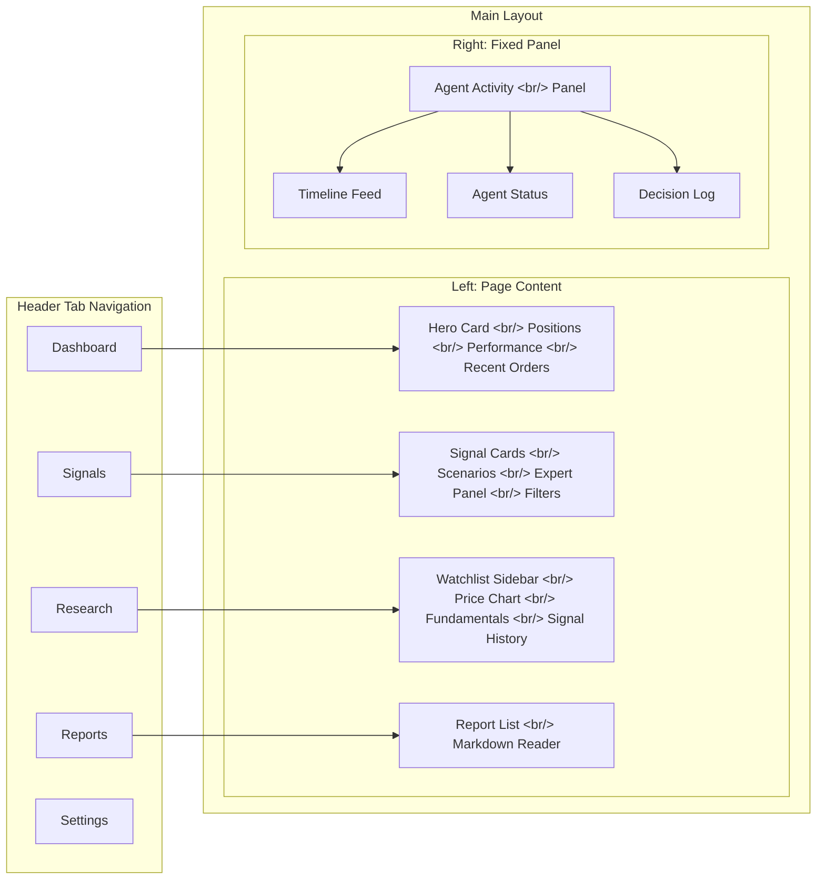

The old Trading Agent UI had a structural problem: the most important feature was one click away. Here's how I rebuilt it from the ground up with Tailwind CSS v4 and shadcn/ui — five pages, a persistent Agent Activity panel, and a layout that finally matches how the tool is actually used.

<!--more-->

> [Previous: Trading Agent Dev Log #9](/en/posts/2026-04-08-trading-agent-dev9/) — ATR-based dynamic stop-loss and investment horizon management

## The Problem: Core Functionality Was Buried

The whole point of the Trading Agent UI is **monitoring agent activity** — watching in real time which agents fired, what signals they generated, and how decisions were reached. That's the primary use case.

Yet the old layout had this core feature **hidden in a secondary tab**. Meanwhile, the chat interface occupied a prominent chunk of the screen at all times. The thing I used 80% of the time required an extra click to see. That's not something you patch — it's a structural problem that demands a full redesign.

## Design First

Rather than jumping straight to code, I dedicated a separate session (Session 3) entirely to design. I built an HTML mockup to nail down the layout, wrote a spec document, then broke the implementation into 12 discrete tasks.

The core principles for the new layout:

1. **Agent Activity is always visible** — fixed right panel, visible from every page
2. **Header tabs for page navigation** — Dashboard / Signals / Research / Reports / Settings
3. **Chat is on-demand** — available when needed, not always on screen

## Implementation: Building from Scratch

### Step 1: Foundation — Tailwind CSS v4 + shadcn/ui

I stripped out all the existing styles and started fresh with **Tailwind CSS v4** and **shadcn/ui**.

The case for shadcn/ui was straightforward:
- Copy-paste architecture means full customization freedom
- Built on Radix UI, so accessibility comes for free
- Pairs perfectly with Tailwind

In this step I set up **17 UI components** in one go: Button, Badge, Card, Command, Dialog, Table, and more. This added roughly 4,900 lines — mostly shadcn/ui component code.

### Step 2: Layout Shell

I rewrote `app.tsx` from scratch. The old 190 lines were replaced with a new 277-line structure.

Key components:
- **`header.tsx`** — five-tab navigation
- **`main-layout.tsx`** — split layout with left content area and right Agent Activity panel

### Step 3: Agent Activity Panel

The most important component in the whole redesign. It has three sub-views:

| Sub-view | Purpose | Key Components |
|---|---|---|
| **Timeline** | Real-time event stream | `timeline-feed.tsx`, `flow-event.tsx` |
| **Agent Status** | Current state of each agent | `activity-panel.tsx` |
| **Decision Log** | Decision chain tracing | `decision-chain.tsx` |

Since this panel is pinned to the right side on every page, you never lose sight of what the agents are doing.

### Step 4: Five Main Pages

**Dashboard** — The heaviest page (+631 lines). A Hero Card summarizes the portfolio, Positions Table shows current holdings, Performance Chart tracks returns over time, and Recent Orders shows the latest trade history at a glance.

**Signals** — Signal cards, scenario rows, an expert panel, and filters. You can see at a glance which scenario generated each signal and where each expert agent stands on it.

**Research** — Watchlist Sidebar on the left, Price Chart and Fundamentals Card in the main area, Signal History at the bottom. The deep-dive view for a single ticker.

**Reports** — Report list on the left, Markdown Reader on the right. For reading the analysis reports generated by the agents.

**Settings** — Placeholder for now.

## Commit History

| # | Description | Delta |
|---|---|---|
| 1 | Tailwind CSS v4 + shadcn/ui foundation | +793/-73 |
| 2 | 17 shadcn/ui components | +4,896/-50 |
| 3 | Layout shell (header tabs, split panel) | +277/-190 |
| 4 | Agent Activity panel | +358/-3 |
| 5 | Dashboard page | +631/-1 |
| 6 | Signals page | +194/-1 |
| 7 | Research page | +289/-1 |
| 8 | Reports page | +115/-1 |

56 files changed, **+7,747 / -514 lines** total.

## Retrospective

### What Went Well

- **Design first**: Doing the HTML mockup, spec document, and 12-task plan before writing a single line of production code kept implementation on track. No mid-session course corrections.
- **Rewrite over patch**: The old code had structural problems, so structural fixes were required. Layering patches on top would have just moved the debt around.
- **Always-on core feature**: Pinning the Agent Activity panel as a fixed sidebar means you can check agent state at any time without switching tabs.

### What's Next

- Implement the Settings page
- Live WebSocket data (currently using mock data throughout)
- Responsive layout (handling the Agent Activity panel on mobile)
- Dark mode support

---

*Continued in the next entry of the Trading Agent series.*
