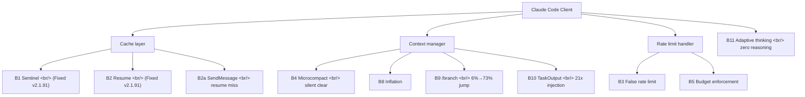
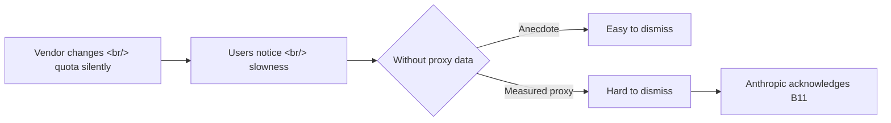

## Overview

[ArkNill/claude-code-hidden-problem-analysis](https://github.com/ArkNill/claude-code-hidden-problem-analysis) is one of the most thorough pieces of community reverse engineering I've seen for any developer tool. It catalogs **11 confirmed client-side bugs** in Claude Code, of which **9 remain unfixed across six releases (v2.1.92–v2.1.97)**, and reconstructs the server-side quota system from intercepted HTTP headers. This post summarizes what's actually in there.

<!--more-->

## Where the Bugs Sit

The repo's bug taxonomy hits three layers: **cache** (B1, B2, B2a), **context** (B4, B8, B9, B10), and **rate limiting** (B3, B5, B11). Anthropic shipped fixes for B1 and B2 in v2.1.91; nothing else has moved across six subsequent releases. The maintainer cross-references the changelog to make this case explicitly.

## The Proxy Dataset

What separates this analysis from ordinary "Claude Code feels slower" complaints is the data. The maintainer runs a transparent HTTP proxy (**cc-relay**) that captures every request between the Claude Code client and Anthropic's API. The April 8 dataset covers:

- **17,610 requests** across **129 sessions** (April 1-8)
- **532 JSONL files** (158.3 MB) of raw session logs
- **Bulk bug detection** automated across the dataset

The numbers that jump out:
- **B5 budget enforcement events:** went from 261 (single-day measurement on Apr 3) to **72,839 (full week April 1-8)** — a 279× increase in detection volume as the dataset grew, suggesting the bug fires on virtually every long session
- **B4 microcompact events:** 3,782 events that silently cleared **15,998 items** mid-session
- **B8 context inflation:** 2.37× average across 10 sessions, max 4.42× — universal, not isolated
- **Synthetic rate limit (B3):** 183 of 532 files (34.4%) contain `<synthetic>` model entries — pervasive

Cache efficiency held at 98-99% across all session lengths on v2.1.91, confirming the cache regression really is fixed. Per-request cost scales with session length — `$0.20/req` for 0-30 minute sessions vs `$0.33/req` for 5+ hour sessions. The maintainer attributes this to structural context growth, not version-specific bugs.

## The Quota Architecture Reverse Engineered

The most interesting single finding is the quota system reconstruction from `anthropic-ratelimit-unified-*` headers across **3,702 requests** (April 4-6). The headline:

**Dual sliding window system:** two independent counters running in parallel — a **5-hour** window (`5h-utilization`) and a **7-day** window (`7d-utilization`). The `representative-claim` field is `five_hour` in **100% of requests** observed — i.e., the 5-hour window is *always* the bottleneck, never the 7-day one.

Per-1% utilization measurements on Max 20x ($200/mo):

| Metric | Range per 1% |
|--------|--------------|
| Output tokens | 9K-16K |
| Cache Read tokens | 1.5M-2.1M |
| Total Visible | 1.5M-2.1M |
| 7d accumulation ratio | 0.12-0.17 |

### The Thinking-Token Blind Spot

Here's the unsettling part. Extended thinking tokens are **not included** in the `output_tokens` field returned by the API. At 9K-16K visible output per 1%, a full 100% 5-hour window equals only 0.9M-1.6M visible output tokens — implausibly low for several hours of Opus work. The pattern is consistent with thinking tokens being counted against the quota server-side without being reported client-side. The maintainer explicitly flags this as unconfirmed from the client and proposes a thinking-disabled isolation test.

This matters because it means **Max plan users have no way to predict when they'll hit the wall** — the visible token counter understates true consumption by a factor that depends on how much thinking the model does, which the user cannot observe.

## Community Cross-Validation

Two independent contributors back the analysis with their own data:
- **@fgrosswig**: dual-machine 18-day JSONL forensics shows a **64× budget reduction** between March 26 (3.2B tokens, no limit) and April 5 (88M tokens at 90%)
- **@Commandershadow9**: separate cache-fix forensics shows **34-143× capacity reduction**, independent of the cache bug, supporting the thinking-token hypothesis

Anthropic acknowledged B11 (adaptive thinking zero-reasoning → fabrication) on Hacker News but has not followed up.

## Why This Analysis Matters

The repo is essentially a worked example of why **transparent observability of vendor APIs matters**. Without `cc-relay` capturing actual headers and JSONL forensics, every claim in the analysis would be dismissable as "user error" or "your prompts are different now." With 17K requests on the record, the conversation shifts to "what is the server actually doing differently."

The companion repo [ArkNill/claude-code-cache-analysis](https://github.com/ArkNill/claude-code-cache-analysis) has the cache-specific deep dive and a [quickstart guide](https://github.com/ArkNill/claude-code-hidden-problem-analysis/blob/main/09_QUICKSTART.md) for users who want to skip the analysis and just apply the workarounds.

## Insights

This is what good developer-tool QA looks like when the vendor is opaque. The pattern — run a transparent proxy, log every header, automate bug detection across hundreds of sessions, cross-reference the changelog — is portable to any opaque API service. The thinking-token blind spot in particular is a case study in **why client-side telemetry from a vendor is not enough**; you need server-side headers or you can't see the bottleneck. For Claude Code users on Max plans, the practical implications are concrete: log your sessions, don't assume `output_tokens` reflects true cost, and watch the `5h-utilization` header if you're hitting walls. For everyone building on top of LLM APIs, the lesson is that **observability infrastructure pays for itself the first time a vendor changes quota behavior without telling you.**

## Quick Links

- [ArkNill/claude-code-hidden-problem-analysis](https://github.com/ArkNill/claude-code-hidden-problem-analysis) — main repo
- [ArkNill/claude-code-cache-analysis](https://github.com/ArkNill/claude-code-cache-analysis) — cache-specific deep dive
- [Korean version (ko/README.md)](https://github.com/ArkNill/claude-code-hidden-problem-analysis/blob/main/ko/README.md)
- [13_PROXY-DATA.md](https://github.com/ArkNill/claude-code-hidden-problem-analysis/blob/main/13_PROXY-DATA.md) — proxy dataset details
