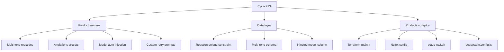

## Overview

Following [Previous Post: #12](/posts/2026-04-10-hybrid-search-dev12/), this is the 13th cycle. 39 commits across backend, frontend, and infrastructure — the largest single cycle yet. Three threads weave together: **product** (multi-tone reactions, angle/lens presets, custom retry prompts), **data layer** (alembic migrations for new reaction shapes), and **production cutover** (EC2 + Nginx + Terraform).

<!--more-->

## Three Threads in One Cycle

---

## Multi-Tone Reactions

The reaction system gained tone awareness — instead of a single 👍/👎 per image, users can react with multiple tone+angle combinations. Three alembic migrations land it:
- `add_multi_tone_angle_text_reactions_*.py` — schema for the new reaction shape
- `add_unique_constraint_to_image_reactions.py` — prevents duplicate reactions per (user, image, tone)
- `add_injected_model_filename_to_*.py` — tracks which model produced the reacted-to variant

Frontend changes (`ReactionButtons.tsx`, `LikesTab.tsx`, `FeedbackModal.tsx`) surface the tone picker.

---

## Angle and Lens Presets

A library of named photographic presets — angle ("eye-level", "low-angle", "dutch tilt") and lens ("35mm", "85mm portrait", "fisheye") — that get injected into generation prompts. Backend tests under `backend/tests/test_angle_presets.py` and `test_lens_presets.py` verify the prompt construction. Frontend `AnglePicker.tsx` provides the visual selector.

---

## Model Auto-Injection for Person-Intent Prompts

When the user's prompt is detected as person-focused, the generation pipeline auto-injects a person-tuned model checkpoint. The injection logic lives in `backend/src/generation/injection.py` and is wired through `prompt.py` and `service.py`. The migration `add_injected_model_filename_to_*.py` records which model was injected for each generation, so the UI can show provenance.

---

## Production Cutover

The biggest infra delta. Previous cycles ran on a developer EC2 with manual deployment. This cycle:
- `terraform/main.tf` — defines the prod VPC, EC2 instance, and security groups
- `terraform/keys/prod.pub` — production SSH key
- `infra/nginx/diffs-image-agent.conf` — Nginx reverse proxy config (TLS termination, route splitting between frontend and backend)
- `scripts/setup-ec2.sh` — provisioning script (uv, node, postgres client, pm2)
- `ecosystem.config.js` — pm2 process definitions, with a fix to remove `APP_ENVIRONMENT` (was conflicting with the .env loader)

After this cycle, the app lives at a real domain behind Nginx with auto-restart via pm2.

---

## Commit Log (Highlights — 39 total)

| Message | Area |
|---------|------|
| feat: add model auto-injection for person-intent prompts | generation/injection.py |
| feat: multi-tone reactions with unique constraint | reactions.py + alembic |
| feat: angle and lens preset libraries | generation/{angle,lens}_presets.py |
| infra: terraform main.tf + nginx config + EC2 setup script | terraform/, infra/, scripts/ |
| fix: remove APP_ENVIRONMENT from ecosystem.config.js | ecosystem.config.js |
| feat: feedback modal + reaction buttons | frontend/components/* |

---

## 인사이트 (Insights)

Three things stand out from this 39-commit cycle. First, **the alembic migration count tracks product velocity** — three migrations in one cycle means the data model is genuinely evolving, not just being patched. Second, **landing prod deploy in the same cycle as new features is risky but fast** — historically these are split across cycles, but bundling them means the new features get tested under realistic conditions immediately. Third, the angle/lens preset pattern (named presets injected into prompts) is the same pattern as the model auto-injection — both are forms of *prompt enrichment based on user signal*. That's the right abstraction to formalize next cycle: a unified prompt enrichment pipeline where presets, model selection, and persona injection all flow through the same hook.
