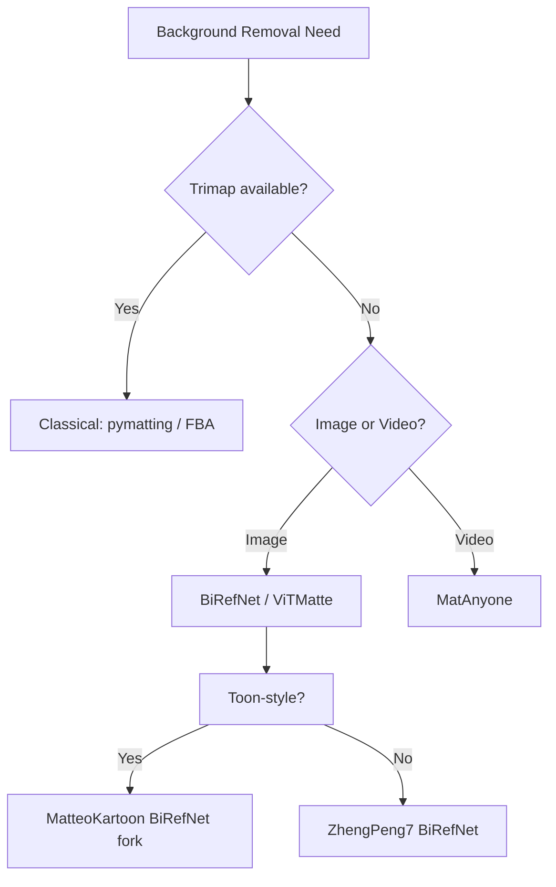
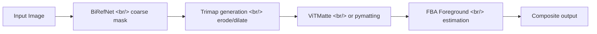

## Overview

Building [popcon-matting-bench](https://github.com/ice-ice-bear/popcon-matting-bench) forced a survey of every credible open-source matting library. The space breaks into three eras: classical algorithms (pymatting, FBA), trimap-free deep models (BiRefNet, ViTMatte), and the new generation of stable video matting (MatAnyone). This post maps the landscape and notes which model wins for which job.

<!--more-->

## Today's Exploration Map

## BiRefNet — High-Resolution Dichotomous Segmentation

[ZhengPeng7/BiRefNet](https://github.com/ZhengPeng7/BiRefNet) (CAAI AIR 2024) is the model nearly every recent background-removal demo, including [birefnet.top](https://www.birefnet.top/), is built on. It targets *dichotomous image segmentation* — high-resolution binary foreground/background masks — and it does so with a bilateral reference design: two streams (one for the source image, one for a reference) cross-attend through the U-Net decoder.

Two things make BiRefNet stand out:
1. **Resolution.** Most segmentation models top out at 1024×1024; BiRefNet has weights for 2048×2048 and the architecture handles arbitrary aspect ratios well. For e-commerce or asset extraction, this is decisive.
2. **Generalization.** The default `general` checkpoint handles humans, products, animals, and abstract shapes. Specialized variants (`portrait`, `matting`, `dis5k_general`) are available on Hugging Face if you need accuracy on a specific domain.

[MatteoKartoon/BiRefNet](https://github.com/MatteoKartoon/BiRefNet) is a fork called **ToonOut** that fine-tunes BiRefNet on toon/sticker datasets — relevant for any product generating animated emoji or cartoon assets. The fork mostly changes the training data and the evaluation harness; the core model is unchanged.

## ViTMatte — ViT Backbone, Trimap Input

[hustvl/ViTMatte](https://github.com/hustvl/ViTMatte) (Information Fusion vol.103, March 2024) takes a different bet: a Vision Transformer backbone with explicit trimap input. The trimap (foreground / background / unknown regions) is a hard requirement, which makes ViTMatte less plug-and-play than BiRefNet but **significantly more accurate on hair, fur, and translucent edges** when you can supply one. The pipeline pattern is: BiRefNet produces an initial mask → erode/dilate to a trimap → ViTMatte refines the alpha at sub-pixel quality.

## MatAnyone — Stable Video Matting (CVPR 2025)

[pq-yang/MatAnyone](https://github.com/pq-yang/MatAnyone) targets the hardest matting problem: **temporal stability**. Frame-by-frame matting on video produces flicker — the alpha mask jitters by a pixel or two between frames, which the human eye picks up immediately. MatAnyone introduces memory-augmented region propagation: the model carries a memory bank of past frames' high-confidence regions and uses them to constrain the current frame's mask. The result is video matting that doesn't shimmer.

This matters for popcon's animated-emoji pipeline: extracting a clean alpha across 30 frames requires either MatAnyone or a hand-rolled temporal smoother on top of BiRefNet.

## pymatting and FBA — The Classical Baselines

[pymatting/pymatting](https://github.com/pymatting/pymatting) (1.9k stars, MIT) implements every classical alpha matting method worth knowing — Closed-Form, KNN, Large Kernel, Random Walk, Shared Sampling — plus Fast Multi-Level Foreground Estimation. It requires a trimap but runs entirely on CPU (with optional CuPy/PyOpenCL acceleration for foreground estimation). The library is also the foundation of [Rembg](https://github.com/danielgatis/rembg), the most widely deployed open-source background removal tool.

[MarcoForte/FBA_Matting](https://github.com/MarcoForte/FBA_Matting) is the official "F, B, Alpha" matting paper repo — predicts foreground color, background color, and alpha jointly, which gives much cleaner composites when the foreground and background colors differ subtly.

The classical methods aren't obsolete. For high-throughput batch processing where a trimap is available (e.g., chroma-key footage, scanned documents), they're often **10-100× faster** than deep models with comparable quality.

## Architecture Pattern for popcon-matting-bench

The benchmark repo's job is to score each model on standard datasets (DIS-5K, AIM-500, RealWorldPortrait636) and produce a comparison harness. Key metrics: SAD, MSE, Grad, Conn for alpha quality; mIoU for binary segmentation; latency per 1024×1024 image on a single A100.

## Insights

The matting space has bifurcated cleanly: **BiRefNet owns high-resolution segmentation, ViTMatte owns trimap-refined alpha, MatAnyone owns video, and pymatting/FBA own the classical CPU path.** There's no single model that wins everywhere — production pipelines almost always cascade two or three. The interesting business question is no longer *which model* but *what trimap workflow you want*: zero-shot (BiRefNet alone) trades quality for ergonomics, while two-stage (BiRefNet → ViTMatte) trades latency for hair-grade accuracy. ToonOut shows the path forward for verticalized matting — the base model is good enough that fine-tuning on niche datasets is a low-risk play.

## Quick Links

- [ZhengPeng7/BiRefNet](https://github.com/ZhengPeng7/BiRefNet) — base model, CAAI AIR'24
- [MatteoKartoon/BiRefNet (ToonOut)](https://github.com/MatteoKartoon/BiRefNet) — toon-finetuned fork
- [hustvl/ViTMatte](https://github.com/hustvl/ViTMatte) — trimap-based ViT matting
- [pq-yang/MatAnyone](https://github.com/pq-yang/MatAnyone) — stable video matting (CVPR'25)
- [pymatting/pymatting](https://github.com/pymatting/pymatting) — classical algorithms
- [MarcoForte/FBA_Matting](https://github.com/MarcoForte/FBA_Matting) — F, B, Alpha joint estimation
- [birefnet.top demo](https://www.birefnet.top/) — online inference
- [ice-ice-bear/popcon-matting-bench](https://github.com/ice-ice-bear/popcon-matting-bench) — the benchmark
