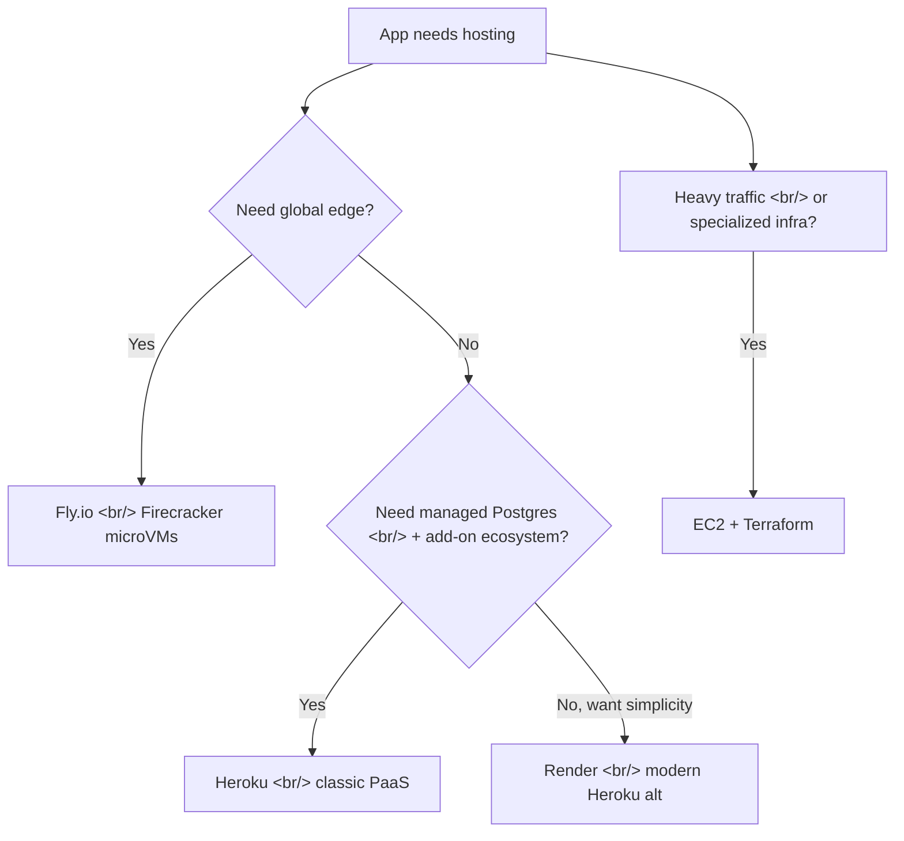
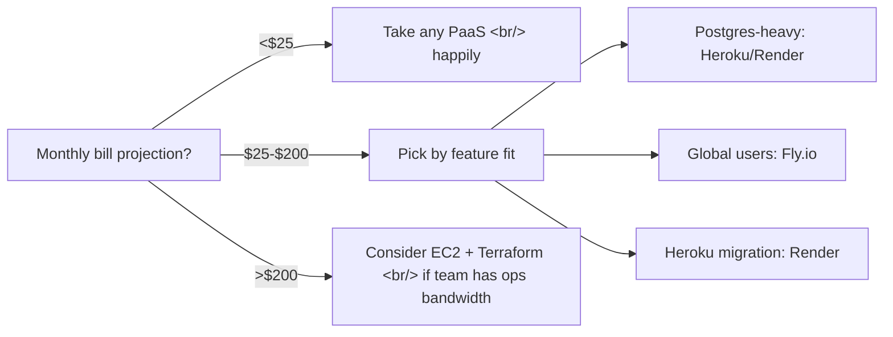

## Overview

For the small CPU-bound side of an app — the API server, the worker queue, the Postgres database — is a micro-PaaS still cheaper than rolling EC2? In 2026, the answer is "almost always, until you cross $200/month." This post compares Fly.io, Heroku, and Render, and gives a decision framework for when to walk away from PaaS entirely.

<!--more-->

## The Three Platforms at a Glance



## Fly.io

Fly runs your Docker images on Firecracker microVMs across **35+ global regions**. Pricing is roughly `$0.0000022/sec` per shared-cpu-1x VM (~`$1.94/mo` if always-on for a 256MB instance), and you can scale to zero on certain plans. The killer feature is `fly.toml` plus `flyctl deploy` — git-push-style deploys without CI/CD pipelines.

```toml
# fly.toml
app = "my-api"
primary_region = "nrt"

[http_service]
  internal_port = 8080
  force_https = true
  auto_stop_machines = true
  auto_start_machines = true
  min_machines_running = 0
```

Postgres is unmanaged-by-Fly (you run their image yourself); for a managed alternative they now point users to Supabase or Neon.

**Best for:** geographically distributed apps, anyone who wants Firecracker isolation, projects where TCP/UDP (not just HTTP) matters.

## Heroku

The granddaddy of PaaS, now under Salesforce. The 2026 platform has two foundations:
- **Cedar** — the classic dyno (LXC-based, broad add-on compatibility)
- **Fir** — Kubernetes-powered, more observability and finer control

| Tier | Price | Use case |
|------|-------|----------|
| Eco dyno | `$5/mo` | Hobby / staging |
| Basic | `$7/mo` | Small production apps |
| Standard-1X | `$25/mo` | Real production |
| Heroku Postgres essentials | `$5/mo` | 10K rows |

Add-ons go through the Elements Marketplace where 1 enterprise credit = `$1`.

The new bet is **Heroku Managed Inference and Agents** — a curated set of LLMs (text-to-text, embedding, image generation) plus MCP server hosting on pay-as-you-go dynos. This is Heroku trying to be the "easy AI app deployment" platform. Whether it competes with Vercel AI SDK + Modal-style stacks is an open question, but Heroku has the deployment ergonomics to make it credible.

**Best for:** apps that need a real managed Postgres, teams with low ops budget, anyone who wants `git push heroku main` with zero config.

## Render

The Heroku alternative everyone migrated to during the free-tier shutdown of 2022. Render advertises Heroku migration credits up to `$10K`. Pricing is competitive:

| Service | Price |
|---------|-------|
| Static sites | Free tier |
| Web services | From `$7/mo` |
| Managed Postgres | From `$7/mo` |
| Background workers | From `$7/mo` |
| Cron jobs | Free |

Native support for cron jobs, background workers, and preview environments. Render Workflows is their newer orchestration layer for multi-service deploys.

**Best for:** former Heroku users, teams who want preview environments out of the box, projects that need Docker support without the Fly.io geo-distribution complexity.

## Side-by-Side

| Capability | Fly.io | Heroku | Render |
|------------|--------|--------|--------|
| Global edge | ✅ 35+ regions | ❌ US/EU only | ❌ US/EU only |
| Managed Postgres | ❌ (Supabase/Neon) | ✅ first-party | ✅ first-party |
| Scale-to-zero | ✅ | ❌ (Eco can sleep) | ❌ |
| Docker native | ✅ | ✅ (Fir) | ✅ |
| Preview envs | ⚠️ via flyctl | ✅ Pipelines | ✅ Workflows |
| Cron / workers | ⚠️ separate machines | ✅ | ✅ |
| AI/LLM hosting | ❌ | ✅ Managed Inference | ❌ |
| Cheapest always-on tier | `~$2/mo` | `$5/mo` | `$7/mo` |

## Decision Framework



A useful heuristic: **if your app fits in `$25/mo`, take the managed PaaS happily.** The hour you save not configuring Terraform and Nginx is worth more than the platform markup. Once you cross `$200/mo` of PaaS billing, EC2 + a thin Terraform module starts being the cheaper path — but only if someone on the team enjoys ops.

## What About Vercel and Railway?

Worth naming them as adjacent options:
- **Vercel** dominates the Next.js / frontend deployment niche. For an SSR React app, it's the default. For a Python API or Go service, you're better off elsewhere.
- **Railway** is the slickest DX of the bunch, but pricing has shifted upward post-pivot; it's no longer the "obvious cheap" option it was in 2023.

## Insights

The cloud-cost narrative of 2024-2025 ("everyone's moving back to bare metal!") is mostly noise for small teams. **At small scale, the markup of managed platforms is lower than the engineering cost of replacing them.** Fly.io continues to be the developer-experience benchmark, Heroku is genuinely back from the dead with Fir + Managed Inference, and Render is the boring-correct choice for most CRUD apps. The right framing isn't "PaaS vs EC2" — it's "PaaS until your bill or your scale forces a migration." For most small apps that day never comes.

## Quick Links

- [Fly.io Pricing](https://fly.io/docs/about/pricing/)
- [Heroku Pricing](https://www.heroku.com/pricing)
- [Render Pricing](https://render.com/pricing)
