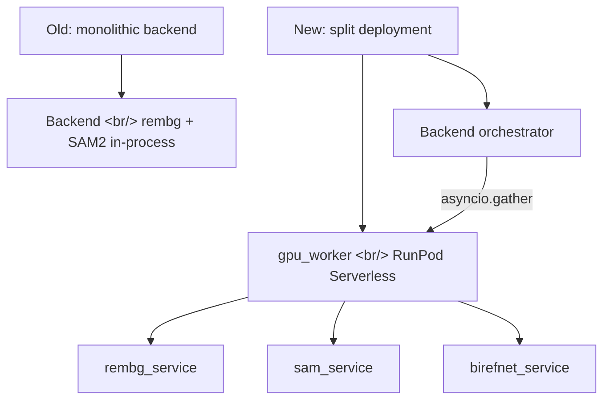

## Overview

Following [Previous Post: #5](/posts/2026-04-10-popcon-dev5/), this is the 6th cycle. The big move: GPU inference (rembg + SAM2) leaves the backend and lives on a dedicated RunPod Serverless worker. Backend becomes a thin orchestrator. On the product side, custom motion prompts and frame-candidate swap let users iterate on individual frames without re-running the whole pipeline.

<!--more-->

## Architecture Shift



---

## GPU Worker on RunPod Serverless

### Background

The backend was holding rembg and SAM2 model weights in process. That made each backend instance a 4GB+ memory hog and forced the backend onto GPU machines just to serve API traffic. The fix: extract inference to a Serverless worker so the backend can run on cheap CPU instances.

### Implementation

A new `gpu_worker/` directory:
- `Dockerfile` — bakes model weights into the image to avoid network-volume cold-start penalty
- `handler.py` — RunPod handler signature, dispatches to one of three services
- `services/rembg_service.py`, `sam_service.py`, `birefnet_service.py` — pure inference functions
- `requirements.txt` — pinned torch/torchvision/onnxruntime versions

The handler accepts `{ "task": "rembg" | "sam" | "birefnet", "image": "<base64>", "params": {...} }` and returns alpha mask base64.

### Backend Refactor

`backend/gpu_client.py` is the new HTTP client to the RunPod endpoint. The old in-process inference paths in `processor.py` and `sam_segmenter.py` are replaced with `await gpu_client.infer(...)` calls.

---

## Async Parallelization

Per-frame inference was sequential — a 30-frame animation took 30 × per-frame latency. Refactor to fire N RunPod requests in parallel via `asyncio.gather`:

```python
results = await asyncio.gather(*[
    gpu_client.infer({"task": "rembg", "image": frame})
    for frame in frames
])
```

The bottleneck shifted from compute to RunPod's autoscaler — when 30 requests land at once, the cold-start of additional Flex workers caps wall-clock latency at ~the slowest cold start, not 30× the warm latency.

---

## Custom Motion Prompts + Frame Swap

Product feature, not infra. Users can now type a custom motion description ("subtle bounce", "slow zoom") that gets injected into the animation prompt template, and swap individual frame candidates from the refine UI. Concretely:
- Backend stores per-frame candidates from the generation step
- Frontend `EmojiPreview.tsx` and `RembgRefineCanvas.tsx` let users pick which candidate to keep per frame
- A retry endpoint regenerates a single frame with the user's modified prompt

---

## Commit Log

| Message | Files |
|---------|-------|
| feat: add gpu_worker for RunPod Serverless (rembg + SAM2) | gpu_worker/* |
| refactor: delegate rembg + SAM2 inference to GPU worker | backend/pipeline/processor.py, sam_segmenter.py |
| perf: parallelize per-frame GPU calls with asyncio.gather | backend/main.py |
| test: add GPU worker smoke test script | backend/scripts/gpu_smoke.py |
| feat: wire up custom retry prompts, frame candidate swap, preset list | backend/main.py, frontend/* |
| feat: add custom motion prompts, white bg handling, and rembg frame viewer | backend/pipeline/animator.py, frontend/* |
| chore: add Makefile for native dev workflow | Makefile |
| chore: add gstack skill routing rules to CLAUDE.md | CLAUDE.md |
| chore: ignore .playwright-mcp/ artifacts | .gitignore |
| merge: integrate main branch changes into SAM2 worktree | (merge) |

---

## Insights

The Serverless extraction pays for itself the moment per-frame latency starts mattering. With the inference inline in the backend, you couldn't parallelize without spinning up multiple backend processes — and those processes each loaded a 4GB model. With Serverless workers, parallelism is just `asyncio.gather` and RunPod handles the worker pool. The pattern — keep the orchestrator small and stateless on cheap CPU, push the GPU work to a queue-based handler — is the right shape for any AI product where the inference is bursty. The custom motion prompts feature, while a smaller change, is worth more in user value per line of code than the entire infrastructure refactor. Both shipped in the same cycle, which is the goal.
