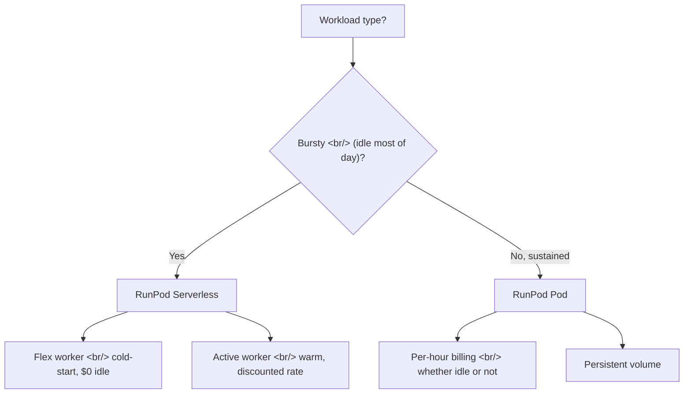

## Overview

Wiring up [popcon's](https://github.com/ice-ice-bear/popcon-matting-bench) GPU worker forced a real choice: should the inference pipeline run on RunPod Serverless or on a long-lived Pod? Both bill per-second, both use the same GPU SKUs, but the cost curves only cross at a specific utilization point. This post walks through the architecture difference and the break-even math.

<!--more-->

## The Two Models



## Pods — Long-Lived Containers

A **Pod** is a persistent container with attached volume disk. You pay the per-hour GPU rate **continuously** while the Pod is running, whether it's processing requests or idling. Storage is `$0.10/GB/month` for running Pods (per-second billing) and **doubles to `$0.20/GB/month` when the Pod is stopped** — RunPod is incentivizing you to either keep using it or delete it. Volumes get deleted entirely when your account balance hits zero.

Pricing rules require **at least one hour's worth of credits** in your account to deploy, and a default `$80/hr` spending cap protects against runaway workloads.

Pods make sense when:
- You need a notebook environment, SSH access, or persistent state
- The GPU is running real work >40% of the time
- Cold-start latency would kill the UX (e.g., interactive video models)

## Serverless — Pay-Per-Second Handlers

**Serverless workers** are stateless container handlers that spin up on demand, process a queue request, and tear down. Two worker classes:
- **Flex** — cold-starts when traffic arrives, **$0 idle cost**
- **Active** — kept warm at a discounted rate, no cold-start

You write a `handler(event)` function and ship it as a Docker image. Network volumes (`$0.07/GB/month` under 1TB, `$0.05/GB/month` over) provide shared storage if model weights need to be cached across workers.

### The Cold-Start Trap

Cold starts count against billed time. For a 30-second image-matting request, a 10-second cold start means you're billed for 40 seconds. If your model is 5GB+ and lives on a network volume, that cold start can balloon. The `gpu_worker/Dockerfile` pattern in [popcon](https://github.com/ice-ice-bear/popcon-matting-bench) **bakes the model weights into the image** specifically to avoid this:

```dockerfile
FROM runpod/pytorch:2.1-cuda12.1
COPY weights/birefnet.pth /app/weights/
COPY handler.py /app/
CMD ["python", "/app/handler.py"]
```

A 6GB image takes longer to pull but loads in seconds once cached on the worker.

## Break-Even Math

Rough numbers on an A100:

| Model | Rate | 24h cost |
|-------|------|----------|
| Pod | `$1.89/hr` | `$45.36` |
| Serverless Flex (active compute) | `$0.00076/sec` ≈ `$2.74/hr` | `$2.74 × hours used` |

**Break-even is around 17 hours/day of utilization.** Below that, Serverless wins; above, Pods win. For a startup with bursty user traffic, Serverless is almost always correct. For a research lab fine-tuning continuously, Pods are.

## Concurrency Pattern

Where Serverless really shines is parallel inference. Fire N requests at once via `asyncio.gather`:

```python
results = await asyncio.gather(*[
    gpu_client.infer({"task": "rembg", "image": frame})
    for frame in frames
])
```

The bottleneck shifts from compute to RunPod's autoscaler — when 30 requests land at once, the cold-start of additional Flex workers caps wall-clock latency at *the slowest cold start*, not 30× the warm latency. Doing the same with a single Pod requires you to either batch the requests (extra code, harder to reason about) or spin up multiple Pods (and pay for all of them continuously).

## When NOT to Use Serverless

- **Long-running training jobs** — RunPod Serverless has a max execution time per request. Multi-hour fine-tuning belongs on a Pod.
- **Models with non-trivial state** — if your inference reads from a hot in-memory KV cache, Serverless's stateless workers will rebuild that cache on every cold start.
- **Latency-critical interactive UX** — if a user is waiting in a UI for <2 second response, Active workers help but still don't match a warmed Pod.

## Insights

The Serverless model is the most interesting thing happening in GPU compute right now — it makes "deploy a model as an API" feel like deploying a Lambda. For 90% of inference workloads at startup scale, Serverless is the right default; the break-even doesn't favor Pods until you're running close to round-the-clock. The trap to watch is cold-start cost amortization: bake weights into the image, not the network volume, and your effective Serverless cost stays close to the warm rate. RunPod's pricing model is essentially saying "we believe most GPU work is bursty," and for product workloads they're probably right.

## Quick Links

- [RunPod Pods Pricing](https://docs.runpod.io/pods/pricing)
- [RunPod Serverless Pricing](https://docs.runpod.io/serverless/pricing)
- [RunPod Billing Overview](https://docs.runpod.io/accounts-billing/billing)
