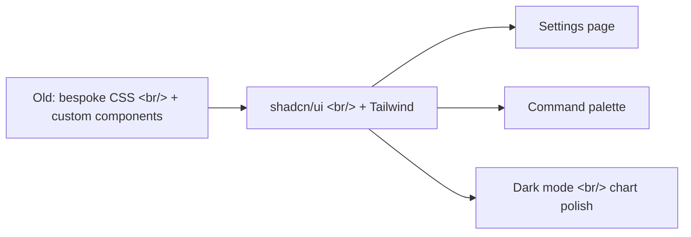

## Overview

Following [Previous Post: #10](/posts/2026-04-10-trading-agent-dev10/), this cycle is entirely UI work — the settings page lands, a command palette ships, and the legacy CSS pile finally gets deleted. Five commits, all on the frontend.

<!--more-->

## Architecture Shift

The migration to shadcn/ui + Tailwind unlocks the rest of this cycle. Once base components are consistent, the settings page and command palette become composition exercises rather than from-scratch builds.

---

## Settings Page

### Background

Trading config, risk thresholds, factor weights, and the scheduler all lived in scattered modal dialogs or hardcoded YAML. Operators needed one place to tune everything.

### Implementation

A four-tab settings view:
- **Trading config** — order routing, default limit/market behavior, position sizing rules
- **Risk config** — max position size, daily loss cap, drawdown halt thresholds
- **Factor weights** — sliders for fundamentals/technicals/sentiment composite scoring
- **Scheduler** — table of cron-style schedules for each agent

Each tab is its own component (`settings/trading-config.tsx`, `settings/risk-config.tsx`, etc.) wired to the same backend config endpoint.

---

## Command Palette

Inspired by the Linear/VS Code command palette pattern. `Cmd-K` opens an overlay with fuzzy search across navigation routes and agent quick actions ("Run discovery scan", "Pause all positions", "Open risk dashboard"). Reduces clicks for power users — operators who know what they want shouldn't have to click through three menus.

---

## Legacy CSS Cleanup

The shadcn migration left dozens of orphan CSS files and component shells. This commit removes them. Pure deletion — no behavior change, but removes confusion about which component implementation is canonical. After this commit, the dashboard, signals, and stockinfo views all run on shadcn/ui exclusively.

---

## Dark Mode + Layout Polish

Two final commits clean up the visible regressions from the migration:
- Chart colors and tooltip styles re-tuned for the dark theme (Recharts defaults look washed out)
- Hero card stat text alignment, KPI label hierarchy, dashboard layout spacing — the small things that make the page look intentional

---

## Commit Log

| Message | Area |
|---------|------|
| feat(ui): settings page with trading config, risk config, factor weights, scheduler | settings/* |
| feat(ui): command palette with navigation and agent quick actions | layout/command-palette.tsx |
| chore(ui): remove old CSS and component files replaced by shadcn/ui + Tailwind | (deletion) |
| fix(ui): dark mode polish — chart colors, tooltip styles, contrast adjustments | dashboard/* |
| fix(ui): dashboard text display fixes — hero card stats, KPIs, layout spacing | dashboard/hero-card.tsx, KPIs |

---

## Insights

This cycle is a textbook "design system migration unlocks features" story. The previous 10 cycles had been making it painful to add new UI surfaces because every new surface meant inventing new components. After committing to shadcn/ui, the next two features (settings page, command palette) shipped in a fraction of the time because they were composition jobs, not invention jobs. The lesson — when a UI codebase is slowing you down, the bottleneck is almost always the missing primitives, not the missing features.
