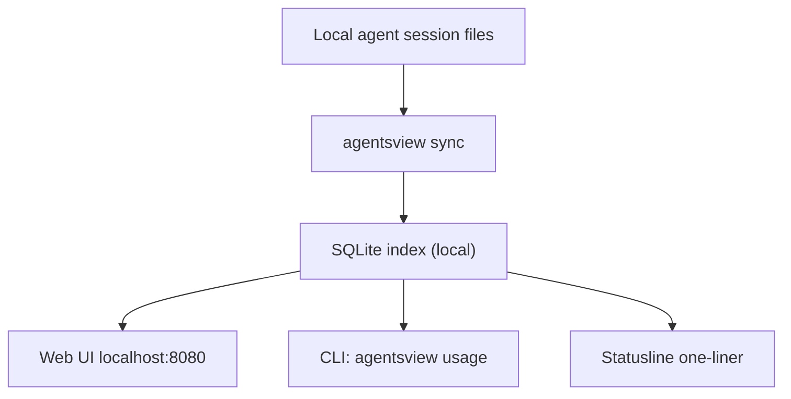

## Overview

Wes McKinney shipped [agentsview](https://github.com/wesm/agentsview) — a single-binary, local-first tool that pulls every coding-agent session on your machine (Claude Code, Codex, OpenCode, and more) into a SQLite database and serves a web UI plus a CLI. It doubles as a drop-in, 100x faster replacement for `ccusage`. 758 stars, mostly Go with a Svelte/TypeScript UI.

<!--more-->



## What it actually does

Point one: discovery. On first run, agentsview scans your machine for sessions from every supported agent and ingests them. No accounts, no upload, no daemon you have to install first — `curl install.sh | bash` and you're done. The web UI opens at `127.0.0.1:8080` and exposes a dashboard with cost over time, cost attribution by project, and a session browser with full transcript search.

Point two: the SQLite trick. `ccusage` re-parses raw JSONL session files every time you run it. At scale that's slow — minutes on a heavily-used Max plan. agentsview indexes once, then every `agentsview usage daily` query is a SQL aggregate. The README claims over 100x speedup and in practice it feels instant even on months of history.

Point three: pricing. Costs are computed from LiteLLM rates with an offline fallback table, cache-aware (prompt caching creation vs. read tokens priced differently), and filterable by agent, model, date, and timezone. The recent commit `3758c37` (fix Opus 4.6 fallback pricing to $5/$25) shows they're keeping pace with current Anthropic list prices.

## CLI surface

```bash
agentsview                  # start server, open web UI
agentsview usage daily      # per-day cost summary (last 30d)
agentsview usage daily --breakdown --agent claude --since 2026-04-01
agentsview usage statusline # one-liner for shell prompts
agentsview usage daily --all --json
```

The `statusline` output is the piece I immediately want — a compact cost string you can pipe into a shell prompt or tmux status bar so you see today's burn rate while you work. JSON output makes it scriptable for cron-based alerting when daily spend crosses a threshold.

## The Cobra migration

Recent PR #324 migrated the CLI dispatch from a hand-rolled `os.Args` switch to [spf13/cobra](https://github.com/spf13/cobra). For a tool that started as a weekend hack this is a meaningful inflection — it signals subcommand stability and makes adding `usage weekly`, `usage monthly`, or `export` trivial. The Go codebase is 2.7MB, which is already non-trivial; Cobra's auto-generated help and completions remove a whole class of maintenance burden.

## Why this matters now

The market has three pieces: (1) ccusage — just Claude, slow, but the pattern-setter. (2) Various per-agent tools that each track their own format. (3) The agent vendors' own dashboards, which are centralized and delayed. agentsview collapses 1 and 2 into one binary and sidesteps 3 by staying local. The same binary serves a data scientist auditing an agent fleet and a solo dev checking whether they're about to blow past the $200 line on Claude Max.

The combination of "local-first + SQLite + one binary + Go" keeps surfacing across 2026 developer tools (see also: [sqlite-utils](https://github.com/simonw/sqlite-utils), [dust](https://github.com/bootandy/dust), [fd](https://github.com/sharkdp/fd)). The thesis: when the data is already on disk and fits in SQLite, server-based SaaS is overkill. agentsview is a clean expression of that thesis applied to AI-agent observability.

## Insights

Three things stand out. First, the 100x speedup isn't a micro-optimization — it's the difference between "I run it once a week" and "it's always in my statusline," which changes whether the data actually shapes behavior. Second, a unified cost view across Claude, Codex, and OpenCode matters because heavy users route different tasks to different agents; per-vendor dashboards fragment the picture. Third, the repo's own usage observability (LiteLLM pricing, prompt-caching-aware math, cache-creation vs. cache-read) is a surprisingly good checklist for anyone building their own Anthropic-SDK app — it's basically the production pricing model distilled into a few hundred lines of Go.
