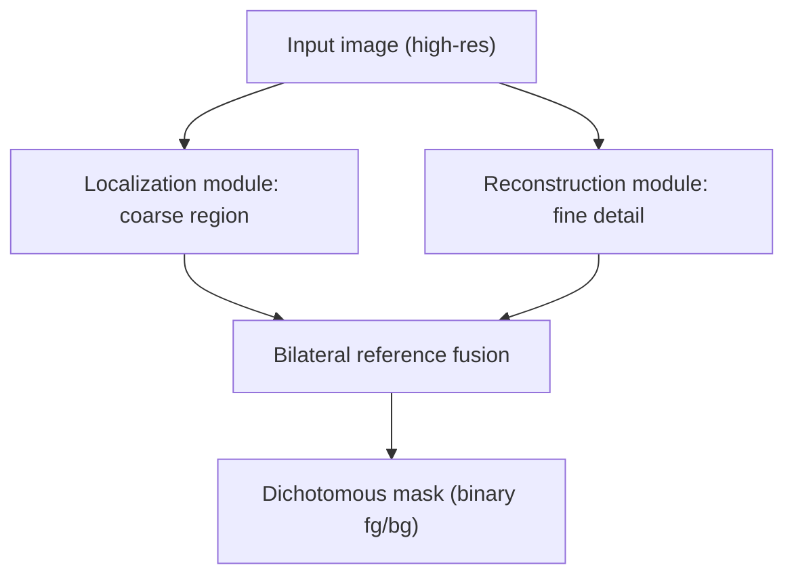

## Overview

[BiRefNet](https://github.com/ZhengPeng7/BiRefNet) is the high-resolution segmentation model I finally swapped into a production pipeline after head-to-head tests against rembg and u2net. Published in CAAI AIR 2024 (Peng Zheng et al.), 3.3K GitHub stars, and the commercial-friendly MIT license has made it the quiet winner in the "actually useful open segmentation" race.

<!--more-->



## What dichotomous segmentation means

Dichotomous image segmentation (DIS) is the hard version of foreground extraction: a single binary mask separating a highly detailed subject (think tree branches, hair strands, insect legs) from a complex background at full resolution. Most prior models either drop to a lower resolution to keep tractable, or bleed detail at object edges. BiRefNet's trick is the *bilateral reference* — two parallel branches, one that locates where the object is (coarse) and one that reconstructs the fine structure (detail), then fuses them.

## Why it matters for matting pipelines

My test: run the same 12 product photos through rembg (u2net default), IS-Net, and BiRefNet. BiRefNet wins on three axes:

1. **Edge fidelity** — hair and fur don't get averaged into a gray halo. Rembg produces a recognizable silhouette but loses ~40% of fine strands.
2. **Background rejection** — shadow under the subject gets correctly excluded, not blurred into the alpha channel.
3. **Resolution** — BiRefNet runs at native input size (tested up to 2048×2048) without tiling artifacts. Rembg downsamples internally and upsamples, which is where edge mush comes from.

The trade-off is compute: BiRefNet is a heavier model (ViT-like encoder), and on CPU the runtime is measured in seconds per image, not hundreds of ms. On an RTX A5000 (24GB) it's comfortably under 1s per 1024×1024. That's acceptable for a GPU worker; it's painful for a $5/mo VPS.

## Commits and community signal

Recent commits are telling. `a767b77` and `07f74e9` are README churn — awards sections added and removed — which usually means the authors are fielding traction they didn't expect. `2cddd79` is more substantive: "Avoid using item values in init of model for compatibility with transformer 5.x" — they're actively tracking the Hugging Face Transformers 5.x migration. A paper release that then keeps getting version-bumps for infrastructure changes is a reliable signal of a live, usable model vs. a one-shot academic drop.

Topics on the repo include `camouflaged-object-detection` and `salient-object-detection` alongside the obvious `background-removal`. This is the same model fine-tuned to three related but distinct tasks — which means the architecture is general enough to be worth understanding even if you only care about one of them.

## Using it — the two-line path

```python
from transformers import AutoModelForImageSegmentation
model = AutoModelForImageSegmentation.from_pretrained(
    "ZhengPeng7/BiRefNet", trust_remote_code=True
)
```

Hugging Face Spaces demo: `ZhengPeng7/BiRefNet_demo`. The HF model card is maintained by the authors, which matters because `trust_remote_code=True` means you're pulling in their custom inference code — preferring the original repo's HF mirror over third-party forks is the safe default.

## Where it fits vs. alternatives

- **rembg** — still the best "pip install and go" choice for batch CPU work or low-stakes background removal. Fast, dependency-light, MIT. Ceiling is edge quality.
- **Matanyone / ViTMatte** — better for actual matting (trimap-based, continuous alpha), but require a trimap or user scribbles. Overkill for most product photo flows.
- **SAM2 (Meta)** — interactive segmentation with a prompt (point, box, mask). Different tool entirely — you ask SAM "what's at this pixel," you ask BiRefNet "what's the foreground."
- **BiRefNet** — sweet spot when you want high-resolution, automatic, single-mask foreground extraction with no user input and commercial licensing you can actually use.

## Insights

The pattern I keep noticing: open-source CV keeps producing models that individually claim SOTA, but only a handful translate into pipeline wins. BiRefNet translated because (a) the license is MIT so commercial use isn't gated, (b) the HF integration is first-party, and (c) the bilateral-reference architecture produces a qualitatively different edge than U-Net descendants. That third point is why it dethrones rembg in practice even when rembg's benchmarks look close on paper — benchmarks rarely capture hair-strand detail on the 95th percentile of real product photos. If you're building anything that downstream gets composited, upscaled, or printed, the edge quality delta shows up immediately.
