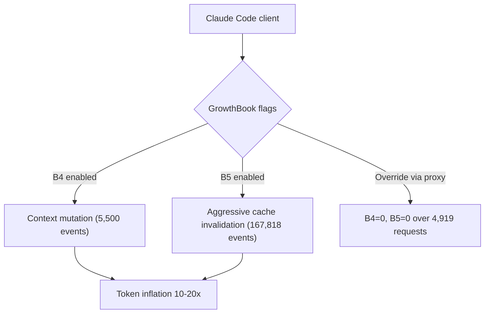

## Overview

[ArkNill/claude-code-hidden-problem-analysis](https://github.com/ArkNill/claude-code-hidden-problem-analysis) is a measured, methodically documented investigation of 11 confirmed client-side bugs in Claude Code that inflate token usage on Max plans by 10-20x. 93 stars, mostly referenced in HN and Reddit threads. The April 14 update is the most important data drop yet — 30,477 proxy requests over 14 days and a GrowthBook flag override that took two of the bugs to zero events.

<!--more-->

## The thesis, measured

The repo's TL;DR: 11 confirmed bugs (B1–B5, B8, B8a, B9, B10, B11, B2a) plus three preliminary findings. Cache bugs B1 and B2 are fixed in v2.1.91. **Nine remain unfixed as of v2.1.101** — eight releases later. The evidence is a proxy that sits between Claude Code and the Anthropic API and logs every request/response header, which is the only way to see client-side token math separate from what Anthropic's billing shows.

What makes this report different from the usual "Claude Code is expensive" thread is the causality work. Every bug claim is backed by either a request diff showing unnecessary context churn, or a response header (`anthropic-ratelimit-*`) showing which quota window is binding.

## The GrowthBook override — the new evidence

Anthropic ships feature flags to Claude Code via [GrowthBook](https://www.growthbook.io/). The repo documents a proxy-based override (the approach in anthropics/claude-code#42542): intercept the GrowthBook config response, force-flip the flags for B4 and B5 to off, and let everything else pass through unchanged.

Result across 4,919 subsequent requests over 4 days (same machine, same account, same usage pattern):

- **B5 events: 167,818 → 0**
- **B4 events: 5,500 → 0**

That's a controlled elimination, which is the cleanest causal evidence you get outside of an A/B test run by the vendor. It effectively proves these GrowthBook flags directly control context mutation and cache invalidation behavior on the client.

## The 7-day quota — previously invisible

A quieter finding: the `anthropic-ratelimit-representative-claim` header, which identifies which rate-limit window is binding, was `five_hour` in 100% of earlier reporting. With the 30K dataset, **22.6% of requests (5,279 / 23,374) showed `seven_day` as the binding constraint** — concentrated on April 9-10 when 7-day utilization hit 0.85–0.97. After the weekly reset, `five_hour` resumed.

The operational implication: Max plan users who feel "throttled out of nowhere on a Monday morning" are hitting the 7-day window, not the 5-hour one. You can't plan around a limit you can't observe, and the 7-day window is not surfaced in the Claude Code UI or in Anthropic's docs with any prominence.

## Methodology notes worth borrowing

A few things the repo does right that are worth copying if you're investigating *any* closed-source client:

1. **Proxy, don't modify** — running a mitm proxy between client and API preserves the client's behavior while making every request inspectable. Modifying the client (decompiling, patching) would invalidate the measurement.
2. **Name every bug with a stable ID** — B1 through B11 with B2a and B8a. Stable IDs let findings get cross-referenced across files and across releases without collisions.
3. **Separate "confirmed" from "preliminary"** — the repo explicitly distinguishes measured bugs from suspected ones (P1-P3). That discipline builds credibility and makes the document survive hostile scrutiny.
4. **Acknowledge environment changes** — the April 14 update flags that data from April 11 onward is from the overridden environment and can't be mixed with the baseline. Small detail, huge integrity.

## What's not fixed

Nine bugs remain unpatched, including B11 ("adaptive thinking zero-reasoning"). Anthropic acknowledged B11 on Hacker News but hasn't followed up with a fix. The `fallback-percentage` header, which the repo tracks separately and is unaffected by the flag override, is still showing non-zero rates — meaning some requests are silently routed to a smaller model than the user requested, which is its own category of bug.

## Insights

Three takeaways. First, proxy-based observation is increasingly the only way to audit a closed-source AI client — billing telemetry from the vendor is aggregated and one-directional, and you need raw request flow to see what the client is actually doing. Second, GrowthBook flag injection is a plausible attack surface and also a plausible remediation surface — the same mechanism that causes the bugs can be used to mute them. Third, if you're paying for a Max plan and burning through a 7-day quota on Monday, this repo is the most complete explanation of where that usage went — and the fact that the underlying problem is unfixed 8 releases later is a more interesting story than the bug itself.
