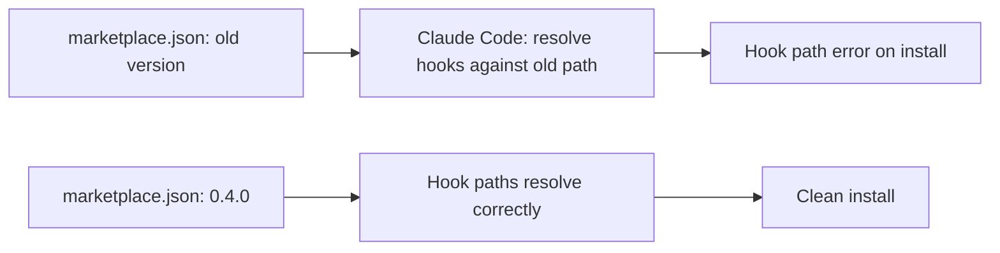

## Overview

Tiny interval, load-bearing fix. HarnessKit's plugin `marketplace.json` was out of sync with the released package version, which meant Claude Code resolved plugin hook paths against the old version and threw hook path errors at install time. A one-line version bump to `0.4.0` fixes it.

Previous: [HarnessKit Dev Log #5](/posts/2026-04-08-harnesskit-dev5/)

<!--more-->



---

## The bug

When Claude Code installs a plugin from a marketplace, it reads `marketplace.json` to learn the plugin's version, then resolves hook paths (and skill paths) relative to that version inside the plugin cache directory. If the version in `marketplace.json` doesn't match the actually-published version, the resolved path points to a directory that doesn't exist, and install fails with a hook path error.

The failure mode is silent-ish — the error message is about hooks, but the root cause is the version mismatch. It's the kind of bug that wastes 20 minutes on the first encounter and 30 seconds on every subsequent one.

## The fix

`a8ce0b1 fix: sync marketplace.json version to 0.4.0 to resolve hook path errors` — bumps the `version` field in `.claude-plugin/marketplace.json` to match the published `0.4.0`. One file, one field.

```diff
- "version": "0.3.x"
+ "version": "0.4.0"
```

## Commit log

| Message | Area |
|---------|------|
| fix: sync marketplace.json version to 0.4.0 to resolve hook path errors | Plugin metadata |

---

## Insights

The interesting piece isn't the fix, it's the failure mode. A version field that has to match across two files (published package and marketplace manifest) is a classic bit of split state — the kind of thing that gets out of sync whenever the release process has a human step. Two structural fixes would prevent recurrence: (1) have the release script write `marketplace.json` from a single source of truth (e.g., the package.json / pyproject.toml version), and (2) have Claude Code's plugin installer emit a precise error message when the declared marketplace version doesn't match the actual package version. For now, the one-line patch unblocks users; the structural fix is next interval's work.
