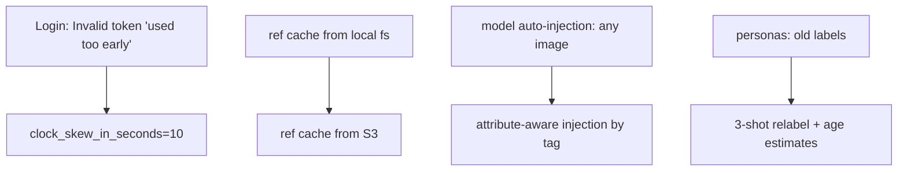

## Overview

Short but sharp week. Five commits, all production-hardening: a Google OAuth clock-skew fix blocking logins, ecosystem.config.js made host-portable for PM2 across dev/prod, the reference-image key cache moved off local filesystem onto S3 (so dev and prod see the same state), attribute-aware model auto-injection wired up, and personas relabeled with a 3-shot prompt that adds age estimates.

Previous: [hybrid-image-search-demo Dev Log #13](/posts/2026-04-13-hybrid-search-dev13/)

<!--more-->



---

## Google OAuth clock skew

### Context
Login blocked with `Invalid Google token: Token used too early, 1776217862 < 1776217863. Check that your computer's clock is set correctly.` The server's clock was ~1 second ahead of Google's — the JWT `iat` was in the future from the server's perspective.

### Fix
Added `clock_skew_in_seconds=10` to `id_token.verify_oauth2_token(...)` in `backend/src/auth.py`:

```python
id_token.verify_oauth2_token(
    token, google_requests.Request(), GOOGLE_CLIENT_ID,
    clock_skew_in_seconds=10,
)
```

Resolved immediately. A server should never trust its own clock to the second against a third party's `iat` — 10 seconds of tolerance is standard practice for JWT validation and doesn't open any meaningful attack surface.

---

## S3-first reference key cache

### Context
The model/reference-image cache was built from the local filesystem. This broke in production because prod's S3-mounted paths didn't always reflect the latest uploads, and because dev and prod had divergent local filesystem state. When a user regenerated in "tone only" mode, the UI showed the wrong reference image because the path resolved against local state, not S3 reality.

### Fix
`ce33906 fix(storage): build ref key cache from S3, not local filesystem` — cache construction now enumerates S3 objects directly. All image retrieval paths resolved against S3 keys. Also backfilled existing generation history so old records point to the correct S3 URL.

---

## Attribute-aware model auto-injection

### Context
Previous injection logic would pull *any* image matching a loose condition, so the comparison mode ("tone + angle" vs "tone only") sometimes injected a model image that didn't match the tagged attribute. Users saw the wrong reference in the output grid.

### Fix
`d492ee1 feat(gen): attribute-aware model auto-injection` — injection now keys on the tagged attributes (angle, tone) of the requested model folder. Subfolders under `s3://diffs-studio-hybrid-search/.../01. Model` are treated as attribute groups, one reference per group.

Pre-requisite: each model reference was relabeled so attributes are trustworthy. Grouping by folder means labels are a filesystem-visible schema, not a DB column, which matters because the ops team can audit and edit labels with just S3 browsing.

---

## Persona relabeling with 3-shot prompt + age

### Context
Persona labels were set earlier with a zero-shot prompt and did not include age estimates. User-facing filters needed age granularity.

### Fix
`2743eaf chore(labels): re-label personas with 3-shot prompt and age estimates` — re-ran the labeler with three in-context examples per request and an age-range field. Labels pushed to the repo so every server picks them up, avoiding per-instance label drift.

---

## PM2 / TSC fixes

- `95f8bbc fix(deploy): make ecosystem.config.js host-portable` — removed hardcoded absolute paths so the same config works on dev and prod. PM2 now boots the same from any `$HOME`.
- `6ebab0d fix(ui): drop unused generatingCount state to unblock tsc build` — dead state variable tripped the TypeScript build after a recent cleanup. Deleted and the build passed.

---

## Commit log

| Message | Area |
|---------|------|
| fix(deploy): make ecosystem.config.js host-portable | PM2 |
| fix(storage): build ref key cache from S3, not local filesystem | Storage |
| feat(gen): attribute-aware model auto-injection | Generation logic |
| fix(ui): drop unused generatingCount state to unblock tsc build | Frontend |
| chore(labels): re-label personas with 3-shot prompt and age estimates | Labeling |

---

## Insights

Two patterns worth locking in. First, "build cache from the source of truth" beats "sync cache with source of truth" every time. The ref-key cache was fragile as long as it started from local state and hoped to reconcile with S3 later; building directly from S3 removes a whole category of drift bugs. Second, the clock-skew fix is a reminder that production OAuth failures are almost always distributed-systems issues (clock sync, DNS propagation, key rotation) rather than crypto issues — a 1-line fix after 10 minutes of log reading, which is exactly how it should feel in a mature stack.
