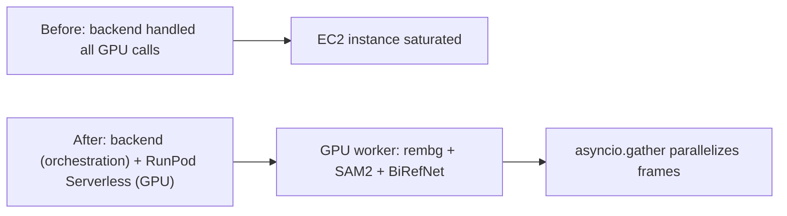

## Overview

This week split popcon's image/video processing pipeline into two distinct environments. Lightweight orchestration stays on the backend; heavy GPU inference (rembg, SAM2, BiRefNet) moved to a RunPod Serverless GPU worker. Bonus: parallelized per-frame GPU calls with `asyncio.gather`, and added gstack skill routing rules to CLAUDE.md.

Previous: [popcon Dev Log #6](/posts/2026-04-13-popcon-dev6/)

<!--more-->

---

## GPU worker split (RunPod Serverless)

### Context
The previous architecture had the backend calling rembg and SAM2 directly. Producing one 12-frame animated emoji set tied up the backend CPU for minutes, and concurrent requests piled up, so total latency grew non-linearly. EC2 CPU instances physically couldn't absorb the workload.

### Implementation
- `d04a14e feat: add gpu_worker for RunPod Serverless (rembg + SAM2)` — GPU worker in its own module. RunPod Serverless endpoint receives and processes requests.
- `995d655 refactor: delegate rembg + SAM2 inference to GPU worker` — backend handles orchestration only. HTTP call to the worker, assemble the result.
- `9ffddfd test: add GPU worker smoke test script` — smoke test to verify endpoint connectivity and I/O format.

RunPod endpoint config: max workers 3, idle timeout 30s, RTX A5000 24GB. `max=3` caps concurrent requests; `idle=30s` is how long the container stays warm before being torn down. There's a cold-start cost, but with `idle=30s` the container is usually reused across sequential requests.

### Debugging
Worker wasn't picking up jobs reliably → checked logs → I'd set 24GB but RTX A5000 got allocated → container disk was adjustable, but GPU spec had to be set separately in the endpoint config. Consolidated all `.env` variables (`POPCON_DASHSCOPE_*`, `RUNPOD_ENDPOINT_ID`, `RUNPOD_API_KEY`) into one place.

---

## Frame parallelization (asyncio.gather)

### Context
A 12-frame animation needs an independent GPU call per frame. Running them serially meant 12x per-frame latency for a single worker. Since the RunPod worker is set to `max=3`, there's headroom for concurrency.

### Implementation
`aed7573 perf: parallelize per-frame GPU calls with asyncio.gather` — dispatch frames in one shot via `asyncio.gather(*[process_frame(f) for f in frames])`. RunPod accepts up to 3 concurrent and queues the rest at the worker.

Measured: 12-frame processing took ~3x less time than the serial path (matches `max=3`). Raising worker count scales further in theory, but cost curves get steep fast.

---

## Matting model upgrade prep (BiRefNet)

The session included a head-to-head test of rembg vs BiRefNet. Ran ViTMatte, Matanyone, BiRefNet, and rembg on the same inputs in a separate testbed repo ([popcon-matting-bench](https://github.com/ice-ice-bear/popcon-matting-bench)). Verdict: BiRefNet removes background detail much more cleanly, but occasionally leaves a fine halo near edges — defringe post-processing under evaluation.

Standalone BiRefNet deep-dive: [BiRefNet review](/posts/2026-04-15-birefnet/).

---

## Small infra cleanups

- `332b083 merge: integrate main branch changes into SAM2 worktree` — synced and removed the SAM2 experiment worktree.
- `5d16046 chore: add gstack skill routing rules to CLAUDE.md` — context priority rules for /fix-visual, /fix-behavior, /walkthrough skill invocations.
- `4f7a524 chore: add Makefile for native dev workflow` — standardized `make dev`, `make stop`.
- `dcbf915 feat: wire up custom retry prompts, frame candidate swap, preset list` — users can retry with custom prompts, manually swap frame candidates, and pick from a pose preset list.
- `87d18a5 chore: ignore .playwright-mcp/ artifacts` — gitignore update for playwright-mcp temp files.

---

## Commit log

| Message | Note |
|---------|------|
| merge: integrate main branch changes into SAM2 worktree | Worktree cleanup |
| chore: add gstack skill routing rules to CLAUDE.md | Skill context rules |
| chore: add Makefile for native dev workflow | make dev/stop |
| feat: wire up custom retry prompts, frame candidate swap, preset list | UX |
| feat: add gpu_worker for RunPod Serverless (rembg + SAM2) | GPU worker split |
| refactor: delegate rembg + SAM2 inference to GPU worker | Backend slimmed |
| perf: parallelize per-frame GPU calls with asyncio.gather | 12 frames parallel |
| test: add GPU worker smoke test script | Worker sanity |
| chore: ignore .playwright-mcp/ artifacts | gitignore |

---

## Insights

The core lesson is layer separation. Specialize the backend for orchestration and state, specialize the GPU worker for stateless inference, and each scales independently. RunPod Serverless makes that separation cheap — with `max=3, idle=30s`, steady-state idle cost is near zero and only burst moments are billed. Also, the `asyncio.gather` win only materializes when worker-side concurrency matches 1:1. Raising `max` to 5+ would mean revisiting RunPod's GPU allocation strategy and cost curve together. BiRefNet is queued for production alongside the defringe pipeline next week.
