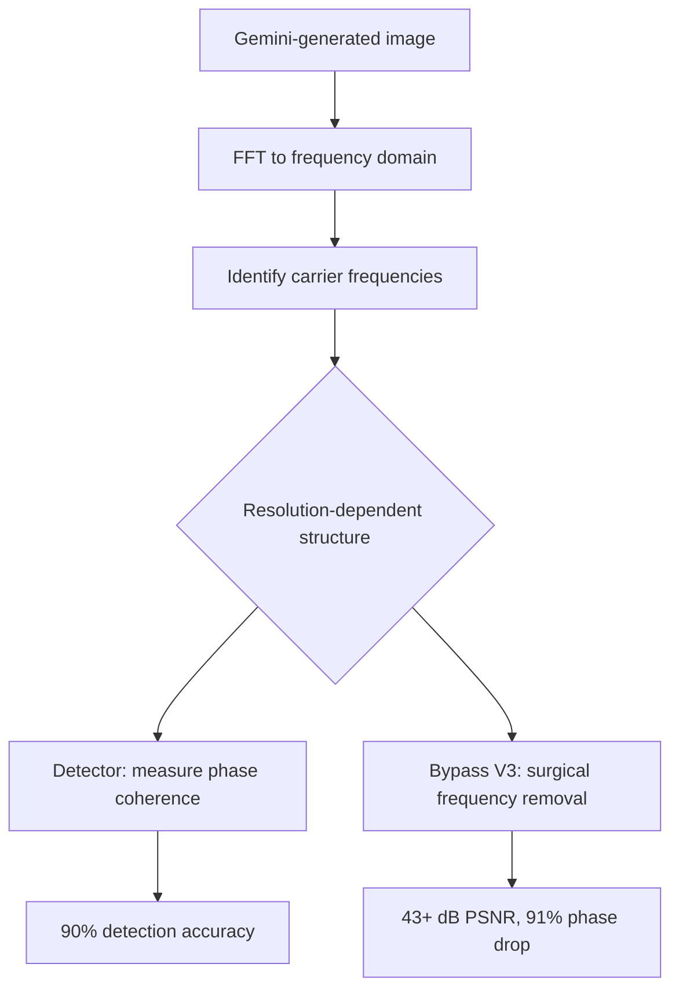

## Overview

[aloshdenny/reverse-SynthID](https://github.com/aloshdenny/reverse-SynthID) is a 2.6K-star open-source project that reverse-engineered Google's SynthID image watermark using only signal processing — no access to the proprietary encoder or decoder. It ships a 90%-accuracy detector and a multi-resolution V3 bypass that drops carrier energy by 75% and phase coherence by 91% while keeping PSNR above 43 dB.

<!--more-->

## What SynthID is, and what this project shows

SynthID is Google's "invisible" watermark embedded into every Gemini image output. The official line is that it survives cropping, resizing, JPEG compression, and modest edits while being imperceptible to humans. The claim is it cannot be removed without visibly degrading the image. This repo disputes that.

The technique: take a batch of Gemini outputs, FFT each to the frequency domain, average, and look for unnatural peaks that don't match what you'd expect from the image content. Those peaks are the watermark carriers. The repo discovered that the carrier frequencies are **resolution-dependent** — the watermark isn't applied in a fixed spatial-domain grid but in a frequency band that scales with image dimensions.

Once you know where the carriers live, two capabilities fall out: a detector (is this image from Gemini?) and a surgical bypass (null those specific frequencies while leaving everything else intact).

## Why "43+ dB PSNR" matters

PSNR above 40 dB is generally considered perceptually indistinguishable from the original — you cannot see the difference with the naked eye. The V3 bypass achieves 43+ dB, which means the watermark can be removed without any visible quality degradation. The 91% phase coherence drop is the quantitative measure: SynthID's detector relies on phase relationships between the carriers, and once those are disrupted, detection collapses.

This is the uncomfortable finding for Google. SynthID is marketed as robust. "Robust" here has to mean "cannot be removed without visible degradation," because any watermark can be trivially removed by sufficiently aggressive transformation. The V3 bypass shows you don't need aggressive transformation — you need a narrow-band spectral edit.

## Recent commits — active maintenance

- `defeb41` — "Fix detection accuracy: replace wrong carrier frequencies with empirically verified ones." Hardcoded carrier positions were wrong; replaced with values measured from real outputs.
- `d012872` (PR #23) — "Fix detection: empirically verified carrier frequencies." Same theme — the detector is getting better as the reference dataset grows.
- The repo is actively recruiting contributors to upload pure black and pure white images generated by Nano Banana Pro. Those are the critical reference samples because a constant-color input lets the spectrum show the watermark cleanly, with no image-content frequencies to confuse things.

The contributor recruitment tells you something about how the research works: this is essentially a crowd-sourced codebook build, the same way early GSM cipher cracking worked — you need a big reference library of known inputs to extract the key.

## The detector

The 90% detection rate is notable because it's achieved without access to Google's detector. In other words, the open detector has converged to roughly the same capability as the closed detector purely by spectral analysis. That makes the detector usable as an "is this AI-generated by Gemini" tool outside of Google's infrastructure — which was already Google's stated long-term goal for the ecosystem, but now it's available to anyone.

## The policy question

There's a harder question here than just "can SynthID be broken." Watermarking was the main anti-deepfake proposal from major AI labs. If a 2.6K-star open-source project can detect at 90% and bypass at 43 dB PSNR, the deployability of watermarking as a disinformation defense is weaker than the launch narrative suggested. The detector half is actually the useful half for society; the bypass half is easier (all bypasses are easier than detectors, which is why watermarking is a hard problem).

The repo stays research-focused and doesn't hand out a CLI "strip SynthID from this image," which is appropriate. Anyone sufficiently motivated could implement it from the paper; not shipping it as a script avoids being the proximate cause of the next wave of abuse.

## Insights

Three things. First, the resolution-dependent carrier structure was the key discovery — once you notice that the carrier frequencies scale with image dimensions, everything else follows, and this is the kind of thing that's hard to hide in a closed system because it has to be consistent across outputs to be detectable by the official tool. Second, 43+ dB PSNR is the number that makes the bypass practically usable; sub-40 bypasses that visibly degrade the image are a curiosity, not a policy-relevant tool. Third, crowd-sourced reference image collection (especially constant-color images) is a cheap, distributed analogue to a cryptanalytic codebook — it works for watermarks the same way it worked for early ciphers, and it's a template that will get applied to the next watermarking scheme too.
