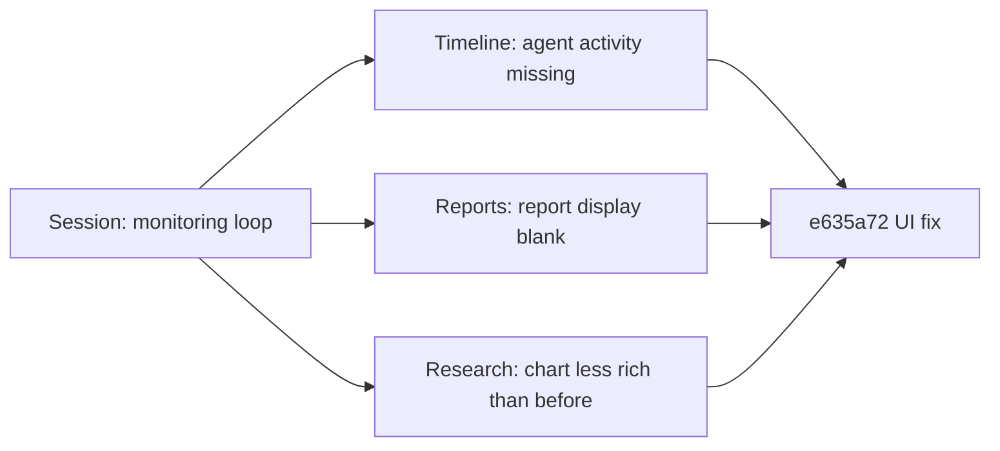

## Overview

A one-commit interval on trading-agent, but a focused one: restore page padding that disappeared in a previous layout refactor, polish the overlay/signal text readability, and fix the Research page chart which was rendering but missing series data. A 2-hour live monitoring session drove the fixes from actual UI artifacts rather than synthetic repros.

Previous: [trading-agent Dev Log #11](/posts/2026-04-13-trading-agent-dev11/)

<!--more-->

---

## Context from the live monitoring run

The session opened with `read @CLAUDE.md and run the monitoring loop` — the agent spent the bulk of the 2 hours watching the live UI, flagging problems as they appeared:

- Timeline showed no agent activity for the morning's 3 agent runs.
- Reports section showed no report display.
- Research page was functioning but "way less fruitful" than previous snapshots (fewer plots, sparser metrics).
- Scroll behavior on long pages had regressed.

Everything rolled up into one fix commit: `e635a72 fix(ui): restore page padding, polish overlay/signal text, fix Research chart`.

---

## What actually shipped

### Page padding restoration
The previous layout refactor removed outer padding as part of a full-bleed treatment, which made the main container hug the viewport edges. On wide monitors it looked stark; on mobile it pushed text flush against the screen edge. Restored a consistent outer padding so the content breathes.

### Signal overlay text polish
Trading signals overlay on top of candle charts. Previously the overlay text was using the default font weight and sat directly on the chart background, producing legibility drops when the chart line crossed under the text. Polished: slightly heavier weight, tightened tracking, and added a subtle background scrim behind the overlay so text stays readable against any chart background.

### Research chart fix
The Research page chart was emitting but rendering with missing series. Root cause: the data contract on the backend had gained a new field and the frontend was filtering on the old shape, silently dropping entries that didn't match. Updated the frontend projection to pass through the new field. Chart is back to the richer earlier state.

---

## Commit log

| Message | Area |
|---------|------|
| fix(ui): restore page padding, polish overlay/signal text, fix Research chart | UI |

---

## Insights

The interval produced one commit, but the commit came out of a 2-hour live monitoring run, which is the better unit of work for a UI-heavy agent project. Reading the UI as it runs catches three categories of regression at once: layout (padding), typography (overlay legibility), and data contract drift (missing series). A synthetic test suite would have caught maybe one of the three; the others require a human (or a monitoring agent) actually looking at pixels. The takeaway is that "monitoring loop" is not just ops — for a product where the UI is the product, it's the primary QA surface, and it scales through automation where agents can screenshot, diff, and file fixes without human prompting.
