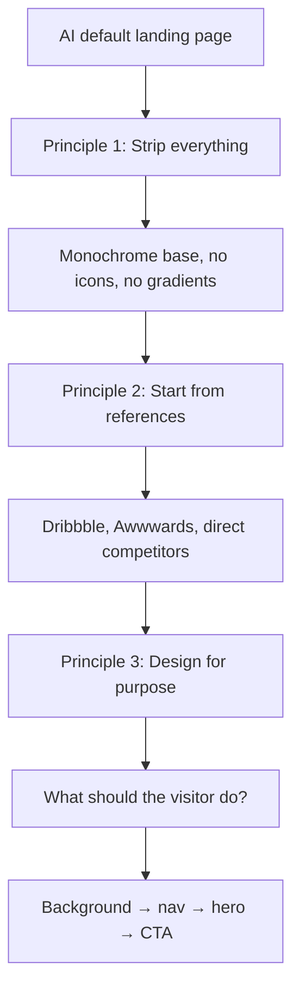

## Overview

A 10-minute tutorial titled "바이브코딩 디자인 풀코스 | 10분만에 AI 티 완전히 없애기" walks through converting a generic AI-generated landing page into an intentional one using three principles: strip what isn't needed, start from references, and design around purpose. It's worth summarizing because the principles generalize well beyond the specific example, and because "AI smell" on vibe-coded sites is becoming a real product liability.

<!--more-->

## Principle 1 — Strip everything

The default LLM landing page has gradients, multi-color palettes, decorative icons, emoji, and at least three CTAs competing for attention. The instinct is to edit it down. The tutorial argues the opposite: delete everything first. Drop to monochrome. Kill every icon. Remove every decorative element. Then add back only what is necessary.

The reasoning is cognitive: when starting from a busy canvas you spend mental energy deciding what to remove next, and the decision never ends. When starting from a blank canvas you spend energy deciding what to add next, and the addition terminates when the page serves its purpose. Same endpoint, much cleaner path.

This is the single most actionable piece of advice for anyone shipping a vibe-coded landing. The default LLM output is calibrated to "look impressive in a screenshot" — stripping is the only way to recover signal.

## Principle 2 — Start from references

References come in two flavors. Aesthetic references (Dribbble, Awwwards) show what is currently considered good design; they're aspirational. **Competitive references** (actual products in your category) show what your users have been trained to expect. Both matter, but competitive references matter more because you are not making art, you are making a product.

For the tutorial's video-generation example, the competitive references are Kling, Wan, and Runway — products already serving this user need. The shared patterns across those sites are more valuable than anything Dribbble will show: where the hero CTA sits, how generation samples are displayed, how pricing is presented. Divergence from competitive norms has to be a deliberate choice, not an accident.

The practical tip: scrap-save sites you find beautiful throughout normal browsing. When you sit down to design something, the reference folder is already curated. Trying to find references *after* you've started coding is backwards — the coding pressures you to finish with what you have, which is usually the AI default.

## Principle 3 — Design for purpose

The focusing question: *what do you want the visitor to do?* Every element on the page has to earn its place relative to that answer. For Coupang or Musinsa, the visitor should start browsing products — so the page opens with a product grid. For Claude or ChatGPT, the visitor should type — so the input box is above the fold. For a video-generation tool, the visitor should generate a video — so the generate button is the hero.

This sounds obvious; in practice, AI-generated landing pages fail it consistently because LLMs have no model of your business. They produce a template that looks like a landing page, not a landing page for *your* landing page's purpose. Telling the LLM the purpose explicitly (instead of "make a nice landing page") is the single biggest prompt upgrade.

## Execution order from the tutorial

1. **Background** — color, image, or video. Video backgrounds work for visually-driven products but must not fight with content.
2. **Navbar** — transparent initial state, borderless, opaque-on-scroll transition, single purpose-aligned CTA.
3. **Hero** — one-sentence copy stating the problem the product solves. Swap default font for a distinctive Google Font. Add the primary CTA.
4. **Supporting sections** — only what the purpose demands.

The order matters because each step constrains the next. Pick the background and navbar style and your font/color choices narrow. Pick the hero copy and your section structure narrows. Trying to design all four in parallel produces the AI-default result.

## Why this matters for vibe coding specifically

Vibe coding's biggest weakness is not code quality — modern LLMs write acceptable code. The weakness is taste, because the LLM is averaging the training distribution, which is itself full of AI-defaults now. The output is a statistical median of landing pages, and statistical medians are exactly what you're trying to escape if you want the product to feel considered.

The three principles convert this weakness into a workflow. Strip gets you out of the AI median. Reference pulls you toward an intentional target. Purpose keeps every addition anchored. It's a small amount of discipline that translates directly into the "doesn't look AI-generated" outcome.

## Insights

Two things stand out. First, "AI smell" is now a measurable product liability — a landing page that reads as AI-generated is one that users skim past because they've seen a thousand variants of it this quarter. Second, the three principles are domain-general. They work for a CLI's website, a mobile app store listing, and a pitch deck. The delete-first move is the highest-leverage one; reference-driven design is the skill that takes longest to build; purpose-first filtering is what separates designers from stylists. If you're vibe coding anything user-facing, this is the shortest path to shipping something that feels intentional instead of auto-generated.
