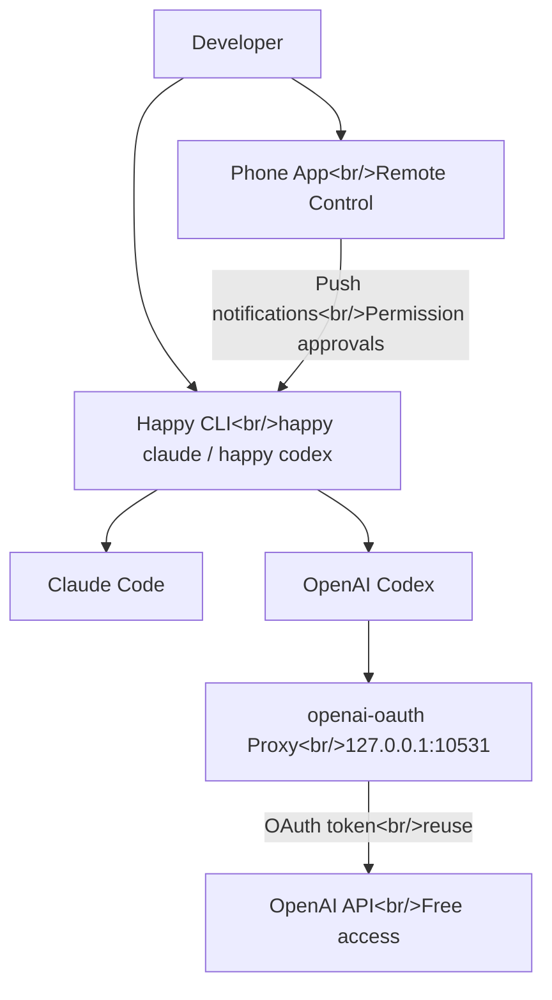

## Overview

Two community projects caught my attention this week, both extending the AI coding agent ecosystem in different directions. **openai-oauth** lets you use your ChatGPT subscription's OAuth token as a free API proxy, while **Happy** gives you mobile control over Claude Code and Codex sessions with push notifications and E2E encryption.

<!--more-->

## Ecosystem Architecture



## openai-oauth — Free API Access via ChatGPT Token

This tool uses your existing ChatGPT account's OAuth token to access the OpenAI API without purchasing separate API credits. Run `npx openai-oauth` and it starts a local proxy at `127.0.0.1:10531/v1`.

**How it works:**

- Uses the same OAuth endpoint that Codex CLI uses internally
- Authentication via `npx @openai/codex login`
- Supports `/v1/responses`, `/v1/chat/completions`, `/v1/models`
- Full support for streaming, tool calls, and reasoning traces

**Important caveats:**

- Unofficial community project, not endorsed by OpenAI
- Personal use only — account risk exists
- Interestingly, Claude/Anthropic blocked similar approaches, but OpenAI appears to tolerate it (they acquired OpenClaw, a project in this space)

## Happy — Mobile Control for AI Coding Agents

Happy is a mobile and web client that wraps Claude Code and Codex, letting you monitor and control AI sessions from your phone.

**Key features:**

- CLI wrapper: `happy claude` or `happy codex`
- Push notifications for permission requests and errors
- E2E encryption for all communication
- Open source (MIT license), TypeScript codebase

**Components:**

- **App** — Expo-based mobile app
- **CLI** — Terminal wrapper for AI agents
- **Agent** — Bridge between CLI and server
- **Server** — Relay for remote communication

**Setup:**

```bash
npm install -g happy
```

Then scan the QR code from the mobile app to pair your phone with your terminal session.

## Why These Matter

Both tools address the same underlying need: AI coding agents are powerful but constrained. openai-oauth removes the cost barrier for API access (at the risk of account terms), while Happy removes the physical proximity requirement for managing agent sessions. Together they represent the community pushing AI agent tooling beyond what the providers officially support.

The ecosystem is rapidly evolving, with developers building bridges between tools, creating mobile control planes, and finding creative ways to maximize the value of their existing subscriptions.
