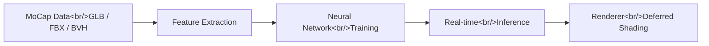

## Overview

AI4AnimationPy is a Python framework for AI-driven character animation created by Paul and Sebastian Starke at Meta. With 807 GitHub stars, it addresses a fundamental bottleneck in animation research: the dependency on Unity. The original AI4Animation project required Unity for everything from data generation to inference visualization, creating a heavy toolchain that slowed iteration. AI4AnimationPy strips this dependency entirely, replacing it with an Entity-Component-System architecture running on NumPy and PyTorch, complete with a real-time renderer featuring deferred shading, SSAO, and bloom effects.

<!--more-->

## ECS Architecture and Game-Engine Update Loops

AI4AnimationPy adopts an Entity-Component-System (ECS) architecture — the same pattern used by modern game engines like Unity's DOTS and Bevy. Entities are lightweight identifiers. Components hold data (position, rotation, mesh, skeleton). Systems operate on components to produce behavior (physics, rendering, animation). This separation of data and logic enables clean composition and efficient batch processing.

The framework implements game-engine-style update loops with fixed timestep updates for physics and animation, and variable timestep updates for rendering. This is not a typical Python application pattern — it is a deliberate transplant of game engine architecture into the Python ecosystem. The result is a framework that thinks like a game engine but runs in an environment where machine learning researchers are already productive.

Three execution modes are available: headless mode for batch training data generation and inference without any display, standalone mode with the full real-time renderer, and manual mode where the developer controls the update loop directly. Headless mode is particularly important for research workflows — it means training data generation can run on remote servers without GPU display capabilities.

## Real-Time Renderer

The built-in renderer is surprisingly capable for a Python framework. It implements deferred shading — a multi-pass rendering technique where geometry information is first written to G-buffers, then lighting is computed in screen space. This allows many lights without the performance penalty of forward rendering.

Additional post-processing effects include Screen Space Ambient Occlusion (SSAO) for contact shadows and depth perception, and bloom for high-dynamic-range glow effects. Skinned mesh rendering handles the deformation of character meshes based on skeleton pose — the core visual output for character animation systems.

The renderer is not just a visualization convenience. In animation research, being able to see results in real time during development is critical for iteration speed. The alternative — rendering offline videos for every experiment — adds minutes or hours to each feedback loop. A real-time renderer that runs alongside the neural network inference pipeline collapses this feedback loop to interactive rates.

## Motion Capture Pipeline

AI4AnimationPy supports importing motion capture data from GLB, FBX, and BVH formats — the three most common mocap interchange formats. This broad format support means researchers can work with data from virtually any motion capture studio or public dataset without conversion preprocessing.

The framework includes a FABRIK (Forward And Backward Reaching Inverse Kinematics) solver for procedural animation and pose correction. IK solvers are essential in character animation for ensuring that feet stay planted on the ground, hands reach target positions, and the character interacts plausibly with the environment. FABRIK is particularly well-suited to real-time applications because of its iterative convergence properties and computational efficiency.

Feature extraction from mocap data prepares the raw motion capture recordings for neural network consumption. This includes computing joint velocities, contact labels, trajectory features, and other derived quantities that neural networks use to learn motion patterns. The extraction pipeline is designed to be configurable, allowing researchers to experiment with different feature representations without modifying the core framework.

## Neural Network Components

The framework provides built-in neural network architectures tailored for character animation: MLPs (Multi-Layer Perceptrons) for simple motion prediction, Autoencoders for motion compression and generation, and Codebook models for discrete motion representation. These are implemented in PyTorch, integrating naturally with the broader PyTorch ecosystem of optimizers, schedulers, and distributed training utilities.

The training data generation pipeline is a standout feature. AI4AnimationPy can generate training data in under 5 minutes for typical datasets, compared to over 4 hours in the Unity-based AI4Animation. This 50x speedup comes from eliminating the Unity runtime overhead and leveraging NumPy's vectorized operations for batch feature computation. For research workflows where training data format changes frequently during experimentation, this speedup dramatically accelerates the research cycle.

The codebook architecture is particularly interesting for animation. By discretizing the motion space into a learned codebook of motion primitives, the model can generate diverse motions by sampling and combining codebook entries. This approach has proven effective for generating varied, high-quality motion sequences that avoid the averaging artifacts common in continuous latent space models.

## Insights

AI4AnimationPy represents a pragmatic recognition that the Python and PyTorch ecosystem has become the center of gravity for machine learning research. Requiring Unity as an intermediary created unnecessary friction for researchers whose primary tools are Jupyter notebooks, PyTorch, and command-line workflows. The 50x speedup in training data generation alone justifies the port. The ECS architecture is a thoughtful choice that preserves the compositional benefits of game engine design while operating in Python's dynamic environment. For animation researchers, this framework eliminates the toolchain tax that has historically made AI-driven character animation research more cumbersome than it needed to be.
