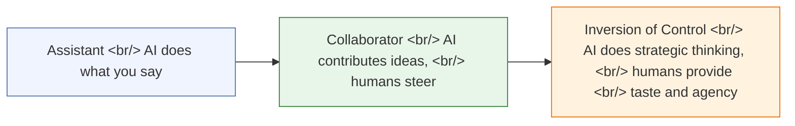

Drew Bent, Head of Education at Anthropic, sat down with EO Korea to share a refreshingly contrarian take on AI productivity: **using AI fast doesn't mean using AI well**. His background in tutoring and teaching brings a unique lens to how we should think about human-AI collaboration — not as a speed hack, but as a fundamental shift in how we work and learn.

<!--more-->

## The AI Mindset Shift

The interview's central argument is that most people are underusing AI. They treat it like a faster search engine or autocomplete, applying it to last-year-level problems. Drew argues we need to **raise our ambition** — give AI harder problems, the kind we wouldn't have attempted before.

This connects to a broader observation about **AI-native people**. In places like Rwanda and India, people encountering AI without legacy mental models from decades of traditional computing often see its current capabilities more clearly. They don't carry the baggage of "this is just a chatbot" — they see it as something genuinely new.

## From Assistant to Collaborator to Inversion of Control

Drew describes a progression in how humans relate to AI:

Most people are stuck at the **Assistant** stage — delegating simple tasks. The real unlock comes when you move to **Collaborator**, where AI contributes ideas and you iterate together. The ultimate destination is **Inversion of Control**: AI handles the strategic heavy lifting while humans bring taste, judgment, and agency.

## The Anthropic Study: Speed vs. Understanding

One of the most striking data points: Anthropic ran a study where the AI-using group finished tasks **17% faster** but understood the underlying concepts **17% worse**.

But here's the nuance — participants who used AI in **inquiry mode** (probing, asking questions, treating it as a thinking partner rather than an answer machine) performed well on both speed and understanding.

The takeaway: **how** you use AI matters far more than **whether** you use it.

## Practical Principles

### Context Is Everything

Drew emphasizes spending most of your time **loading context** before asking questions. The quality of AI output is directly proportional to the quality of context you provide. Don't jump straight to "write me X" — first give the AI everything it needs to understand your situation deeply.

### Come With the Problem, Not the Solution

Open-ended problems get better AI responses than pre-defined solutions. Instead of "write a function that does X with approach Y," try "here's the problem I'm trying to solve — what are the best approaches?" Let the AI explore the solution space.

### The R&D Mindset

Spend a fraction of your time experimenting at AI's limits, even if you lose time today. This investment pays off as capabilities improve. The people who will be most effective with next-generation AI are those who are already pushing current-generation AI to its edges.

## Beyond Code: Claude Code for Learning

A surprising insight: people are using **Claude Code** — ostensibly a coding tool — for non-coding learning. Languages, economics, research. This points toward a future of **AI learning companions** that adapt to your pace and style, not just answer your questions.

## The 2030 Vision

Drew's vision for 2030: AI that knows your curriculum, knows **you**, and becomes invisible technology in classrooms. Not a flashy app students open, but infrastructure woven into the learning experience — like electricity, you don't think about it, you just benefit from it.

---

Source: [Drew Bent on EO Korea](https://www.youtube.com/watch?v=XwjfzwR4XO0)
