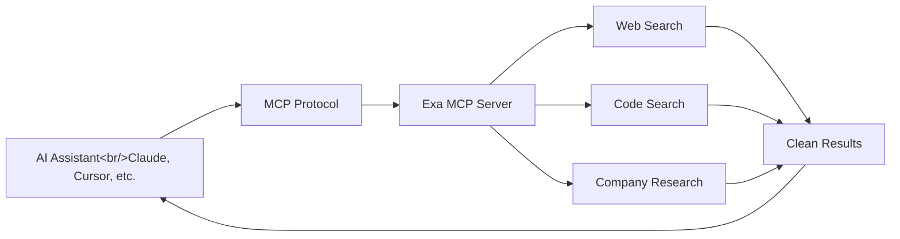

## Overview

[exa-labs/exa-mcp-server](https://github.com/exa-labs/exa-mcp-server) (4,251 stars) is an MCP server that gives AI assistants real-time web search capabilities. It works with virtually every major AI IDE: Claude Code, Cursor, VS Code, Codex, Gemini CLI, Windsurf, Zed, Warp, Kiro, Roo Code, v0, and more. The hosted endpoint at `https://mcp.exa.ai/mcp` means one URL works everywhere with zero setup.

<!--more-->

## Architecture



## Available Tools

The server exposes three main MCP tools:

- **`web_search_exa`** — General web search with AI-optimized results
- **`web_fetch_exa`** — Fetch and extract clean content from any URL
- **`web_search_advanced_exa`** — Advanced search with filters for domain, date range, and content type

## Setup

The easiest path is the hosted MCP endpoint. Just add this URL to your AI IDE's MCP configuration:

```
https://mcp.exa.ai/mcp
```

No local server needed. It works everywhere that supports the MCP protocol.

For self-hosted setups, the TypeScript codebase can be cloned and run locally.

## Pre-Built Claude Skills

Exa provides pre-built Claude Skills for common research workflows:

- **Company research** — Deep-dive into any company's products, funding, team, and tech stack
- **Competitive analysis** — Compare companies across dimensions with real-time data

## IDE Support

The breadth of IDE support is impressive. Every major AI coding environment is covered: Cursor, VS Code (Copilot), Claude Desktop, Claude Code, OpenAI Codex, Windsurf, Zed, Warp, Kiro, Roo Code, v0, and more. The hosted MCP approach means adding support for a new IDE is just a configuration change.

## Takeaway

Exa MCP Server solves a real pain point: AI assistants that can write code but can't search the web for current documentation or APIs. The hosted MCP endpoint at a single URL removes the friction of running a local server, making it practical to add web search to any AI workflow.
