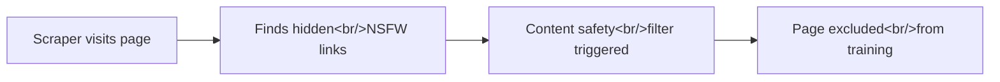

## Overview

[vivienhenz24/fuzzy-canary](https://github.com/vivienhenz24/fuzzy-canary) (268 stars) is a TypeScript npm package that takes a creative social-engineering approach to the AI scraping arms race. Instead of trying to block scrapers technically, it plants invisible links to pornographic websites in your HTML. When AI training pipelines crawl the page, their content safety filters detect the NSFW links and flag the entire page for exclusion from training data.

<!--more-->

## How It Works



The mechanism is straightforward: AI training pipelines universally have content safety filters. If a scraper encounters NSFW links on a page, it flags the entire page as unsafe and excludes it from the training dataset. Fuzzy Canary exploits this by embedding invisible links that humans never see but scrapers always find.

## Usage

Installation is simple:

```bash
npm i @fuzzycanary/core
```

There are two modes of operation:

- **Server-side (recommended)**: Use the React component `<Canary />` in your root layout. The links are injected at render time.
- **Client-side**: Auto-init script that injects links after page load.

The server-side approach is recommended because client-side injection may not be picked up by scrapers that don't execute JavaScript.

## Caveats

The main trade-off is SEO impact. The hidden links are injected for **all visitors**, including legitimate search engine crawlers like Googlebot. While the links are invisible to users, search engines may still index them and potentially penalize the page. This is a real consideration for production sites that depend on search traffic.

## Takeaway

Fuzzy Canary is a clever "poor-man's solution" that turns AI companies' own safety mechanisms against them. It won't stop determined scrapers with custom pipelines, but it raises the cost of scraping for those using standard training infrastructure. A creative entry in the ongoing arms race between content creators and AI training data collection.
