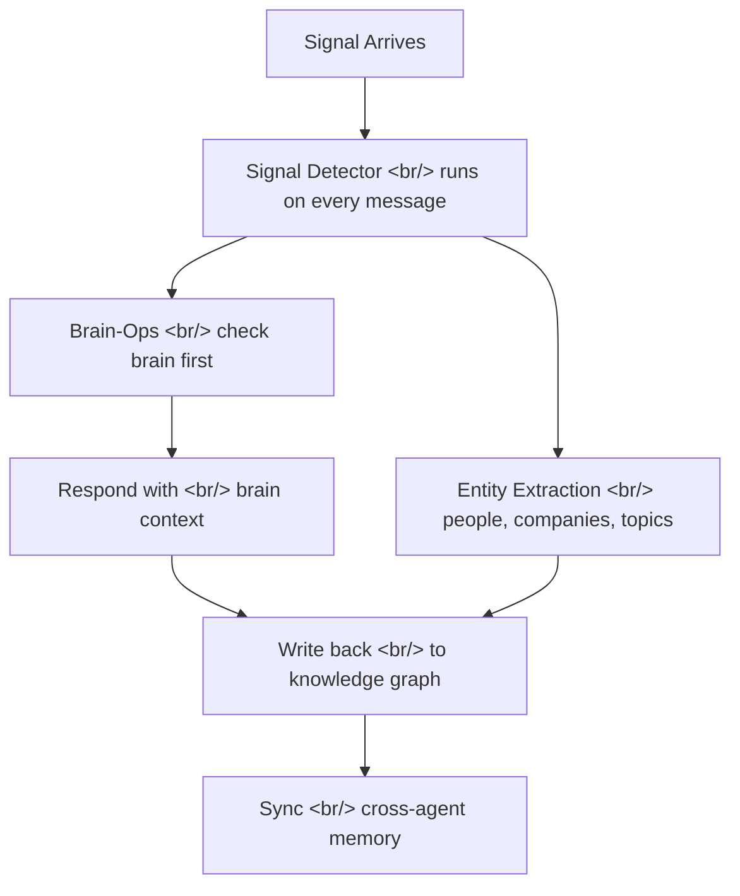

## Overview

"Your AI agent is smart but forgetful. GBrain gives it a brain."

GBrain is an open-source AI agent memory system built by Garry Tan, President and CEO of Y Combinator. It is not a toy or a demo — Tan built it for the agents he actually uses in production. The repository has already gathered 8,349 stars and 931 forks on GitHub, written primarily in TypeScript and PLpgSQL.

<!--more-->

## Production Scale

GBrain's production deployment speaks for itself:

| Metric | Count |
|--------|-------|
| Pages ingested | 17,888 |
| People tracked | 4,383 |
| Companies indexed | 723 |
| Cron jobs running | 21 |
| Time to build | 12 days |

This is not a proof-of-concept. It is a working knowledge graph that powers real agent workflows every day.

## Architecture: The Signal-to-Memory Loop

The core loop is straightforward: every message is a signal, and every signal gets processed through the brain.

The key insight is that the signal detector fires on **every single message** in parallel, capturing the agent's thinking and extracting entities before the main response even begins. This means the brain is always accumulating context, not just when explicitly asked.

## Philosophy: Thin Harness, Fat Skills

GBrain follows a distinctive design philosophy: **intelligence lives in skills, not in the runtime**.

The harness itself is deliberately thin — it handles message routing, database connections, and the signal detection loop. Everything else is pushed into 25 skill files organized by a central `RESOLVER.md`:

- **signal-detector** — always-on, fires on every message
- **brain-ops** — the 5-step lookup protocol before any external call
- **ingest** — pull in pages, documents, feeds
- **enrich** — add metadata, classify, link entities
- **query** — structured retrieval from the knowledge graph
- **maintain** — garbage collection, deduplication, health checks
- **daily-task-manager** — recurring workflows
- **cron-scheduler** — 21 cron jobs and counting
- **soul-audit** — personality and behavior consistency checks

The phrase "skill files are code" captures this well. Each skill is a fat markdown document that encodes an entire workflow — not just a prompt template, but a complete operational specification with decision trees, error handling, and output formats.

## Brain-First Convention

Before any agent reaches for an external API, it follows a strict 5-step brain lookup:

1. Check the knowledge graph for existing information
2. Check recent signals for context
3. Check entity relationships
4. Check temporal patterns
5. Only then, if needed, call an external API

This "brain-first" convention dramatically reduces redundant API calls and ensures the agent's responses are grounded in accumulated knowledge rather than fresh (and potentially inconsistent) lookups.

## Technical Stack

**PGLite** deserves special mention. Instead of requiring a Postgres server, GBrain uses PGLite for instant database setup — about 2 seconds from zero to a running knowledge graph. No Docker, no server provisioning, no connection strings.

The system also ships as an **MCP server**, meaning it integrates directly with Claude Code, Cursor, and Windsurf. Any MCP-compatible tool can tap into the brain.

Installation takes roughly 30 minutes, and the agent handles its own setup — you point it at the repo and it bootstraps the database, installs skills, and configures cron jobs.

## Why It Matters

Most AI agent frameworks focus on orchestration: how to chain LLM calls, how to manage tool use, how to handle errors. GBrain addresses a different problem entirely — **persistent, structured memory across sessions and across agents**.

The fact that it was built in 12 days and is already running at production scale (17,888 pages, 4,383 people) suggests that the "thin harness, fat skills" approach is not just philosophically clean but practically effective.

GitHub: [garrytan/gbrain](https://github.com/garrytan/gbrain)
