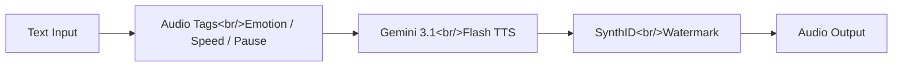

## Overview

Google's Gemini 3.1 Flash TTS represents a fundamental shift in text-to-speech technology. Rather than simply converting text to audio, it positions itself as a digital voice director — giving developers fine-grained control over how speech is delivered through over 200 audio tags that govern emotion, pacing, pauses, and emphasis. With support for 70+ languages, 30 preset voices, and multi-speaker dialog, this is not just an incremental improvement but a rethinking of what TTS can be.

<!--more-->

## Audio Tag System and Expressive Control

The core innovation in Gemini 3.1 Flash TTS is its audio tag system. Traditional TTS engines accept plain text and produce a single flat reading. Gemini Flash TTS instead accepts rich annotations — over 200 distinct tags — that let developers specify emotional tone, speaking rate, strategic pauses, and emphasis patterns. This transforms the API from a text reader into an expressive speech synthesis director.

The practical implications are significant. A weather app delivering a storm warning needs urgency and clarity. A travel app describing a sunset cruise needs warmth and enthusiasm. An emergency alert system needs authoritative calm. Previously, achieving these different tones required either separate voice models or post-processing pipelines. With Gemini Flash TTS, a single API call with different tag configurations produces dramatically different vocal deliveries from the same underlying text.

Multi-speaker dialog support further extends the use cases. Audiobook production, interactive voice assistants with distinct personas, and educational content with teacher-student dynamics all become feasible through the API without stitching together outputs from multiple models. The 30 preset voices provide a solid foundation, but the real power lies in combining them with the tag system to create nuanced, context-appropriate delivery.

## TTS Pipeline Architecture

The pipeline from text to watermarked audio follows a clean, linear flow. Text input is first annotated with audio tags that encode the desired expressive parameters. These enriched inputs are processed by the Gemini 3.1 Flash TTS model, which synthesizes speech that respects the tag directives. Before output, every audio segment passes through SynthID watermarking.

This architecture means that provenance tracking is not an afterthought but an integral part of the synthesis pipeline. Every piece of audio that leaves the system is identifiable as AI-generated, regardless of how it is subsequently processed or distributed.

## SynthID Watermarking and Trust

Every audio output from Gemini Flash TTS carries a SynthID watermark — an inaudible signal embedded in the audio that identifies it as AI-generated. This is not optional; it is applied to all output by default. In an era of increasing concern about deepfakes and synthetic media, this represents Google taking a proactive stance on AI audio provenance.

SynthID watermarks are designed to survive common audio transformations like compression, format conversion, and moderate editing. This means that even if generated audio is shared, recompressed, and redistributed, the watermark persists and can be detected. For enterprises deploying TTS at scale — customer service, content production, accessibility — this built-in provenance chain reduces compliance risk significantly.

The mandatory nature of the watermark is a deliberate design choice. By removing the option to generate unwatermarked audio, Google establishes a trust baseline that downstream applications and regulators can rely on. This contrasts with approaches where watermarking is optional and therefore rarely used.

## Availability and Performance

Gemini 3.1 Flash TTS is available through the Gemini API, AI Studio, Vertex AI, and Google Vids. This multi-platform availability means it fits into both prototyping workflows and production enterprise pipelines. The model has achieved an Elo rating of 1,211 on the Artificial Analysis TTS leaderboard, placing it among the top-performing TTS systems currently available.

The brand voice design use case is particularly compelling. Consider the difference between a weather app that needs calm authority, a travel app that needs infectious enthusiasm, and an emergency alert system that needs urgent clarity. All three can be served by the same model with different tag configurations, eliminating the need to maintain separate voice pipelines for different product contexts.

For developers evaluating TTS solutions, the combination of expressiveness, language coverage, and built-in trust infrastructure makes this a strong candidate. The 70+ language support also means that internationalization does not require switching providers or maintaining separate voice stacks per locale.

## Insights

Gemini 3.1 Flash TTS signals that the TTS market is moving beyond intelligibility as the primary metric. The competitive frontier is now expressiveness, controllability, and trust infrastructure. The audio tag approach is particularly clever — it avoids the complexity of voice cloning while still delivering nuanced control over delivery. The mandatory SynthID watermarking sets a standard that other providers will likely need to match as synthetic audio regulation tightens globally. For developers building voice-centric products, this is worth evaluating as both a capability upgrade and a compliance simplification.
