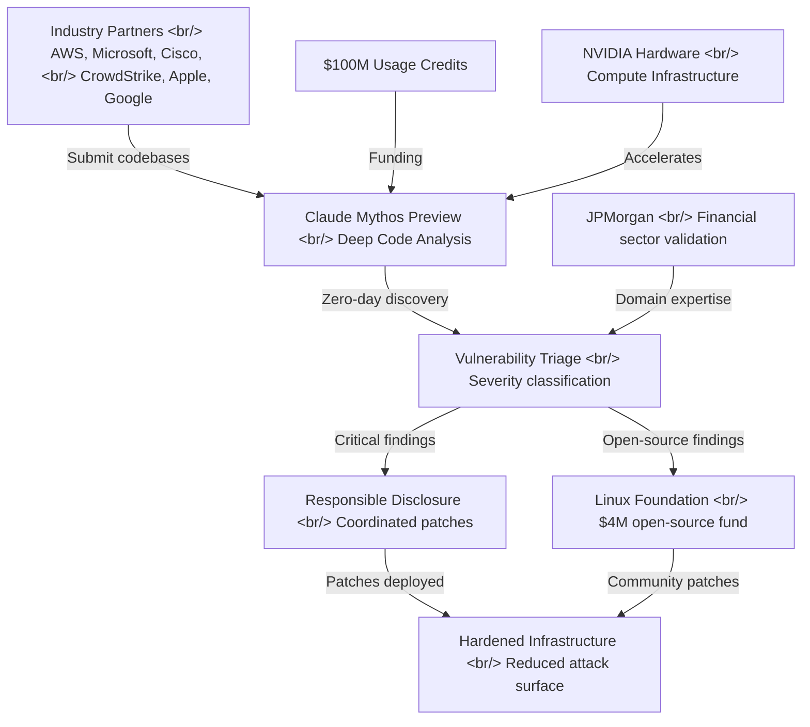
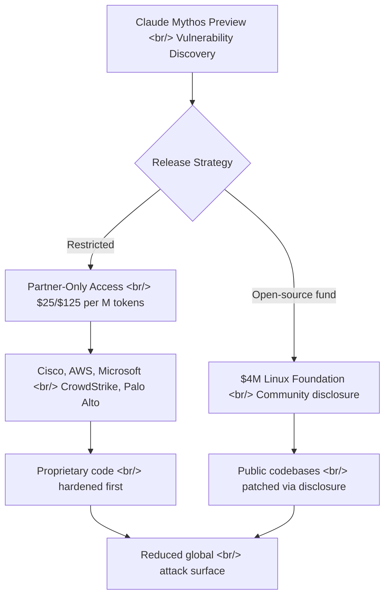

## Overview

Anthropic announced Project Glasswing, a coalition with AWS, Apple, Google, Microsoft, Cisco, CrowdStrike, NVIDIA, JPMorgan, and the Linux Foundation, aimed at using AI to proactively discover and patch software vulnerabilities before attackers can exploit them. At the center of this initiative is Claude Mythos Preview, an unreleased frontier model purpose-built for deep code analysis that has already found thousands of zero-day vulnerabilities in every major operating system and browser.

<!--more-->

## The Glasswing Architecture

The name "Glasswing" references the transparent-winged butterfly — a fitting metaphor for making opaque codebases transparent to security analysis. The project operates as a coordinated defense pipeline: partners submit code, Mythos analyzes it at a depth no automated tool has previously achieved, and confirmed vulnerabilities flow back through responsible disclosure.

What makes this different from existing bug bounty programs or static analysis tools is the depth of reasoning. Mythos does not merely pattern-match against known vulnerability classes — it constructs semantic models of program behavior across function boundaries, library interfaces, and even cross-process communication channels.

## Mythos Benchmark Performance

The numbers tell a striking story about the gap between Mythos and current frontier models.

| Benchmark | Claude Mythos Preview | Claude Opus 4.6 | Delta |
|---|---|---|---|
| SWE-bench Verified | **93.9%** | 80.8% | +13.1pp |
| CyberGym | **83.1%** | 66.6% | +16.5pp |
| Terminal-Bench 2.0 | **82.0%** | — | — |

The CyberGym gap is particularly telling. This benchmark tests the ability to find and exploit vulnerabilities in realistic codebases — not just solve programming problems. A 16.5 percentage-point improvement over Opus 4.6 suggests Mythos has genuinely new capabilities in vulnerability reasoning, not just incremental gains in code understanding.

SWE-bench Verified at 93.9% is also remarkable. We are approaching a ceiling where the remaining failures likely reflect ambiguous specifications or contested ground-truth patches rather than model limitations.

## The Headline Discoveries

Three findings stand out for what they reveal about the limits of existing security tooling.

### The 27-Year-Old OpenBSD Bug

OpenBSD is the operating system that security-conscious engineers choose *because* of its audit culture. The project has conducted line-by-line manual audits for decades. That Mythos found a vulnerability surviving 27 years of this scrutiny suggests the bug existed in a semantic gap — a place where the interaction between components created a vulnerability invisible to function-level reasoning.

### The 16-Year-Old FFmpeg Bug

This one is arguably more impressive. FFmpeg has survived over 5 million automated fuzzing tests. Fuzzing is the standard automated approach to finding memory corruption bugs — feed random inputs and see what crashes. That this bug persisted through 5M fuzz iterations means it is triggered by a *semantic* condition, not a random byte pattern. Mythos found it by understanding what the code *means*, not just what inputs make it crash.

### Linux Kernel Privilege Escalation Chain

A privilege escalation chain is not a single bug — it is a sequence of individually benign behaviors that compose into a security violation. Finding one requires understanding how separate subsystems interact under specific conditions. This is the class of vulnerability that has historically required elite human researchers spending months of focused effort.

## What This Means for the Security Landscape

### The Asymmetry Problem

Software security has always suffered from a fundamental asymmetry: defenders must secure every possible path, while attackers need to find just one flaw. Glasswing inverts this dynamic by giving defenders a tool that can systematically explore the vulnerability space at a depth and speed that human reviewers and existing automated tools cannot match.

### The Open-Source Question

The $4M committed to open-source security through the Linux Foundation is notable but modest relative to the $100M total credits. Open-source codebases are the foundation of virtually all commercial software — OpenSSL, the Linux kernel, FFmpeg, and similar projects underpin every partner's products. The ratio suggests the primary value proposition is protecting proprietary partner code, with open-source as a secondary beneficiary.

### Controlled Release Strategy

Mythos is not publicly available. It is partner-only, priced at $25 per million input tokens and $125 per million output tokens. This is a deliberate choice: a model this capable at finding vulnerabilities is also potentially capable at *exploiting* them. The controlled distribution through vetted partners is Anthropic's attempt to ensure the model creates more patches than attacks.

## Early Partner Results

Partners are already reporting findings. Cisco, AWS, Microsoft, CrowdStrike, and Palo Alto Networks have all confirmed that Mythos is surfacing vulnerabilities their existing toolchains missed. The specifics remain under disclosure timelines, but the breadth of confirmation across both cloud providers and security vendors suggests this is not a narrow capability limited to specific codebases or vulnerability types.

The fact that *security companies* — organizations whose entire business is finding vulnerabilities — are finding new results with Mythos is the strongest signal. CrowdStrike and Palo Alto Networks already employ world-class vulnerability researchers. That Mythos augments even their capabilities speaks to the model's depth.

## Implications for AI Development

Project Glasswing represents a new paradigm: AI models purpose-built for defensive security, deployed through industry consortia rather than public APIs. If Mythos delivers at scale, it establishes a template for how frontier AI capabilities can be deployed in sensitive domains — controlled access, institutional partnerships, and responsible disclosure frameworks.

The question remains whether this defensive advantage is durable. If Mythos-class models eventually become broadly available, attackers gain the same analytical depth. The Glasswing model implicitly assumes a window of advantage — a period where defenders have access and attackers do not. How long that window lasts will determine whether this initiative produces lasting security improvements or merely accelerates the arms race.

## References

- [Project Glasswing — Anthropic](https://www.anthropic.com/glasswing)
- [Glasswing Analysis — tilnote.io](https://tilnote.io/pages/69d57107e020f9fdf26ccefc)
