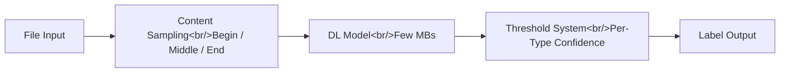

## Overview

Google Magika is an open-source, AI-powered file type identification tool that replaces traditional magic-byte heuristics with a compact deep learning model. With 13,849 GitHub stars, it has earned attention for good reason: trained on approximately 100 million samples across 200+ content types, it achieves roughly 99% accuracy while running inference in about 5 milliseconds on CPU. The model itself weighs only a few megabytes, making it practical for deployment anywhere from CLI tools to browser environments.

<!--more-->

## Deep Learning Architecture

Magika's architecture departs fundamentally from the traditional approach to file identification. Tools like `file` and `libmagic` rely on magic bytes — fixed byte sequences at known offsets that identify file formats. This works well for formats with rigid headers but fails on content types that lack distinctive signatures, such as different programming languages, markup formats, or obfuscated files.

Magika instead treats file identification as a classification problem. It samples content from the file — beginning, middle, and end regions — and feeds these samples through a custom deep learning model. The model was trained on approximately 100 million samples spanning 200+ content types, giving it statistical patterns that go far beyond what fixed-rule systems can capture.

The result is a model that fits in a few megabytes and runs inference in roughly 5 milliseconds on CPU. This is fast enough for inline use in email scanning, file upload validation, and real-time security analysis. The small model size also means it can be embedded directly in client applications without significant overhead.

## Confidence and Threshold System

One of Magika's more sophisticated features is its per-content-type threshold system. Rather than applying a single confidence cutoff across all file types, Magika maintains individual thresholds for each content type. This reflects the reality that some file types are inherently easier to identify than others — a PNG file with its distinctive header is far more certain than distinguishing between two similar scripting languages.

The system offers multiple confidence modes, allowing callers to tune the trade-off between precision and recall based on their use case. A security scanner might want high-recall mode to catch every suspicious file, while a file organization tool might prefer high-precision mode to avoid mislabeling. This flexibility makes Magika adaptable across very different operational contexts.

The threshold system was validated through the ICSE 2025 publication, demonstrating that per-type thresholds significantly outperform global threshold approaches, particularly on content types that are naturally confusable.

## Production Deployment and Integration

Magika is not a research prototype — it runs at Google scale. It is integrated into Gmail for attachment scanning, Google Drive for file type validation, and Chrome Safe Browsing for download safety checks. This production pedigree is significant because it means the model has been tested against adversarial inputs at a scale that few open-source tools experience.

External integrations further validate the tool's utility. VirusTotal uses Magika for file identification in its malware analysis pipeline, and abuse.ch integrates it for threat intelligence workflows. These are environments where misidentifying a file type can mean missing a malware sample or generating a false positive that wastes analyst time.

The multi-language availability — Rust CLI, Python API, JavaScript/TypeScript bindings, and Go bindings — means Magika can be integrated into virtually any tech stack. The Rust CLI provides native performance for command-line workflows, while the Python API integrates naturally into data science and security analysis pipelines.

## Security Implications

File type detection sits at a critical junction in security infrastructure. Attackers frequently disguise malicious files with misleading extensions or crafted headers to bypass security filters. Traditional magic-byte detection can be fooled by carefully constructed files that present benign headers while containing malicious payloads.

Magika's deep learning approach is inherently more resilient to this kind of evasion. Because it examines content patterns across the entire file rather than just checking fixed offset positions, it can detect inconsistencies between a file's claimed type and its actual content. This makes it a meaningful upgrade for any security pipeline that needs to make decisions based on file type.

The roughly 99% accuracy across 200+ content types means that the error rate is low enough for automated decision-making in most contexts, with the threshold system providing additional control for high-stakes applications.

## Insights

Magika demonstrates that deep learning can replace traditional heuristic systems even in domains where heuristics have worked adequately for decades. The key insight is not just accuracy improvement but the combination of accuracy, speed, and model size that makes deployment practical everywhere. The per-type threshold system is a particularly thoughtful design decision that acknowledges the heterogeneous nature of file identification confidence. For security teams and platform builders, Magika offers a drop-in upgrade that brings AI-level accuracy without AI-level complexity or resource requirements.
