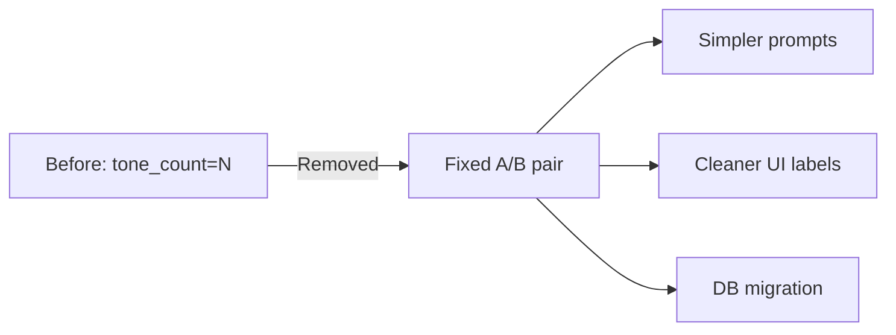

## Overview

This session focused on fully removing the tone_count system across the entire project and unifying generated image naming to a clean A/B pair. The change touched backend logic, existing DB rows, and the frontend UI, resulting in 7 commits. A deploy environment issue and an angle/lens-only regeneration bug were also fixed along the way.

[Previous: hybrid-image-search-demo Dev Log #14](/posts/2026-04-15-hybrid-search-dev14/)

<!--more-->

## Summary of Changes

### Why Remove Tone Count?

The original design managed the number of tone (color) variants per generation via a `tone_count` parameter. In practice, two variants (A and B) were always sufficient. The tone count concept added unnecessary complexity to both the UI and the prompt construction pipeline. This session removes it entirely.

### DB Migration (Alembic)

Existing rows in the `injection_reason` column carried suffixes like `_tone2` or `_tone3`. An Alembic migration strips these suffixes from all existing rows. The parsing logic in `app_utils.py` was also updated to ignore any lingering suffixes.

### Backend Changes

- `app_utils.py` — Removed tone_count suffix appending logic; added suffix stripping during parsing
- `routes/generation.py` — Removed tone_count parameter
- `generation/injection.py` — Removed tone ratio logic
- `generation/prompt.py` — Enriched the B variant with more detail in the prompt
- `routes/history.py` — Added backward-compatible tone suffix handling for history queries
- `schemas.py` — Removed tone_count field

### Frontend Changes

- `App.tsx` — Removed tone count badges, unified to A/B naming
- `GeneratedImageDetail.tsx` — Removed tone-related labels
- `api.ts` — Removed tone_count parameter

### Angle/Lens-Only Regeneration Fix

When regenerating with only an angle or lens change (no attribute injection), the prompt was not constructed correctly. This was fixed by explicitly handling the angle/lens-only case in the generation pipeline.

### Deploy Script Fix

The `uv` binary installs to `~/.local/bin` on EC2, but the deploy script's PATH did not include this directory, causing deployment failures. Fixed by adding it to PATH in the script.

## Commit Log

| # | Scope | Description |
|:---:|:---:|:---|
| 1 | db | Alembic migration to strip tone_count suffix from existing injection_reason rows |
| 2 | gen | Stop appending tone_count to the reason string |
| 3 | history | Strip tone_count suffix before parsing category from reason |
| 4 | ui | Remove tone count badge from cards, use A/B only |
| 5 | ui | Replace remaining tone labels with A/B naming |
| 6 | deploy | Add ~/.local/bin to PATH for uv on EC2 |
| 7 | gen | Remove tone ratio entirely, fix angle/lens-only regen, enrich B variant detail |

## Insights

- **Incremental removal is safer** — Rather than deleting tone_count in one massive commit, the work was split into DB migration, backend logic, then frontend. Each step could be verified for backward compatibility with existing data.
- **A/B beats N variants** — From a user perspective, "A / B" is far more intuitive than "Tone 3 images." Reducing choice complexity improves UX.
- **PATH differences between dev and prod** — A classic failure mode: works locally but breaks on EC2. Explicitly setting PATH in deploy scripts is a habit worth building.
